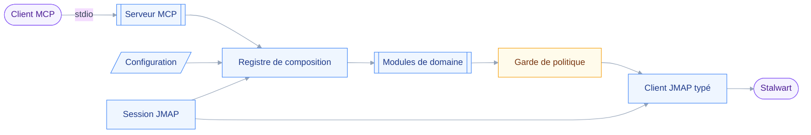

# INSTALL — jmap-mcp

## 🎯 Vision

Serveur MCP local qui expose toute la surface JMAP d'un serveur Stalwart à un assistant IA : mail, calendrier, contacts, fichiers, partages, Sieve.

Le produit s'adresse aux personnes qui auto-hébergent Stalwart et veulent qu'un assistant lise, cherche et rédige dans leur messagerie sans passer par un intermédiaire tiers.
Le différenciateur tient en deux points : la couverture complète des six domaines JMAP, là où l'art antérieur s'arrête au mail, et une politique d'écriture configurable qui encadre chaque opération irréversible.
Aucune donnée ne quitte la machine de l'utilisateur en dehors de l'échange avec son propre serveur.

## ⚖️ Décisions

| Décision | Choix | Pourquoi |
| --- | --- | --- |
| Architecture | Monolithe modulaire | Politique appliquée en un point |
| Front-end | Aucun | Transport stdio, aucune interface |
| Back-end | Node 24, TypeScript 7 | SDK MCP officiel, langage maîtrisé |
| Base de données | Aucune | Stalwart est la source de vérité |
| Authentification | Jeton bearer JMAP | Aucun utilisateur à authentifier |
| Hébergement | Machine locale via `npx` | Le serveur tourne chez l'utilisateur |

### Politique d'écriture

Quatre classes d'opération, trois niveaux configurables chacune.

| Classe | Couvre | Niveau par défaut |
| --- | --- | --- |
| `read` | Lecture, recherche, listage | `allow` |
| `draft` | Écriture réversible, brouillons | `allow` |
| `send` | Envoi sortant, irréversible | `confirm` |
| `destroy` | Suppression définitive | `confirm` |

Le niveau `confirm` s'appuie sur MRTR, le mécanisme d'entrée requise de la spécification MCP `2026-07-28`[^mrtr].
Quand le client ne l'expose pas, l'outil refuse : jamais d'exécution silencieuse.

## 🧱 Stack

| Composant | Version | Rôle |
| --- | --- | --- |
| Node | 24, `engines: ">=24"` | Runtime |
| TypeScript | 7.0.2 | Compilateur natif Go |
| `@modelcontextprotocol/server` | 2.0.0 | SDK MCP, spec `2026-07-28` |
| `zod` | `~4.4.3` | Schémas d'entrée des outils |
| Vitest | 4.1.11 | Tests |
| Biome | 2.5.11 | Lint et format |
| pnpm | 11 | Gestionnaire de paquets |

Intégrations : serveur Stalwart via JMAP, clients MCP Claude Code et Claude Desktop.
Licence MIT.

> [!WARNING]
> Node 24 passe en Maintenance le 20 octobre 2026, Node 26 devenant Active LTS le 28.
> Le champ `engines` reste valide, mais la mention « Node 24 LTS » sera périmée dans la documentation publique.

## 🏗️ Architecture

Le diagramme montre le chemin d'un appel d'outil, du client MCP jusqu'à Stalwart.



Le registre est le seul point qui croise les capacités annoncées par la session JMAP avec la politique configurée, et le seul qui décide quels outils sont enregistrés.
Il compose une fois, avant `connect()` : la liste d'outils ne varie ni par connexion ni en cours de session, comme l'exige la spécification[^tools].
Un module de domaine déclare sa classe d'opération et rend son résultat ; il ignore qu'il peut être désactivé ou soumis à confirmation.

## 📂 Arborescence

```text
jmap-mcp/
├── .nvmrc                        # 24
├── package.json                  # bin: jmap-mcp, type: module, engines: >=24
├── tsconfig.json                 # module nodenext, rootDir explicite
├── biome.json
├── vitest.config.ts
├── README.md
├── LICENSE                       # MIT
├── aidd_docs/
│   └── INSTALL.md
├── src/
│   ├── index.ts                  # point d'entrée exécutable
│   ├── server.ts                 # construit le McpServer, branche stdio
│   ├── config/
│   │   ├── schema.ts             # schéma Zod de la configuration
│   │   ├── load.ts               # env, fichier, trousseau macOS
│   │   └── policy.ts             # OperationClass x PolicyLevel
│   ├── jmap/
│   │   ├── session.ts            # découverte, capacités, accountId
│   │   ├── client.ts             # request, requestMany, back-references
│   │   ├── errors.ts             # erreur JMAP vers erreur MCP
│   │   ├── blob.ts               # téléversement et téléchargement
│   │   └── types/
│   │       ├── core.ts           # RFC 8620
│   │       ├── mail.ts           # RFC 8621
│   │       ├── contacts.ts       # RFC 9610
│   │       ├── sharing.ts        # RFC 9670
│   │       ├── calendars.ts      # draft-ietf-jmap-calendars-28
│   │       └── filenode.ts       # draft-ietf-jmap-filenode-14
│   ├── registry/
│   │   ├── define-tool.ts        # policy obligatoire au niveau du type
│   │   ├── manifest.ts           # type DomainManifest
│   │   └── compose.ts            # capacités x politique vers outils
│   ├── domains/
│   │   ├── mail/                 # search, read, compose, organize, attachments
│   │   ├── calendar/             # events, availability, participants
│   │   ├── contacts/             # books, cards
│   │   ├── files/                # nodes, upload
│   │   ├── sharing/              # principals, rights
│   │   └── sieve/                # scripts, vacation
│   └── shared/
│       ├── pagination.ts         # curseurs, budget de tokens
│       └── render.ts             # objet JMAP vers texte compact
└── tests/
    ├── unit/
    ├── contract/                 # invariant de garde sur send et destroy
    └── fixtures/
```

## 🚀 Installation

Installation manuelle : le framework ne génère aucun fichier de code.

- [x] Installer Node 24 avec `nvm install` depuis la racine, puis vérifier `node -v` et `pnpm -v`.
- [x] Initialiser le dépôt Git, créer le dépôt GitHub public et déposer la licence MIT.
- [x] Créer `package.json` : `type: module`, `bin.jmap-mcp`, `engines.node: ">=24"`.
- [x] Installer les dépendances d'exécution `@modelcontextprotocol/server` et `zod`, puis les dépendances de développement `typescript`, `vitest`, `@biomejs/biome`.
- [x] Vérifier l'unicité de Zod avec `pnpm why zod` et ajouter un `pnpm.overrides` si deux copies apparaissent.
- [x] Configurer `tsconfig.json` avec `module: nodenext` et un `rootDir` explicite, sans quoi TypeScript 7 émet `TS5011`.
- [ ] Renseigner `JMAP_SESSION_URL` et `JMAP_BEARER_TOKEN`, puis enregistrer le serveur auprès du client MCP.

## 🔍 Audit

Résultats de l'audit parallèle mené à l'étape 03 du bootstrap.

| Candidat | Verdict | Note |
| --- | --- | --- |
| Monolithe par domaine | ⚠️ | Garde d'écriture non imposable |
| Monolithe modulaire à registre | ⚠️ | Retenu, amendé en composition statique |
| Génération pilotée par le protocole | ❌ | Signatures JMAP non remplissables |

### Points de vigilance retenus

| Sujet | Constat | Conduite |
| --- | --- | --- |
| Élicitation | Claude Desktop ne la supporte pas | Refuser, jamais exécuter |
| Drafts JMAP | Calendars `-28` et Filenode `-14` mouvants | Un fichier de types par spec |
| Révision Filenode | README Stalwart et CHANGELOG divergent | Vérifier le code avant `files` |
| Nombre d'outils | Dégradation observée dès 30 outils | Gating par capacité, 26 visés |
| Annotations MCP | `destructiveHint` est déclaré non fiable | Usage documentaire seulement |

Aucune bibliothèque JMAP TypeScript ne couvre Calendars, Contacts ni File Storage : le client typé fait main est le seul chemin viable, pas un contournement[^libs].

[^mrtr]: [Spécification MCP 2026-07-28, motif MRTR](https://modelcontextprotocol.io/specification/2026-07-28/basic/patterns/mrtr)
[^tools]: [Spécification MCP 2026-07-28, outils serveur](https://modelcontextprotocol.io/specification/2026-07-28/server/tools)
[^libs]: [jmap-jam](https://github.com/htunnicliff/jmap-jam) et [jmap-kit](https://github.com/lachlanhunt/jmap-kit), tous deux limités aux RFC mail.
