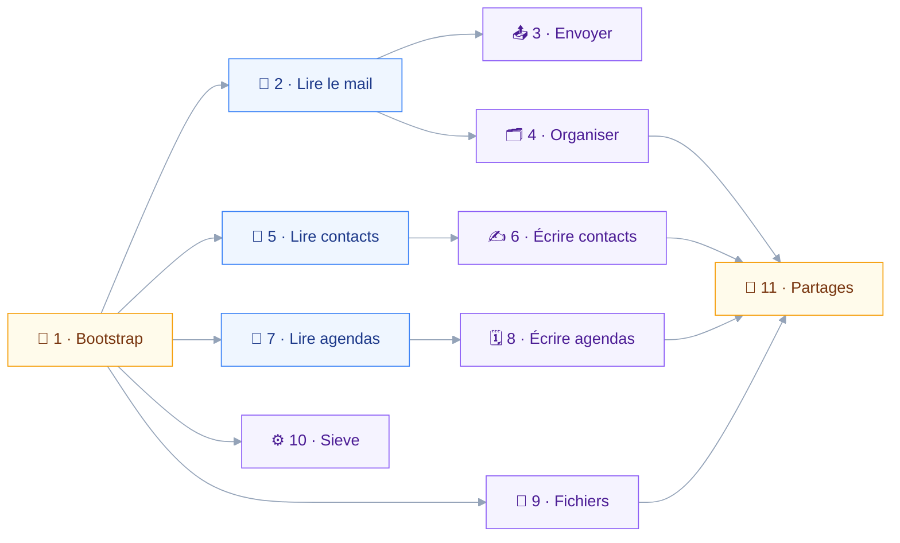

# ROADMAP — jmap-mcp

## 🎯 Principe de découpe

Un module livre un verbe métier complet sur un domaine, pas une couche technique.
La lecture précède l'écriture partout : sans recherche, une opération destructrice n'a pas d'identifiants à consommer.

Le recensement compte environ quatre-vingts méthodes JMAP pour un budget de vingt-six outils.
Un outil agrège donc plusieurs méthodes sous une intention, et la surface se mesure module après module.
— `aidd_docs/memory/external/stalwart-jmap.md`

## 🔗 Dépendances

Le diagramme montre ce qui bloque quoi. Une flèche signifie « ne peut pas commencer avant ».

Les branches mail, contacts, agendas, fichiers et Sieve sont indépendantes après le module 1.
Le module 11 attend les quatre types qui portent `shareWith`.

## 🧱 Module 1 — Bootstrap et garde

| Aspect | Contenu |
| --- | --- |
| Livre | Squelette, session, client, registre, garde |
| Outils | `jmap_session_info`, classe `read` |
| Méthodes | `Core/echo`, découverte de session |
| Sortie | Test de contrat vert sur fixture |

La garde est le vrai livrable. Elle classe l'appel sur ses arguments, pas sur le nom de la méthode.
`define-tool.ts` prend donc une fonction de classification, et le test de contrat prouve qu'aucun chemin `send` ou `destroy` ne contourne le registre.

Prérequis manuels hors code : dépôt Git initialisé, CLI Stalwart installé, jeton bearer d'Alfred créé.

## 📖 Module 2 — Lecture de mails ✅

| Aspect | Contenu |
| --- | --- |
| Outils | `mail_search`, `mail_read`, `mail_folders` |
| Classes | `read` |
| Méthodes | `Email/query`, `Email/get`, `Mailbox/query`, `Mailbox/get`, `Thread/get`, `SearchSnippet/get` |

`mail_read` explicite toujours `properties` et passe par `fetchTextBodyValues` avec `maxBodyValueBytes` : sans cela, `Email/get` tire les propriétés lentes par défaut.
`mail_search` pagine défensivement, `queryMaxResults` valant 5000 sans être annoncé dans la session.

C'est ce module qui rend le scénario newsletters observable.

## 📤 Module 3 — Envoi de mails ✅

| Aspect | Contenu |
| --- | --- |
| Outils | `mail_compose`, `mail_send`, `mail_identities` |
| Classes | `draft`, `send`, `read` |
| Méthodes | `Email/set` create, `EmailSubmission/set`, `Identity/get` |

Première classe `send` : le module valide MRTR de bout en bout, et le refus explicite quand le client ne l'expose pas.
`onSuccessDestroyEmail` est interdit à l'outil : envoyer et détruire sont deux gestes, deux confirmations.

Livré avec un ajout hors périmètre initial : `recipients.scope` borne les destinataires aux carnets d'adresses du compte.
Le contrôle tombe avant la confirmation, jamais après — une adresse hors périmètre n'est pas une question posée à l'utilisateur.

## 🗂️ Module 4 — Organisation du mail ✅

| Aspect | Contenu |
| --- | --- |
| Outils | `mail_move`, `mail_flag`, `mail_delete`, `mail_folder_manage` |
| Classes | `draft`, `destroy` |
| Méthodes | `Email/set` update et destroy, `Mailbox/set` |

Mettre à la corbeille reste `draft` : c'est un patch de `mailboxIds` vers le dossier de rôle `trash`.
Détruire est `destroy`, et l'outil prend des identifiants, jamais un filtre.

L'outil de dossiers s'appelle `mail_folder_manage` : le préfixe `mail_` est ce qui rassemble les trois manifestes du domaine, et un outil qui y échappe ne se retrouve pas dans une liste de vingt-six.

Deux écarts assumés au périmètre initial :

- `Email/copy` n'est pas utilisé, la méthode ne servant qu'à franchir une frontière de compte, et le multi-compte reste hors périmètre.
- Un second chemin vers la confirmation a été ajouté : au-delà de `bulkConfirmAbove`, une écriture réversible mais massive est soumise à confirmation sans changer de classe.

> [!CAUTION]
> `Mailbox/set` destroy avec `onDestroyRemoveEmails` détruit les messages en cascade.
> L'argument est écrit à faux sur chaque requête émise, et un test de contrat le vérifie sur toute la surface.

## 📇 Module 5 — Lecture des contacts ✅

| Aspect | Contenu |
| --- | --- |
| Outils | `contacts_search`, `contacts_read` |
| Classes | `read` |
| Méthodes | `ContactCard/query`, `ContactCard/get`, `AddressBook/get` |

Deux écarts documentés dans la description des outils : le tri par nom rend `UnsupportedSort`, donc les fiches sortent par date de création, et filtrer sur le prénom seul est impossible, les trois champs de nom partageant un index.

Deux questions ouvertes tranchées à la livraison :

- **Deux outils, pas trois.** Aucun outil dédié aux carnets : `AddressBook/query` n'existe pas dans la RFC 9610, et la liste des carnets tient dans l'en-tête que `contacts_search` rend déjà. Un troisième outil aurait coûté une entrée au budget pour une ligne de texte.
- **Une fiche de groupe est rendue telle quelle**, ses membres listés par uid sans lecture supplémentaire. Déplier un groupe est une lecture en cascade dont le coût dépend de sa taille ; elle revient au module 6, qui écrit les appartenances.

Écart au périmètre initial : le périmètre des destinataires devient observable. Sous un scope autre que `anyone`, les deux outils marquent chaque adresse rendue comme dedans ou dehors, et rappellent que le périmètre est figé au démarrage.

## ✍️ Module 6 — Écriture des contacts ✅

| Aspect | Contenu |
| --- | --- |
| Outils | `contacts_write`, `contacts_delete`, `contacts_book_manage` |
| Classes | `draft`, `destroy` |
| Méthodes | `ContactCard/set`, `AddressBook/set`, `ContactCard/query`, `AddressBook/get` |

Aucune corbeille n'existe pour les contacts : toute destruction est définitive.
`onDestroyRemoveContents` vide le carnet entier, donc même traitement qu'au module 4.

Une écriture de fiche part en `PatchObject` sur les seuls chemins nommés par l'appel.
Envoyer l'objet complet effacerait ce que la lecture ne rend pas, un champ absent d'une réponse partielle valant suppression.

`ContactCard/copy` n'a pas été utilisée : elle ne sert qu'à franchir une frontière de compte, et le multi-compte reste hors périmètre, comme `Email/copy` au module 4.

**Trois outils plutôt que deux.** Un carnet et une fiche ne partagent aucun schéma : le premier a un nom et un drapeau de défaut, la seconde une trentaine de champs et des appartenances.
Les fondre aurait donné un outil dont la moitié des arguments est refusée selon la valeur d'un autre, ce que le module 5 avait justement évité en n'ouvrant pas de troisième outil de lecture.
L'entrée coûtée au budget est assumée ici, pas rattrapée plus loin.

## 📅 Module 7 — Lecture des agendas ✅

| Aspect | Contenu |
| --- | --- |
| Outils | `calendar_search`, `calendar_read`, `calendar_availability` |
| Classes | `read` |
| Méthodes | `Calendar/get`, `CalendarEvent/query`, `CalendarEvent/get`, `Principal/getAvailability` |

Les bornes de `CalendarEvent/query` sont des `LocalDateTime` interprétées dans l'argument `timeZone` : l'outil impose ce fuseau plutôt que de le déduire.
Le fuseau retenu est toujours nommé dans la réponse, faute de quoi une heure ne veut rien dire.

Trois écarts au périmètre initial, chacun imposé par le code de Stalwart :

- **Aucun outil de listage des agendas.** La légende tient dans l'en-tête de `calendar_search`, comme les carnets au module 5. `Calendar/query` n'est donc jamais émise.
- **Un repli sur la disponibilité.** `Principal/getAvailability` est refusée en `forbidden` tant que `allowDirectoryQueries` reste désactivé, alors que la capacité est annoncée sans condition : le gating ne protège de rien, seul un repli répond. Le repli lit les agendas du compte et dit ce qu'il ignore.
- **Le tiers est absent du schéma.** Son identifiant de principal passerait par `Principal/query`, qui rend zéro. Exposer l'argument aurait promis une capacité que le serveur retient.

Deux modes de recherche, et non un : `expandRecurrences` exige les deux bornes, donc sans fenêtre la recherche rend les événements de base et l'en-tête le dit.
Le tri est `start` ascendant, seul ordre accepté des deux côtés, `created` et `updated` étant refusés hors dépliage.

## 🗓️ Module 8 — Écriture des agendas ✅

| Aspect | Contenu |
| --- | --- |
| Outils | `calendar_write`, `calendar_respond`, `calendar_delete` |
| Classes | `draft`, `send`, `destroy` |
| Méthodes | `CalendarEvent/set`, `CalendarEvent/get`, `Calendar/get`, `ParticipantIdentity/get` |

Le module qui démontre la classification par argument : `sendSchedulingMessages` fait basculer un même `CalendarEvent/set` de `draft` à `send`.
L'argument est écrit sur chaque appel émis, y compris ceux où il vaut faux, un défaut serveur n'étant pas une garantie.

La réponse à une invitation est un patch borné aux chemins du participant que le compte occupe, jamais la carte entière.
La clé de ce participant ne se devine pas : zéro correspondance comme deux font refuser.

Trois écarts au périmètre initial :

- **Le préfixe est `calendar_`, pas `event_`.** C'est lui qui rassemble les trois manifestes du domaine, comme `mail_` au module 4.
- **`CalendarEvent/copy` n'est pas utilisée**, la méthode ne servant qu'à franchir une frontière de compte, comme aux modules 4 et 6.
- **Une occurrence isolée ne s'écrit pas.** Stalwart accepte un identifiant synthétique et transforme silencieusement l'écriture en plan d'instance, donc les trois outils le refusent côté client.

**⚠️ Le trou que le registre ne voit pas**
`calendar_delete` reste `destroy` même quand il prévient les participants : notifier élargit qui l'apprend sans adoucir ce que l'appel fait.
Le registre ne classant l'appel qu'une fois, l'outil lit lui-même la politique `send` pour qu'une annulation expédiée ne passe pas sous couvert de destruction.

## 📁 Module 9 — Fichiers ✅

| Aspect | Contenu |
| --- | --- |
| Outils | `files_browse`, `files_fetch`, `files_write`, `files_delete` |
| Classes | `read`, `draft`, `destroy` |
| Méthodes | `FileNode/query`, `FileNode/get`, `FileNode/set`, canal de blobs |

Lister un répertoire se fait par `FileNode/query` filtré sur `parentId` : aucune méthode de listage n'existe.
`onExists` est écrit à `null` sur chaque requête émise : remplacer un fichier est une destruction, et une destruction passe par `files_delete`, où elle se confirme.

Les octets ne traversent jamais la conversation : `files_fetch` écrit sur le disque et rend un chemin, `files_write` lit un chemin et téléverse.
Le canal de blobs vit dans le noyau, parce qu'il ferme sur le jeton et sur les deux gabarits d'URL de la session.

Trois écarts au périmètre initial :

- **`FileNode/copy` n'est pas utilisée**, pour la raison des modules 4, 6 et 8.
- **La cascade est autorisée ici, seule des trois.** Un dossier ne se vide pas fichier par fichier, donc `onDestroyRemoveChildren` peut valoir vrai — après comptage du sous-arbre, et la confirmation nomme ce qui disparaît.
- **Treize conditions de filtre sont bannies.** `FileNode/query` en parse vingt-deux et n'en exécute que neuf, les autres tombant dans une branche vide sans erreur.

Le budget s'est mesuré ici, comme prévu : vingt-cinq outils exposés, quatre pris par le module.

## ⚙️ Module 10 — Sieve et absence ✅

| Aspect | Contenu |
| --- | --- |
| Outils | `sieve_scripts`, `sieve_write`, `vacation_manage` |
| Classes | `read`, `draft`, `send`, `destroy` |
| Méthodes | `SieveScript/get`, `set`, `query`, `validate`, `VacationResponse/get`, `set` |

`validate` est gratuit et sans effet : l'outil d'écriture l'appelle systématiquement avant de stocker.
`onSuccessActivateScript` a le rayon maximal du projet, il réécrit le traitement de tout le courrier entrant, et un `discard` perd le mail sans corbeille.

L'absence passe uniquement par `VacationResponse/set` : `SieveScript/set` sur le script `vacation` renvoie `forbidden` en écriture comme en création.
`isEnabled` ne retombe pas seul — `vacation/set.rs:144` l'initialise depuis le script actif courant, et seule une propriété explicite le change, `vacation/set.rs:186-191`.
L'outil ne l'écrit donc que si l'appel le nomme : le réécrire à chaque changement de texte fondrait les deux gestes que le module sépare, reformuler le message d'une part, décider qu'il répond d'autre part.

Le compte d'outils est celui du plan `aidd_docs/tasks/2026_09/2026_09_02_sieve/plan.md`, qui a tranché à trois là où le PRD en recommandait deux.
Fondre l'absence dans l'outil d'écriture aurait mis une lecture et une destruction sous un nom, et l'absence est de surcroît portée par une capacité distincte, que le gating doit pouvoir taire seule.

## 🔗 Module 11 — Partages

| Aspect | Contenu |
| --- | --- |
| Outils | `sharing_principals`, `sharing_rights`, `sharing_notifications` |
| Classes | `read`, `send` |
| Méthodes | `Principal/get`, `Principal/query`, `ShareNotification/*`, propriété `shareWith` |

Aucune méthode de partage n'existe : accorder ou révoquer, c'est patcher la map `shareWith` portée par `Mailbox`, `Calendar`, `AddressBook` et `FileNode`.
Trois des quatre types sont désormais écrits par un module livré : `Mailbox/set` au module 4, `AddressBook/set` au module 6, `FileNode/set` au module 9, et la lecture-modification-réécriture de `shareWith` s'y branchera sans nouveau client.
Le quatrième reste à ouvrir : aucun module n'émet `Calendar/set`, un test de contrat le tenant hors de portée du module 8.
L'outil lit la map, la modifie, la réécrit entière, sans quoi il révoque silencieusement tous les autres partages.

Octroyer un accès à un tiers est classé `send` : c'est irréversible du point de vue de la donnée déjà consultée.

> [!NOTE]
> `Principal/set`, `Principal/changes` et `Principal/queryChanges` sont reconnues par Stalwart mais sans implémentation.
> `Principal/query` rend zéro tant que `allowDirectoryQueries` reste désactivé.

## 📊 Budget d'outils

| Tranche | Modules | Outils cumulés | État |
| --- | --- | --- | --- |
| Fondation | 1 | 0 | ✅ |
| Mail | 2 à 4 | 10 | ✅ |
| Contacts | 5 et 6 | 15 | ✅ |
| Agendas | 7 et 8 | 21 | ✅ |
| Fichiers | 9 | 25 | ✅ |
| Sieve et absence | 10 | 28 | ✅ |
| Reste | 11 | à arbitrer | ⏳ |

Vingt-huit outils sont exposés à ce jour pour vingt-six visés, chiffre relevé sur le rapport de composition et jamais par un décompte à la main.

| Manifeste | Outils |
| --- | --- |
| Mail, lecture | `mail_search`, `mail_read`, `mail_folders` |
| Mail, rangement | `mail_move`, `mail_flag`, `mail_delete`, `mail_folder_manage` |
| Mail, envoi | `mail_identities`, `mail_compose`, `mail_send` |
| Contacts, lecture | `contacts_search`, `contacts_read` |
| Contacts, écriture | `contacts_write`, `contacts_delete`, `contacts_book_manage` |
| Agendas, lecture | `calendar_search`, `calendar_read` |
| Agendas, disponibilité | `calendar_availability` |
| Agendas, écriture | `calendar_write`, `calendar_respond`, `calendar_delete` |
| Fichiers, lecture | `files_browse`, `files_fetch` |
| Fichiers, écriture | `files_write`, `files_delete` |
| Sieve, lecture | `sieve_scripts` |
| Sieve, écriture | `sieve_write` |
| Absence | `vacation_manage` |

La tranche contacts en prévoyait quatre et en consomme cinq : le module 5 s'était tenu à deux, le module 6 en a pris trois pour ne pas mêler le schéma d'un carnet à celui d'une fiche.
Les cumuls des tranches suivantes portent ce décalage d'une unité, sans qu'aucune ne le rattrape.
Le module 1 n'a livré aucun outil, `jmap_session_info` ayant été remplacé par les instructions d'initialisation, qui portent la même information sans coûter une entrée au budget.

La cible est vingt-six, la dégradation étant observée dès trente.
Le module 10 l'a dépassée de deux, et le constat est écrit plutôt qu'arrondi : `aidd_docs/memory/internal/tool-budget.md` porte le compte, la règle d'arbitrage et les candidats à la fusion.
Le module 11 hérite donc d'une règle et non d'une place.

Les trois outils de Sieve sont derrière deux capacités qui peuvent manquer, ce que le premier critère d'arbitrage met devant un domaine que tout le monde voit : un serveur sans Sieve n'en expose aucun, et le compte qu'un client donné voit reste sous la cible.
Retirer un outil déjà publié n'est pas une issue : le nom d'un outil est le contrat public du paquet.
