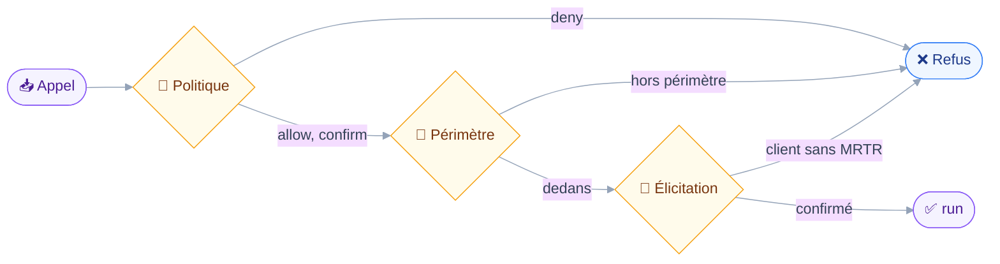

# Architecture

## 🧱 Stack

- Node et TypeScript, transport stdio, SDK MCP officiel.
- `zod` pour les schémas d'entrée des outils.
- Monolithe modulaire : la politique d'écriture s'applique en un point unique.
- Aucune base de données ni front-end. Stalwart est la source de vérité, le client MCP est l'interface.

## 🔗 Comment les pièces s'assemblent

Le diagramme suit un appel d'outil, du client MCP jusqu'à Stalwart.


## ⚖️ Décisions structurantes

- Le registre est le seul point qui croise les capacités de la session JMAP avec la politique configurée, et le seul qui décide quels outils sont enregistrés.
- La composition est statique : elle tourne une fois avant `connect()`, car la spécification interdit une liste d'outils qui varie en cours de session.
- Un module de domaine fournit une fonction qui classe l'appel d'après ses arguments, puis rend son résultat. Il ignore qu'il peut être désactivé ou soumis à confirmation.
- Quatre classes d'opération, trois niveaux chacune : `read` et `draft` en `allow`, `send` et `destroy` en `confirm`.
- Le client JMAP est écrit à la main : aucune bibliothèque TypeScript ne couvre Calendars, Contacts ni File Storage.
- Un fichier de types par spécification, les drafts Calendars et Filenode bougeant encore.
- Le périmètre des destinataires est une fonction pure d'un ensemble résolu et d'une liste d'adresses : la règle qui empêche un message de quitter le compte se teste sans serveur.

## 🛡️ Ce que traverse un envoi

Quatre filtres, dans cet ordre, tous dans le registre avant que l'outil ne tourne.



Le périmètre passe avant l'élicitation, par un hook `precheck` optionnel porté par la définition d'outil.
Un appel voué au refus quelle que soit la réponse ne doit pas être posé en question à l'utilisateur.

Le périmètre est résolu une seule fois, au démarrage, en lisant les fiches de contact du compte.
Il échoue fermé : capacité contacts absente, requête en erreur ou carnet trop volumineux rendent un périmètre `unreadable`, qui refuse tout, y compris une adresse que la liste `allow` nomme.

Quand une réponse ne nomme aucune adresse, le `precheck` lit lui-même le message source pour connaître son destinataire.
Lire coûte un aller-retour, mais l'alternative est de faire confirmer un envoi que `run` refusera de toute façon : le périmètre tranche avant l'élicitation, sans exception.

`mail_compose` et `mail_send` refont ensuite le contrôle dans `run`, sur les adresses réellement écrites.
La redondance est voulue : le `precheck` avale une lecture en échec plutôt que de transformer une erreur de transport en refus, donc le dernier mot sur les destinataires lui échappe.

Le périmètre est désormais observable avant d'être subi : sous un scope autre que `anyone`, `contacts_search` et `contacts_read` marquent chaque adresse rendue comme dedans ou dehors.
Le marquage ne change rien à la règle, il la donne à lire ; la même fonction `isWithinScope` sert l'affichage et le refus, sans quoi les deux dériveraient.
Il rappelle aussi que le périmètre est figé au démarrage, une fiche créée depuis n'y entrant qu'après un redémarrage.

## 🔁 Le second chemin vers la confirmation

La classe dit ce que l'appel fait, jamais combien il en fait.
Déplacer deux cents messages reste un `draft` : le classer `destroy` pour forcer la question mentirait à l'utilisateur à l'instant précis où il arbitre.

Une définition d'outil porte donc un hook `confirmWhen` optionnel, qui rend la raison pour laquelle cet appel-là mérite une question que sa classe n'exige pas.
Cette raison s'affiche à la place de la classe, « ceci est une opération de brouillon » n'expliquant rien sur un volume.

L'ordre des hooks ne s'inverse jamais :

```txt
precheck → confirmWhen → élicitation → run
```

`confirmWhen` n'est consulté qu'au niveau `allow` : à `confirm` la question est déjà posée, à `deny` il n'y a rien à demander.
Il suit `precheck` pour la raison qui vaut déjà pour le périmètre des destinataires : un appel voué au refus ne se fait pas confirmer.

Le seuil est `bulkConfirmAbove`, porté par le contexte et non lu par le registre, car seul l'outil sait ce que ses arguments comptent.
Un plafond dur de cinquante identifiants par appel s'y ajoute, non réglable, et refuse avant toute question.

## ✍️ Ce qu'une correction touche

Une écriture de fiche part en `PatchObject` sur les seuls chemins que l'appel a nommés.
Envoyer l'objet complet effacerait ce que la lecture ne rend pas : `ContactCard/get` peut répondre partiellement, et une propriété absente d'un objet complet vaut suppression.
La création est le seul cas qui envoie un objet entier, puisqu'il n'y a rien à préserver.

Deux règles du patch se tiennent avant la requête, pas sur le fil.
Un patch préfixe d'un autre est invalide (RFC 8620 §5.3) : remplacer une famille de champs et l'amender dans le même appel est refusé ici plutôt que renvoyé en `invalidPatch`.
Les clés d'une entry-map sont opaques, donc une adresse se retire par sa valeur et jamais par sa clé, que le serveur choisit.

La non-cascade porte désormais quatre drapeaux : `onDestroyRemoveEmails` sur un dossier, `onDestroyRemoveContents` sur un carnet, `onDestroyRemoveChildren` sur un nœud de fichier, et `onDestroyRemoveEvents` sur un agenda, ce dernier n'étant écrit que par l'émetteur de partage.
Le second est obligatoire dans le type des arguments : une branche qui l'oublierait ne compile pas, et le contrat le vérifie quand même, pour le jour où le type serait assoupli.

Le périmètre des destinataires ne s'élargit pas en cours de session.
Créer une fiche avec `contacts_write` n'ouvre rien : le périmètre est résolu une fois au démarrage, et l'adresse n'y entre qu'au redémarrage suivant.

## 📅 Ce qu'une disponibilité traverse

`Principal/getAvailability` est le seul chemin propre vers une disponibilité, et son refus est plus rare que ce document l'écrivait.
Le verrou est un ET et non le réglage seul : `principal/availability.rs:65-66` ne répond `forbidden` que si `allow_directory_query` est faux et que le jeton n'a pas non plus `JmapPrincipalGetAvailability`.
Or le rôle utilisateur par défaut reçoit toute permission dont le nom commence par `jmap` — `common/src/auth/permissions.rs:263-274` — donc un compte ordinaire franchit la méthode même sur un serveur qui n'autorise pas les requêtes d'annuaire.
Le repli reste écrit pour le compte à qui un administrateur a retiré cette permission-là, et la capacité étant annoncée sans condition, le gating par capacité ne protège de rien ici.

```txt
Principal/getAvailability
  → réponse           → plages fusionnées
  → forbidden         → repli : Calendar/get + CalendarEvent/query déplié
  → toute autre erreur → remontée telle quelle
```

Seul `forbidden` ouvre le repli. Une panne de transport ou une autre erreur de méthode voyage jusqu'à l'appelant : répondre depuis les agendas à la place d'une requête qui n'a jamais tourné rendrait une réponse sûre d'elle et sans fondement.

Le repli dit toujours ce qu'il ne voit pas : les agendas partagés par un tiers, et la nuance `includeInAvailability: "attending"` traitée comme `all` faute de pouvoir juger l'assistance sans lire la liste des participants.
Les deux écarts sous-déclarent le temps occupé, soit la direction qui trompe : un créneau annoncé libre peut ne pas l'être.

La fenêtre est refusée avant qu'aucune méthode ne parte, sur les bornes en heure locale et avant même que le fuseau soit résolu.
Ce contrôle n'existe que pour devancer un refus que le serveur prononcerait de toute façon, et une heure de décalage ne change aucun verdict qu'il rend.

## ✉️ Ce qu'une écriture d'agenda expédie

Trois outils écrivent dans un agenda, et chacun peut faire partir un mail sans qu'une méthode le dise : `sendSchedulingMessages` en décide, sur le `CalendarEvent/set` qui écrit l'événement.
L'argument est donc écrit sur chaque appel émis, y compris ceux où il vaut faux : un défaut serveur n'est pas une garantie, et son absence ne se voit sur aucun test unitaire.

La classe se lit sur `notify`, jamais sur le nom de l'outil.
`calendar_write` et `calendar_respond` passent de `draft` à `send` selon lui ; `calendar_delete` reste `destroy` dans les deux cas, prévenir élargissant qui l'apprend sans adoucir ce que l'appel fait.

C'est ce dernier qui ouvre un trou que le registre ne peut pas voir : il classe l'appel une fois, donc une politique `send: deny` laisserait passer une annulation expédiée sous couvert de destruction.
`calendar_delete` lit donc `context.policy.send` lui-même et refuse avant toute question — c'est la raison d'être de `policy` dans le contexte d'outil.
Ils sont deux à le lire désormais : `vacation_manage` lit `context.policy.destroy` sur le même patron, allumer l'absence coupant le filtrage sous une classe `send`.

Un `CalendarEvent/set` réussi ne prouve jamais qu'un mail est parti.
Stalwart avale l'envoi sans erreur quand iTIP est éteint, quand le compte n'a pas la permission de planification, ou quand l'événement est entièrement passé : les réponses disent ce qui a été demandé au serveur, jamais ce qu'il en a fait.

## 📦 Ce qu'un octet ne traverse pas

Les octets d'un fichier ne passent jamais par la conversation.
`files_fetch` écrit sur le disque et rend un chemin, `files_write` lit un chemin et téléverse : ce que le client voit est une ligne de compte rendu, jamais un contenu encodé.

Le canal d'octets est une paire de méthodes posée dans le contexte d'outil, `upload` et `download`.
Il ferme sur le jeton et sur les deux gabarits d'URL du noyau, parce que les blobs voyagent en HTTP simple hors du point JMAP : un outil qui les atteindrait lui-même aurait le jeton en main, et un jeton passé en argument finit dans une trace.

```txt
Outil → BlobChannel.upload/download → uploadUrl / downloadUrl → Stalwart
         ↑ jeton fermé ici, jamais au-delà
```

La frontière du disque est `files.localRoot`, et rien ne bouge tant qu'elle n'est pas posée.
Le refus nomme la clé plutôt que d'inventer un répertoire de travail : un chemin que l'utilisateur n'a pas nommé est un chemin qu'il ne surveille pas.

La résolution se fait deux fois, et c'est la seconde qui compte.
Le contrôle lexical arrête `../`, la résolution réelle arrête le lien symbolique : `racine/lien` est dans la racine, le fichier visé n'a aucune raison de l'être.

## 🌳 La cascade autorisée

`onDestroyRemoveChildren` est le seul des quatre drapeaux de cascade à pouvoir valoir vrai, et la raison est écrite ici plutôt que sous-entendue.
Un dossier ne se vide pas comme un carnet : il n'y a pas d'outil pour supprimer cent fichiers un par un, et refuser toute cascade ferait de la suppression d'une arborescence une impasse.

Ce qui rend la cascade acceptable n'est pas le drapeau, c'est ce qui le précède.

```txt
ids → plafond de cinquante → comptage du sous-arbre → refus si peuplé sans cascade
                                                    → question comptant fichiers et dossiers → set
```

Le comptage tourne une fois par appel et sert deux fois : `precheck` décide dessus, `summarize` l'énonce.
Deux comptages pourraient diverger, et refuser sur un arbre en confirmant l'autre est exactement ce que ce partage empêche.

Un comptage que rien n'établit fait refuser, dans les deux sens du drapeau.
Une lecture en échec, un `total` que le serveur décline, et la confirmation sous-déclarerait ce qui disparaît : il n'y a pas de corbeille pour rattraper la différence.

## 🧹 Ce qu'une activation traverse

Activer un script est la décision au rayon le plus large du projet : elle réécrit le traitement de tout le courrier à venir, et le nom du script n'en dit rien.
Le `precheck` lit donc le texte avant toute question, et refuse quand la lecture échoue : une activation qu'on ne peut pas décrire ne se fait pas confirmer à l'aveugle.

```txt
id → refus si vacation → lecture du texte → détection du rayon → question nommant les actions
                                          → et le script remplacé → onSuccessActivateScript
```

La détection est lexicale et sur-détecte volontairement.
Annoncer un `discard` absent coûte une inquiétude ; taire celui qui est là coûte du courrier, sans copie nulle part.

Un seul script est actif à la fois, donc activer remplace toujours, et la question nomme ce qui s'arrête.
Quand c'est l'absence qui était active, la phrase le dit : `vacation/set.rs:144` fait du script actif l'état de l'absence, donc activer un filtre l'éteint.

Dans l'autre sens, la question d'allumage de l'absence désigne le filtre qui s'arrête sans jamais le nommer.
Lire son nom demanderait un `SieveScript/get`, hors de portée d'un manifeste gaté sur `urn:ietf:params:jmap:vacationresponse` seul, Stalwart accordant `JmapSieveScriptGet` par une permission distincte — `api/session.rs:113` et `:118`.

Le texte d'un script traverse la conversation là où les octets d'un fichier ne le font jamais, et l'écart est voulu : un fichier est un contenu que l'utilisateur possède, un script est un texte qu'il rédige, relit et corrige.
Le stockage porte un `confirmWhen` pour la même raison : écraser le corps du script actif change le courrier immédiatement, ce que la classe `draft` n'annonce pas.

## 🔑 Ce qu'un octroi traverse

Ouvrir un accès est la seule écriture du projet dont l'annulation ne restaure pas l'état antérieur.
Un message replacé dans son dossier y est de nouveau ; un accès révoqué ne l'est pas, ce qui a été lu pendant qu'il était ouvert l'ayant été, et rien ici ne le rappelle.
Cette phrase est dans la confirmation et pas seulement ici : c'est le fait qui manque à la personne qui arbitre.

La classe se lit sur l'action et jamais sur le nom de l'outil.
`grant` est un `send` — il remet quelque chose à un autre compte, et le serveur peut lever une notification chez lui.
`revoke` et `dismiss` sont des `destroy`, l'un retirant un accès, l'autre le seul témoin qu'un accès ait bougé.

```txt
ids → plafond de lot → capacité du type → vocabulaire des droits → bénéficiaire → myRights.mayShare → question → set
```

L'ordre du `precheck` est celui-là, et il refuse avant de demander pour la raison qui vaut partout : un appel que le serveur refusera quelle que soit la réponse ne se fait pas confirmer.

Le patch par chemin est la seule forme sûre, et il en a exactement deux.
`shareWith/{principalId}/{droit}` à un booléen déplace un droit et laisse le reste de la carte du bénéficiaire où il est ; `shareWith/{principalId}` à `null` retire le bénéficiaire entier — `api/acl.rs:142-144`.
Écrire la carte `shareWith` complète effacerait le tiers que l'appel ne nomme pas, ce qu'aucune confirmation parlant d'un seul bénéficiaire n'a annoncé.

Les deux formes ne voyagent jamais ensemble, et un chemin préfixe d'un autre est refusé côté client plutôt que renvoyé en `invalidPatch` (RFC 8620 §5.3).
Ne nommer aucun droit sur une révocation n'est pas une révocation vide : c'est l'entrée entière qui part, et la phrase de confirmation dit lequel des deux gestes a lieu.

## ⚠️ Pièges

- Le niveau `confirm` s'appuie sur la capacité `elicitation` et non sur la révision du protocole. Quand le client ne la déclare pas, l'outil refuse : jamais d'exécution silencieuse.
- MRTR ne voyage pas toujours en MRTR. Sous `2026-07-28` le client lit `inputRequests` sur le résultat et rappelle ; sur toute révision antérieure, le legacy shim du SDK déroule le même résultat en requêtes `elicitation/create` ordinaires et mène les tours lui-même — huit au plus, dix minutes par tour. C'est ce qui se passe sur une session `2025-11-25`, et un client qui ignore cette méthode attend sans rien voir venir.
- Le portillon du shim est un `elicitation` nu, la règle d'avant les modes. Exiger `elicitation.form` refuserait tout client de l'ère 2025 que le shim s'apprêtait à servir, donc `clientCanElicit` ne teste que la présence de la clé, et un contrat tient les deux portillons ensemble.
- `elicitInput` et `sendElicitation` lèvent sur une requête de l'ère 2026. Une confirmation poussée par le serveur ne marcherait que sur une révision, et l'ère est le choix du client : `inputRequired` est le seul émetteur, ce qu'un contrat vérifie en lisant les sources.
- Claude Desktop ne supporte pas l'élicitation. Toute opération `send` ou `destroy` y échoue par conception.
- Les annotations MCP, `destructiveHint` en tête, sont déclarées non fiables. Elles documentent, elles ne gardent rien.
- La dégradation se voit dès trente outils exposés. La cible est vingt-six, la composition en enregistre vingt-neuf, et `internal/tool-budget.md` porte ce dépassement plutôt que de l'arrondir.
- La classe d'opération ne se lit pas sur le nom de la méthode. Un argument suffit à faire basculer une écriture en destruction ou en envoi, dans les six domaines.
- Une opération destructrice ne prend jamais un filtre en entrée. Stalwart abandonne silencieusement une condition `header` mal formée, et la requête rend alors plus de résultats que demandé.
- Supprimer un dossier ne supprime jamais son contenu. `onDestroyRemoveEmails` est écrit à faux sur chaque `Mailbox/set` émis, y compris ceux qui ne détruisent rien : un défaut serveur n'est pas une garantie, et l'absence de l'argument ne se voit sur aucun test unitaire.
- Le README de Stalwart n'est pas fiable sur les révisions de draft : Filenode y est resté à `-03` alors que le code est à `-14`. Le CHANGELOG et le code arbitrent.
- Les fiches de contact ne se trient pas par nom. Stalwart rend `UnsupportedSort` sur `name`, seuls `created` et `updated` étant indexés pour l'ordre : une pagination stable n'a d'autre choix que la date de création.
- Les clés de `members` sont des `uid` de fiche, jamais des identifiants JMAP. Un outil qui reçoit des identifiants doit les traduire par une lecture, sans quoi le groupe pointe sur des membres inexistants et le serveur l'accepte sans broncher.
- Supprimer un carnet ne supprime jamais ses fiches, et rien ne les rattrape : les contacts n'ont pas de corbeille. Un carnet encore peuplé, le carnet par défaut et le dernier carnet restant sont refusés avant la requête.
- `expandRecurrences` exige les deux bornes. Sans fenêtre complète, Stalwart refuse le dépliage : une recherche sans dates rend des événements de base, et l'en-tête doit le dire plutôt que laisser croire à des occurrences.
- Le tri des événements ne connaît qu'un ordre stable. `created` et `updated` sont refusés hors dépliage, donc `start` ascendant est le seul tri que les deux modes acceptent.
- `recurrenceOverrides` ne se demande jamais avec `utcStart` ou `utcEnd`. Le draft interdit la combinaison, et le dépliage rend la question sans objet.
- `until` d'une règle de récurrence est une heure locale, pas un instant. La lire dans le fuseau de la réponse déplacerait une borne qui n'a pas de décalage à subir : seule sa date est affichée.
- `Temporal` est absent de Node 24. Toute conversion local vers UTC passe par `Intl.DateTimeFormat` et `formatToParts`, en deux passes pour tenir un changement d'heure.
- Une occurrence isolée ne s'écrit pas. Stalwart accepte un identifiant synthétique et transforme silencieusement l'écriture en plan d'instance, donc les trois outils d'écriture le refusent côté client : corriger un mardi n'est pas corriger la série, et la réponse ne dirait pas lequel a eu lieu.
- `baseEventId` est rempli sur tout événement, un événement de base pointant sur lui-même. Le test est donc l'inégalité avec `id` et jamais la présence de la propriété : lue comme présence, elle a fait refuser toute écriture d'agenda contre un vrai serveur, et rendre chaque événement comme une occurrence. Les fixtures écrivaient `null` là où le fil rend l'identifiant, ce qui a caché le défaut jusqu'au premier test en conditions réelles.
- Un dépliage frappe un identifiant d'instance même sans récurrence. Le même événement unique est `c` sans fenêtre et `eaaaaac` avec, sans `recurrenceId` pour dire quelle date il représente, et les trois écritures refusent une instance : `calendar_search` rend donc l'identifiant de base sur toute ligne qui n'en porte pas, faute de quoi une recherche par dates est une impasse pour l'événement qu'elle vient de trouver. Une occurrence réelle garde le sien, la date qu'elle nomme étant ce que `calendar_read` doit pouvoir montrer.
- La clé du participant que le compte occupe ne se devine pas. Zéro correspondance comme deux font refuser : prendre la première clé répondrait à la place de l'organisateur, et une réponse partie ne se rappelle pas.
- Les trois champs de nom retombent sur le même index. Filtrer sur `name`, `name/given` ou `name/surname` rend le même résultat, donc chercher un prénom seul est hors de portée du serveur et la description de l'outil doit le dire.
- `FileNode/query` parse vingt-deux conditions et n'en exécute que neuf. Les treize autres tombent dans une branche vide, sans erreur : une requête qui en porte une rend plus de résultats que demandé, donc aucune condition hors des neuf honorées ne part sur le fil, et un contrat le tient.
- Un comparateur de fichiers non supporté ne rend pas `UnsupportedSort`, il disparaît. La liste vidée retombe en ordre de document, et une pagination qui croit trier par date pagine alors un ordre qu'elle n'a pas demandé.
- Le stockage de fichiers n'a pas de corbeille et `onExists` a quatre valeurs, dont deux détruisent. Ce serveur écrit `null` sur chaque `FileNode/set` : remplacer un fichier est une destruction, et une destruction passe par `files_delete`, où elle se confirme.
- Trois chemins activent un script, pas deux. La propriété `isActive` écrite dans une création ou une mise à jour est capturée puis retraduite en `onSuccessActivateScript` — `sieve/set.rs:482-484` et `:358-368` — donc un appel qui l'émet active en croyant nommer, et le type la rend irreprésentable.
- Le filtrage et l'absence ne peuvent pas être actifs ensemble. Un seul script est actif — `sieve/set.rs:328` — et l'absence en est un : activer un filtre l'éteint, allumer l'absence coupe le filtrage, et les deux phrases de confirmation le disent.
- Détruire le script `vacation` n'est gardé que par le client. Son écriture et sa création sont refusées par le serveur, mais `sieve/set.rs:329-351` ne teste que la condition du script actif : c'est le seul endroit du module où rien ne rattraperait l'oubli.
- Les codes de refus de Sieve ne sont pas ceux de la RFC. Le fil rend `invalidScript` et `scriptIsActive` là où RFC 9661 nomme `invalidSieve` et `sieveIsActive`, donc un mapping écrit sur la RFC ne reconnaîtrait aucun des deux.
- `isEnabled` ne retombe jamais seul. `vacation/set.rs:144` l'initialise depuis le script actif et seule une propriété explicite le change : l'écrire à chaque changement de texte confondrait reformuler l'absence et décider qu'elle répond.
- Deux droits d'une boîte ne se distinguent pas, ni deux droits d'un agenda. `api/acl.rs:196` fait retomber `maySetSeen` et `maySetKeywords` sur la même permission interne, et `mayWriteAll` d'un agenda emporte `mayDelete` : accorder l'un accorde l'autre, et la lecture les rend tous les deux.
- Un nom de droit que le type ne connaît pas, écrit à `false`, disparaît sans erreur. `jmap-tools/src/json/value.rs:236-242` ne garde que les entrées valant `true`, donc une révocation mal orthographiée réussit sans rien révoquer : le vocabulaire est vérifié côté client, jamais laissé au serveur.
- Le nombre de bénéficiaires par objet est plafonné à dix par défaut. `crates/registry/src/schema/structs_impl.rs:36076-36083` pose ce défaut, `crates/jmap/src/api/acl.rs:242-245` l'applique sous le nom `max_shares_per_item` : un octroi peut échouer sur un objet déjà partagé sans que rien dans l'appel l'annonce.
- Un corps de message ne se lit qu'en l'absence de `bodyStructure`. `email/set.rs:128-129` envoie toute création qui en porte une, ou qui porte `attachments`, dans une branche où `textBody` et `htmlBody` ne sont jamais regardés : le message part vide, sans erreur. C'est pourquoi ni l'une ni l'autre n'entre dans le type de création.
- Le garde-fou serveur contre le message vide ne garde rien ici. `email/set.rs:728-740` ne refuse que le message sans en-tête, sans corps et sans pièce jointe, or une création écrit toujours `from`, `to` et `subject` : le refus d'un appel sans corps tombe donc dans le schéma d'entrée, jamais sur le fil.
- Un corps n'arrive intact qu'à une normalisation près. L'encodage de transfert est choisi par détection — `mime.rs:393-404` — et la branche `7bit` transforme un saut de ligne nu en `\r\n` — `mime.rs:405-410` ; `quoted-printable` et `base64` restituent l'entrée à l'identique.
- `changedBy.name` d'une notification n'est pas un nom d'affichage garanti. `sn-get.rs:205-206` rend la description de l'annuaire et retombe sur l'identifiant de connexion, donc ce champ n'est jamais vide mais peut ne porter qu'une adresse : le rendu ne suppose ni l'un ni l'autre.
