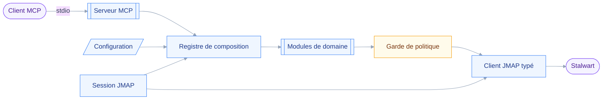

# Architecture

## 🧱 Stack

- Node et TypeScript, transport stdio, SDK MCP officiel.
- `zod` pour les schémas d'entrée des outils.
- Monolithe modulaire : la politique d'écriture s'applique en un point unique.
- Aucune base de données ni front-end. Stalwart est la source de vérité, le client MCP est l'interface.

## 🔗 Comment les pièces s'assemblent

Le diagramme suit un appel d'outil, du client MCP jusqu'à Stalwart.

## ⚖️ Décisions structurantes

- Le registre est le seul point qui croise les capacités de la session JMAP avec la politique configurée, et le seul qui décide quels outils sont enregistrés.
- La composition est statique : elle tourne une fois avant `connect()`, car la spécification interdit une liste d'outils qui varie en cours de session.
- Un module de domaine fournit une fonction qui classe l'appel d'après ses arguments, puis rend son résultat. Il ignore qu'il peut être désactivé ou soumis à confirmation.
- Quatre classes d'opération, trois niveaux chacune : `read` et `draft` en `allow`, `send` et `destroy` en `confirm`.
- Le client JMAP est écrit à la main : aucune bibliothèque TypeScript ne couvre Calendars, Contacts ni File Storage.
- Un fichier de types par spécification, les drafts Calendars et Filenode bougeant encore.

## ⚠️ Pièges

- Le niveau `confirm` s'appuie sur MRTR. Quand le client ne l'expose pas, l'outil refuse : jamais d'exécution silencieuse.
- Claude Desktop ne supporte pas l'élicitation. Toute opération `send` ou `destroy` y échoue par conception.
- Les annotations MCP, `destructiveHint` en tête, sont déclarées non fiables. Elles documentent, elles ne gardent rien.
- La dégradation se voit dès trente outils exposés. Le gating par capacité vise vingt-six.
- La classe d'opération ne se lit pas sur le nom de la méthode. Un argument suffit à faire basculer une écriture en destruction ou en envoi, dans les six domaines.
- Une opération destructrice ne prend jamais un filtre en entrée. Stalwart abandonne silencieusement une condition `header` mal formée, et la requête rend alors plus de résultats que demandé.
- Le README de Stalwart n'est pas fiable sur les révisions de draft : Filenode y est resté à `-03` alors que le code est à `-14`. Le CHANGELOG et le code arbitrent.
