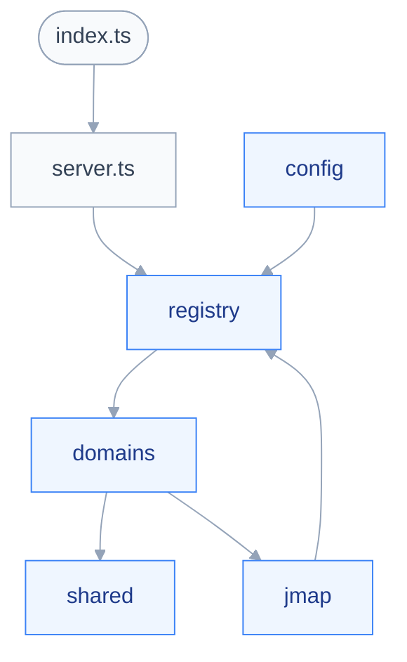

# Carte du code

> [!NOTE]
> Le mail expose dix outils : `mail_search`, `mail_read`, `mail_folders`, `mail_identities`, `mail_compose`, `mail_send`, `mail_move`, `mail_flag`, `mail_delete`, `mail_folder_manage` ; les contacts en exposent deux, en lecture seule : `contacts_search`, `contacts_read`.
> Les quatre autres domaines restent des manifestes à `tools: []`.

## 🗺️ Découpe

Le diagramme montre les zones de `src/` et leur dépendance.

## 📂 Zones

| Zone | Responsabilité |
| --- | --- |
| `src/config/` | Schéma, chargement, politique, périmètre des destinataires |
| `src/jmap/` | Session, client, erreurs, blobs, types |
| `src/registry/` | Définition d'outil, manifeste, composition |
| `src/domains/` | Les six domaines métier |
| `src/shared/` | Pagination et rendu compact |
| `tests/` | Unitaires, contrat, fixtures |

Les types JMAP vivent sous `src/jmap/types/`, un fichier par spécification.
Chaque domaine sous `src/domains/` regroupe ses outils par verbe métier, jamais par méthode JMAP.
Un domaine peut se scinder en plusieurs manifestes : le mail en a trois.

| Manifeste | Capacités | Outils |
| --- | --- | --- |
| `mailDomain` | `mail` | `mail_search`, `mail_read`, `mail_folders` |
| `mailOrganizingDomain` | `mail` | `mail_move`, `mail_flag`, `mail_delete`, `mail_folder_manage` |
| `mailSendingDomain` | `mail`, `submission` | `mail_identities`, `mail_compose`, `mail_send` |
| `contactsDomain` | `contacts` | `contacts_search`, `contacts_read` |

Sans ce découpage, un serveur qui n'expédie pas ferait taire aussi les outils de lecture.
Le rangement est séparé de la lecture sur la même capacité, pour une autre raison : `mailDomain` reste ainsi prouvablement en lecture seule, et le contrat qui l'affirme vaut mieux qu'un fichier de moins.
`src/domains/mail/organize.ts` porte ce que les quatre outils de rangement partagent : plafond de lot, résolution des dossiers mise en cache, rendu des refus par identifiant.

Les contacts tiennent en un seul manifeste : rien n'y écrit, donc aucune seconde capacité ne justifie une scission.
`src/domains/contacts/card.ts` porte ce que les deux outils partagent : nom d'affichage, adresse principale, noms de carnets, marque de périmètre et rendu d'une fiche complète.

## 🚪 Points d'entrée

- `src/index.ts` : exécutable déclaré par `bin.jmap-mcp`.
- `src/server.ts` : construit le `McpServer` et branche le transport stdio.
