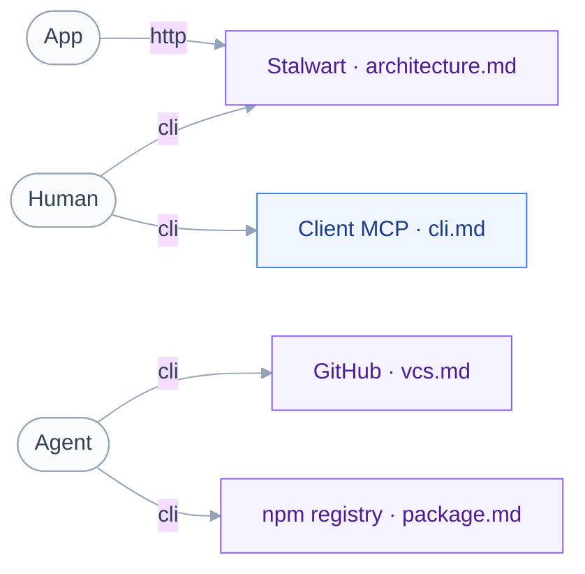

# Écosystème

```mermaid
%%{init: {'theme':'base','themeVariables':{'fontFamily':'ui-sans-serif, system-ui, sans-serif','lineColor':'#94a3b8','primaryTextColor':'#334155'}}}%%
flowchart LR
  Human([Human])
  Agent([Agent])
  App([App])
  Github["GitHub · vcs.md"]
  Npm["npm registry · package.md"]
  Stalwart["Stalwart · architecture.md"]
  Client["Client MCP · cli.md"]

  Agent -- cli --> Github
  Agent -- cli --> Npm
  App -- http --> Stalwart
  Human -- cli --> Stalwart
  Human -- cli --> Client

  classDef neutre fill:#f8fafc,stroke:#94a3b8,color:#334155
  classDef violet fill:#f5f3ff,stroke:#8b5cf6,color:#4c1d95
  classDef bleu fill:#eff6ff,stroke:#3b82f6,color:#1e3a8a

  class Human,Agent,App neutre
  class Github,Npm,Stalwart violet
  class Client bleu
```
