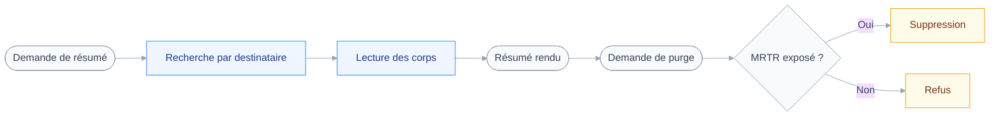

# Scénario d'acceptation — résumer et purger les newsletters d'Alfred

## 🎯 L'intention

Un serveur MCP local, branché en stdio sur un client MCP, se connecte avec le jeton bearer du compte `alfred@bryanberger.dev` d'une instance Stalwart.
L'assistant cherche les mails reçus sur l'alias `newsletters@bryanberger.dev`, en lit le contenu, en produit un résumé, puis les supprime sur demande.
La suppression est le geste qui compte : elle traverse la garde de politique en classe `destroy`, et prouve que la garde refuse au lieu d'exécuter quand le client MCP n'expose pas MRTR.

Ce scénario n'est pas un module : c'est le critère d'acceptation qui valide les modules 1 à 4 de `aidd_docs/ROADMAP.md`.
Il traverse toute la chaîne de l'architecture — configuration, session JMAP, client typé, registre de composition, garde, module de domaine — sur le seul domaine mail.
Ce qui le valide n'est pas une suite de tests, c'est une phrase adressée à l'assistant : « résume-moi mes newsletters », puis « supprime-les ».

Le diagramme montre le parcours d'un scénario complet, de la demande jusqu'au refus possible de la garde.

## ✅ Ce qui est clair

| Point | Décision |
| --- | --- |
| Compte JMAP | Alfred seul, mono-compte |
| Besoin des deux boîtes | Deux instances du serveur |
| Reconnaissance d'une newsletter | Destinataire `newsletters@bryanberger.dev` |
| Outils sollicités | Chercher, lire, supprimer |
| Modules couverts | Feuille de route 1, 2, 4 |
| Classe `send` | Hors périmètre, module 3 |
| Cinq autres domaines | Hors périmètre |
| Prérequis manuel | CLI Stalwart, puis jeton bearer |
| Critère `to` | Filtrable, RFC 8621 §4.4.1 |
| Repli si l'alias réécrit `To:` | Filtre `header` sur `Delivered-To` |

Le serveur n'embarque aucune notion de « newsletter » : les outils restent génériques et c'est l'assistant qui formule le critère.

La session JMAP doit lire `primaryAccounts` correctement dès cette tranche, sous peine de condamner le passage ultérieur au multi-compte.

L'instance Stalwart existe et est jointe depuis la machine de développement.

> [!IMPORTANT]
> Le jeton bearer doit être créé avant toute validation en réel.
> Sans lui, la tranche ne se vérifie que sur fixtures.

## ⚠️ Ce qui reste ouvert

| Question ouverte | Ce qu'elle déplace |
| --- | --- |
| Budget de tokens du résumé | Pagination ou troncature à prévoir |
| Corbeille ou destruction réelle | La classe d'opération, donc la garde |
| En-têtes réellement indexés | La fiabilité du repli `Delivered-To` |

Les deux premières se tranchent au module 2, la troisième par un appel sur l'instance réelle.

Le recensement a fermé les deux questions de spécification qui figuraient ici.
`to` est bien une condition de filtre exécutée par Stalwart, et le filtre `header` fournit le repli si l'alias réécrit l'en-tête.
— `aidd_docs/memory/external/stalwart-jmap.md`

## 🚀 Prochain pas

Ouvrir le module 1 : bootstrap, garde de politique, test de contrat sur fixture.
Ce scénario sert de critère d'acceptation une fois les modules 2 et 4 livrés.
