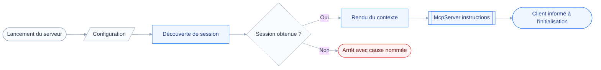
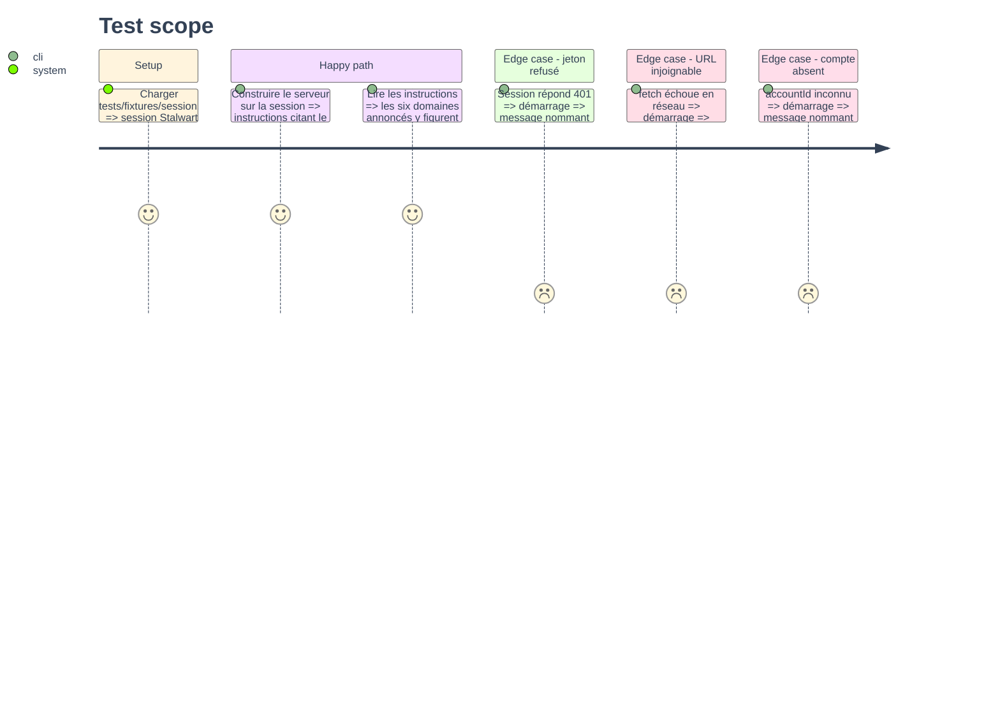

# Instruction: Contexte au démarrage et échec nommé

## Architecture projection

> Tree of the final files. ✅ create · ✏️ modify · ❌ delete

```txt
.
├── src
│   ├── index.ts                      ✏️ nomme la cause d'un démarrage échoué
│   ├── server.ts                     ✏️ passe les instructions au McpServer
│   ├── jmap
│   │   ├── errors.ts                 ✏️ traduit un échec en cause lisible
│   │   └── session.ts                ✏️ expose le nom de compte et les capacités
│   └── registry
│       └── instructions.ts           ✅ rend le contexte de session en texte
└── tests
    ├── fixtures
    │   └── session.json              ✅ session Stalwart complète
    └── unit
        ├── instructions.test.ts      ✅ contenu du texte d'initialisation
        └── startup-errors.test.ts    ✅ mapping des causes de démarrage
```

## User Journey



## Test Scope



## Tasks to do

### `1)` Exposer le contexte de session

> `JmapSession` répond aux questions que le texte d'initialisation pose.

1. Ajouter `get account(): Account` qui résout `raw.accounts[accountId]`, et lève si absent.
2. Ajouter `get username(): string` déléguant à `raw.username`.
3. Ajouter `capabilities(): string[]`, les clés de `raw.capabilities` triées.
4. Ne rien changer à `has`, `accountHas` et `apiUrl` : la composition en dépend déjà.

### `2)` Rendre le contexte en instructions

> Un texte court, lu une fois par le client, qui dit sur quelle boîte l'assistant agit.

1. Créer `src/registry/instructions.ts` exportant `buildInstructions(session: JmapSession): string`.
2. Y citer le nom du compte, son `username`, et son caractère personnel ou partagé.
3. Traduire les URN de capacité en noms de domaine lisibles, en ignorant toute URN inconnue.
4. Terminer par la portée réelle : lecture seule, un seul compte, aucune écriture exposée.
5. Garder le texte sous mille caractères — il est payé à chaque initialisation.

### `3)` Brancher les instructions sur le serveur

> Le client reçoit le contexte à l'initialisation, sans appeler d'outil.

1. Dans `buildServer`, appeler `buildInstructions(session)` après la découverte.
2. Passer le résultat au second argument de `McpServer`, à côté de `capabilities`.
3. Ne pas ajouter d'outil : la surface exposée reste celle des manifestes.

### `4)` Nommer la cause d'un démarrage échoué

> L'utilisateur corrige son jeton ou son URL sans lire de trace technique.

1. Dans `errors.ts`, exporter `describeStartupFailure(error: unknown): string`.
2. Traiter `JmapError` de statut 401 ou 403 comme un jeton refusé ou sans droit.
3. Traiter une erreur réseau de `fetch` comme une URL injoignable, en citant `sessionUrl`.
4. Laisser passer tel quel le message de `loadConfig`, déjà rendu par `z.prettifyError`.
5. Dans `index.ts`, faire passer l'erreur par cette fonction avant `console.error`.
6. Conserver `process.exit(1)` : un démarrage partiel n'existe pas.

### `5)` Couvrir les deux comportements

> Les tests portent sur le texte rendu et sur la cause nommée, jamais sur le réseau.

1. Écrire `tests/fixtures/session.json` : deux capacités mail, un compte personnel nommé.
2. Écrire `tests/unit/instructions.test.ts` sur le contenu et la longueur du texte.
3. Écrire `tests/unit/startup-errors.test.ts` sur les trois causes, jeton, réseau, compte.
4. Injecter un `fetchImpl` factice dans `discoverSession` plutôt que de simuler `fetch` global.

## Test acceptance criteria

| Task | Acceptance criteria                                                                     |
| ---- | ---------------------------------------------------------------------------------------- |
| 1    | `session.account.name` rend le compte résolu, et lève quand l'`accountId` n'existe pas    |
| 2    | Le texte cite le compte et chaque domaine annoncé, et ignore une URN inconnue sans échouer |
| 3    | Un client qui s'initialise reçoit le contexte sans avoir listé ni appelé d'outil           |
| 4    | Un jeton refusé, une URL injoignable et un compte absent rendent trois messages distincts  |
| 5    | `pnpm test` passe, et aucun test n'ouvre de connexion réseau                               |
