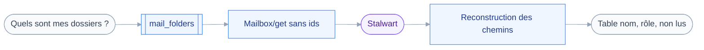
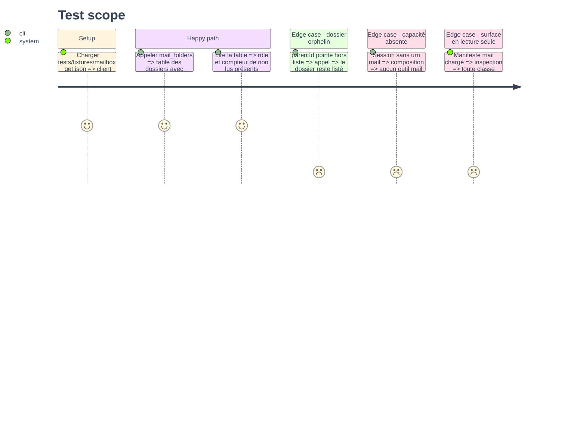

# Instruction: Types mail, manifeste et `mail_folders`

## Architecture projection

> Tree of the final files. ✅ create · ✏️ modify · ❌ delete

```txt
.
├── src
│   ├── domains
│   │   └── mail
│   │       ├── folders.ts            ✅ outil mail_folders, classe read
│   │       └── index.ts              ✏️ requires réduit à mail, expose l'outil
│   └── jmap
│       └── types
│           └── mail.ts               ✏️ Mailbox, MailboxRights, enveloppes get
└── tests
    ├── contract
    │   └── read-only-surface.test.ts ✅ le domaine mail n'expose que read
    ├── fixtures
    │   └── mailbox-get.json          ✅ arborescence de dossiers Stalwart
    └── unit
        └── mail-folders.test.ts      ✅ rendu et chemins des dossiers
```

## User Journey



## Test Scope



## Tasks to do

### `1)` Typer les objets mail nécessaires

> Seulement ce que cette phase consomme : un type inutilisé est une dette.

1. Dans `src/jmap/types/mail.ts`, déclarer `Mailbox` : `id`, `name`, `parentId`, `role`, `sortOrder`, `totalEmails`, `unreadEmails`, `totalThreads`, `unreadThreads`, `isSubscribed`.
2. Déclarer `MailboxRights` et le rattacher à `Mailbox.myRights`.
3. Typer `MailboxGetArguments` avec `accountId`, `ids`, `properties`.
4. Réutiliser `GetResponse` et `Id` de `types/core.ts`, ne pas les redéclarer.

### `2)` Corriger le manifeste du domaine

> Un domaine ne réclame que ce dont ses outils se servent.

1. Ramener `requires` à `[CAPABILITY_MAIL]` dans `src/domains/mail/index.ts`.
2. Retirer l'import de `CAPABILITY_SUBMISSION`, que plus rien n'utilise.
3. Mettre le commentaire du manifeste au périmètre réel : chercher, lire, situer.
4. Réintroduire `CAPABILITY_SUBMISSION` au module d'envoi, pas avant.

### `3)` Écrire `mail_folders`

> Une table des dossiers, avec le chemin qui permet de cibler une recherche.

1. Créer `src/domains/mail/folders.ts` avec `defineTool`, `classes: ["read"]`, `classify` constant.
2. Entrée : un objet vide, ou `includeEmpty` optionnel par défaut à `true`.
3. Appeler `Mailbox/get` sans `ids` et avec `properties` explicites.
4. Reconstruire le chemin en remontant `parentId`, et laisser le nom seul quand le parent manque.
5. Rendre par `renderTable` sur `path`, `role`, `unreadEmails`, `totalEmails`, `id`.
6. Trier par chemin, pour que l'arborescence se lise dans l'ordre.
7. Écrire une `description` qui dit que l'`id` rendu alimente le filtre `inMailbox` de `mail_search`.

### `4)` Enregistrer l'outil et prouver la lecture seule

> La surface exposée ne doit contenir aucune opération d'écriture.

1. Ajouter `mailFolders` à `tools` dans le manifeste mail.
2. Écrire `tests/contract/read-only-surface.test.ts` : parcourir `mailDomain.tools`, exiger `classes` égal à `["read"]`.
3. Y vérifier aussi que `classify` rend `read` sur une entrée arbitraire de chaque outil.
4. Ce test grandit avec les phases suivantes sans être réécrit.

### `5)` Fixtures et test unitaire

> Aucun serveur Stalwart réel : la réponse vient du disque.

1. Écrire `tests/fixtures/mailbox-get.json` : `Inbox`, `Archive`, un sous-dossier, un orphelin.
2. Écrire un utilitaire de test qui construit un `JmapClient` sur un `fetchImpl` rendant la fixture.
3. Écrire `tests/unit/mail-folders.test.ts` sur le chemin composé, l'ordre, et l'orphelin.

## Test acceptance criteria

| Task | Acceptance criteria                                                                       |
| ---- | ------------------------------------------------------------------------------------------ |
| 1    | `pnpm typecheck` passe et aucun type déclaré n'est laissé sans usage                         |
| 2    | Une session annonçant `mail` sans `submission` enregistre quand même les outils du domaine   |
| 3    | L'appel rend une table lisible où un sous-dossier montre son chemin complet                  |
| 4    | Le test de contrat échoue si un outil du domaine mail déclare une classe autre que `read`    |
| 5    | `pnpm test` passe, et un dossier au parent absent est listé sans chemin inventé               |
