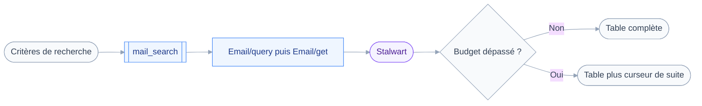
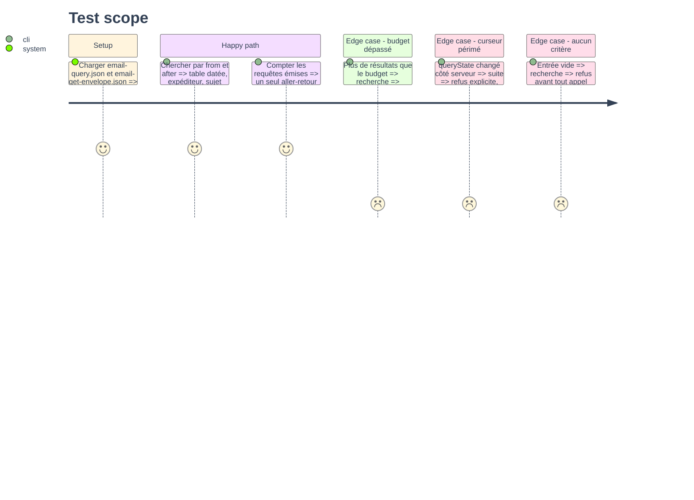

# Instruction: Recherche de messages avec `mail_search`

## Architecture projection

> Tree of the final files. ✅ create · ✏️ modify · ❌ delete

```txt
.
├── src
│   ├── domains
│   │   └── mail
│   │       ├── search.ts             ✅ outil mail_search, classe read
│   │       └── index.ts              ✏️ expose mail_search
│   └── jmap
│       └── types
│           └── mail.ts               ✏️ Email, EmailAddress, EmailFilterCondition
└── tests
    ├── fixtures
    │   ├── email-query.json          ✅ page d'ids et queryState
    │   └── email-get-envelope.json   ✅ en-têtes des messages listés
    └── unit
        └── mail-search.test.ts       ✅ filtres, budget, curseur
```

## User Journey



## Test Scope



## Tasks to do

### `1)` Typer la requête de messages

> Les vingt conditions de la RFC existent, l'outil n'en expose qu'une poignée.

1. Déclarer `EmailAddress` avec `name` nullable et `email`.
2. Déclarer `Email` limité aux propriétés d'enveloppe : `id`, `threadId`, `mailboxIds`, `from`, `to`, `subject`, `receivedAt`, `preview`, `hasAttachment`, `size`.
3. Déclarer `EmailFilterCondition` avec `from`, `to`, `subject`, `text`, `header`, `inMailbox`, `before`, `after`.
4. Typer `header` comme un tuple d'un ou deux éléments, conforme au filtre Stalwart.
5. Typer `EmailQueryArguments` avec `filter`, `sort`, `position`, `limit`, `calculateTotal`.

### `2)` Écrire l'outil et son schéma d'entrée

> Le serveur n'a aucune notion de newsletter : c'est l'assistant qui formule le critère.

1. Créer `src/domains/mail/search.ts` avec `defineTool`, `classes: ["read"]`.
2. Entrée zod : `from`, `to`, `deliveredTo`, `subject`, `text`, `mailboxId`, `after`, `before`, `limit`, `cursor`, toutes optionnelles.
3. Refuser une entrée sans aucun critère ni curseur, avant tout appel réseau.
4. Traduire `deliveredTo` en `header: ["Delivered-To", valeur]`, jamais en `to`.
5. Écrire dans la `description` que Stalwart abandonne une condition `header` mal formée sans erreur, donc qu'un repli d'alias peut rendre plus large que demandé.
6. Trier par `receivedAt` décroissant, le tri accepté par Stalwart.

### `3)` Émettre un seul aller-retour

> Deux appels dans une requête, reliés par une back-reference.

1. Appeler `requestMany` avec `Email/query` puis `Email/get`.
2. Renseigner `ids` de `Email/get` par une `ResultReference` sur `/ids` du premier appel.
3. Poser `properties` explicitement sur `Email/get` : sans cela, Stalwart tire les propriétés lentes.
4. Toujours envoyer `limit` : `queryMaxResults` vaut 5000 et n'est annoncé nulle part.
5. Demander `calculateTotal` pour pouvoir dire combien de messages répondent au critère.

### `4)` Borner et paginer

> Le contexte du client est la ressource rare, pas la bande passante.

1. Rendre chaque message par une ligne, puis couper avec `takeWithinBudget`.
2. Composer le curseur avec `encodeCursor` sur `position` et `queryState`.
3. À la reprise, comparer le `queryState` reçu à celui de la réponse et refuser s'il a changé.
4. Rendre le total et le nombre affiché, pour qu'une liste tronquée se voie.
5. Reporter le curseur dans `ToolResult.nextCursor` : le registre l'affiche déjà.

### `5)` Couvrir les cas qui trompent

> Un résultat tronqué qui ne se signale pas est le pire échec de cette phase.

1. Écrire les deux fixtures, dont une page plus longue que le budget.
2. Tester le filtre produit pour `deliveredTo`, forme du tuple comprise.
3. Tester le curseur rendu, la reprise, et le refus sur `queryState` changé.
4. Tester le refus d'une entrée vide, en vérifiant qu'aucun `fetch` n'a eu lieu.
5. Ajouter `mailSearch` au manifeste, le test de contrat de la phase 2 le couvre sans retouche.

## Test acceptance criteria

| Task | Acceptance criteria                                                                     |
| ---- | ---------------------------------------------------------------------------------------- |
| 1    | `pnpm typecheck` passe et le filtre `header` n'accepte pas plus de deux éléments           |
| 2    | Une recherche sans critère est refusée par un message, pas par une exception               |
| 3    | Une recherche émet exactement un appel HTTP, quel que soit le nombre de résultats          |
| 4    | Un résultat coupé rend un curseur, et la reprise sur un état périmé est refusée            |
| 5    | `pnpm test` passe, et le filtre `Delivered-To` est vérifié sur sa forme exacte             |
