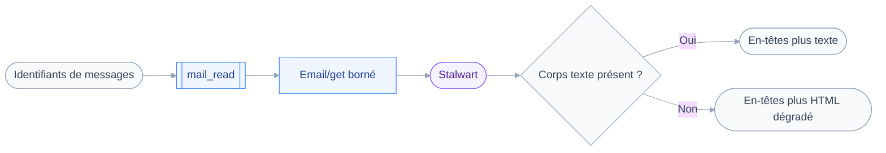
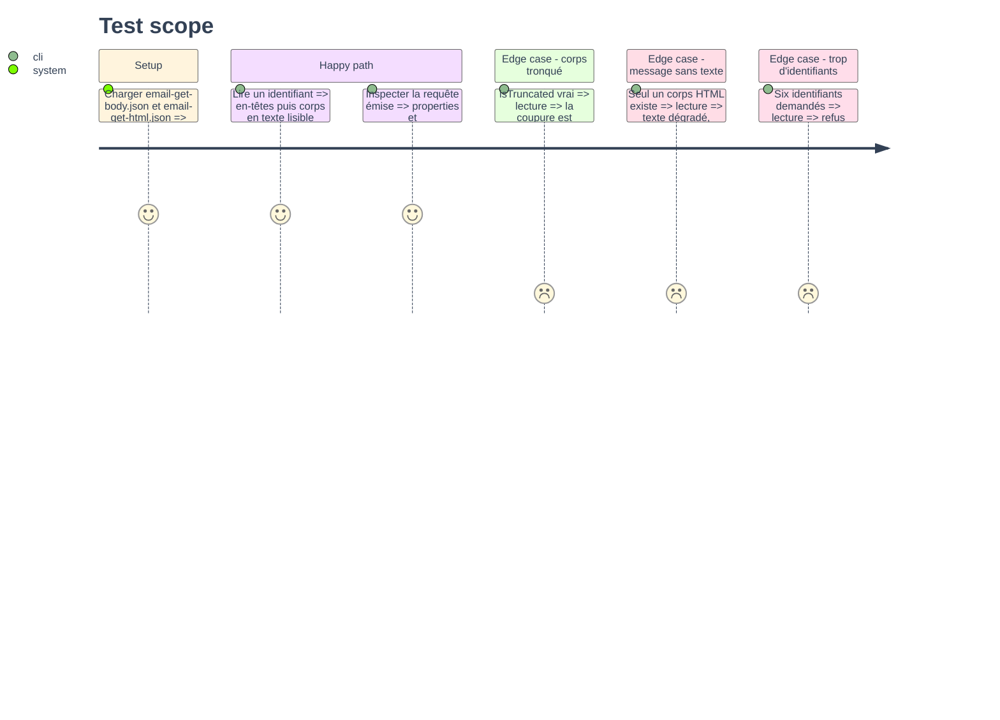

# Instruction: Lecture d'un message avec `mail_read`

## Architecture projection

> Tree of the final files. ✅ create · ✏️ modify · ❌ delete

```txt
.
├── src
│   ├── domains
│   │   └── mail
│   │       ├── read.ts               ✅ outil mail_read, classe read
│   │       └── index.ts              ✏️ expose mail_read
│   ├── jmap
│   │   └── types
│   │       └── mail.ts               ✏️ EmailBodyPart, EmailBodyValue
│   └── shared
│       └── render.ts                 ✏️ dégradation d'un corps HTML en texte
└── tests
    ├── fixtures
    │   ├── email-get-body.json       ✅ message avec corps texte
    │   └── email-get-html.json       ✅ message sans corps texte
    └── unit
        └── mail-read.test.ts         ✅ bornage, troncature, repli
```

## User Journey



## Test Scope



## Tasks to do

### `1)` Typer le corps d'un message

> Deux structures suffisent pour lire, aucune pour écrire.

1. Déclarer `EmailBodyValue` : `value`, `isEncodingProblem`, `isTruncated`.
2. Déclarer `EmailBodyPart` limité à `partId`, `blobId`, `type`, `charset`, `size`, `name`.
3. Étendre `Email` de `textBody`, `htmlBody`, `bodyValues`, `cc`, `bcc`, `replyTo`, `sentAt`.
4. Typer `EmailGetArguments` avec `ids`, `properties`, `bodyProperties`, `fetchTextBodyValues`, `fetchHTMLBodyValues`, `maxBodyValueBytes`.

### `2)` Écrire l'outil et son bornage

> Le budget de lecture est la réponse à la question ouverte du PRD.

1. Créer `src/domains/mail/read.ts` avec `defineTool`, `classes: ["read"]`.
2. Entrée : `ids`, tableau de un à cinq identifiants, et `maxBodyBytes` optionnel.
3. Poser `MAX_BODY_VALUE_BYTES` à 8000 comme constante exportée, et la documenter dans la `description`.
4. Refuser plus de cinq identifiants par le schéma zod, pas par une vérification manuelle.
5. Ne jamais accepter de filtre en entrée : cet outil consomme des identifiants vus.

### `3)` Appeler `Email/get` sans tirer les propriétés lentes

> Omettre `properties` fait tirer `bodyStructure` et tous les `bodyValues`.

1. Lister `properties` explicitement, en-têtes et références de corps seulement.
2. Poser `fetchTextBodyValues` et `fetchHTMLBodyValues` à `true`.
3. Passer `maxBodyValueBytes` à la valeur d'entrée, plafonnée par la constante.
4. Restreindre `bodyProperties` à ce que le rendu consomme.

### `4)` Rendre un message toujours lisible

> Un message sans corps texte reste lisible plutôt que vide.

1. Rendre les en-têtes par `renderFields` : date, expéditeur, destinataires, sujet.
2. Prendre le corps texte quand `textBody` désigne une valeur présente.
3. À défaut, dégrader le corps HTML en texte par une fonction locale de `render.ts`, sans dépendance ajoutée.
4. À défaut encore, rendre `preview`, puis les seuls en-têtes assortis d'une note.
5. Annoncer la coupure quand `isTruncated` vaut vrai, avec le nombre d'octets retenus.
6. Séparer plusieurs messages par une règle visible, chacun précédé de son identifiant.

### `5)` Couvrir la dégradation

> Le repli est la partie qui casse en silence.

1. Écrire les deux fixtures, dont une où `textBody` est vide et `htmlBody` renseigné.
2. Tester les arguments émis, `properties` et `maxBodyValueBytes` compris.
3. Tester les trois niveaux de repli et la mention de troncature.
4. Tester le refus au delà de cinq identifiants, en vérifiant qu'aucun `fetch` n'a eu lieu.
5. Ajouter `mailRead` au manifeste, puis vérifier que la surface exposée compte trois outils.

## Test acceptance criteria

| Task | Acceptance criteria                                                                    |
| ---- | --------------------------------------------------------------------------------------- |
| 1    | `pnpm typecheck` passe et `EmailBodyValue.isTruncated` est exploité par le rendu          |
| 2    | Une demande de six identifiants est refusée sans qu'aucune requête ne parte               |
| 3    | La requête émise porte `properties` et `maxBodyValueBytes`, vérifié sur le corps envoyé   |
| 4    | Un message dont seul le HTML existe rend du texte lisible, jamais un bloc de balises      |
| 5    | `pnpm test` passe, et le domaine mail expose exactement `mail_search`, `mail_read`, `mail_folders` |
