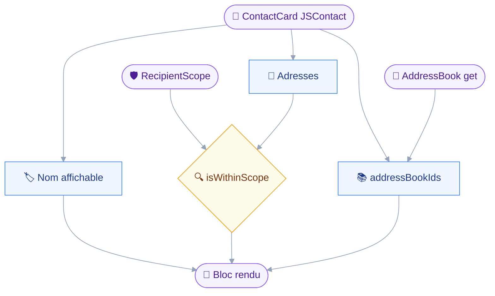
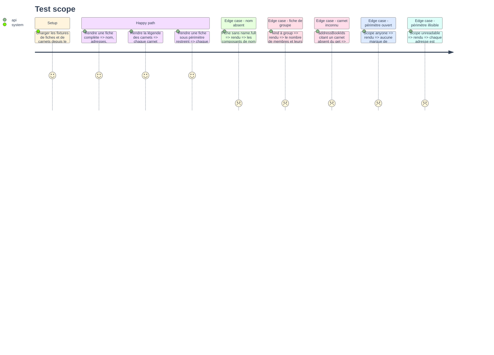

# Instruction: Types JSContact, rendu de fiche, périmètre lisible

## Architecture projection

> Tree of the final files. ✅ create · ✏️ modify · ❌ delete

```txt
.
├── src
│   ├── config
│   │   └── recipients.ts                     ✏️ isWithinScope exporté, checkRecipients s'appuie dessus
│   ├── domains
│   │   └── contacts
│   │       └── card.ts                       ✅ rendu de fiche, légende des carnets, marque de périmètre
│   └── jmap
│       └── types
│           └── contacts.ts                   ✏️ AddressBook, ContactCard complet, filtre, arguments
└── tests
    ├── fixtures
    │   ├── address-book-get.json             ✅ deux carnets, un par défaut
    │   └── contact-cards-detail.json         ✅ une personne complète, un groupe, une fiche minimale
    └── unit
        └── contacts-card.test.ts             ✅ rendu, repli de nom, marque de périmètre
```

## User Journey

Le diagramme suit une fiche brute jusqu'au texte que le client lit.
Aucun outil n'existe encore : cette phase produit ce que les deux suivantes appelleront.



## Test Scope



## Tasks to do

### `1)` Élargir les types contacts à ce que la lecture demande

> Le fichier ne couvre aujourd'hui que ce dont le périmètre a besoin : deux propriétés sur une fiche.

1. Dans `src/jmap/types/contacts.ts`, ajouter `AddressBook` : `id`, `name`, `description`, `sortOrder`, `isDefault`, `isSubscribed`.
2. Laisser `shareWith` et `myRights` hors du type : le module 11 les portera, et un type qui les annonce ferait croire qu'ils sont lus.
3. Étendre `ContactCard` aux propriétés JSContact que le rendu lit : `kind`, `uid`, `name`, `nicknames`, `organizations`, `titles`, `emails`, `phones`, `onlineServices`, `addresses`, `notes`, `members`, `addressBookIds`, `created`, `updated`.
4. Typer `Name` avec `full` optionnel et `components` porteurs de `kind` et `value`, `full` n'étant pas garanti par la RFC 9553.
5. Typer les cinq maps d'entrées sur leur seule propriété de rendu : `organizations{}.name`, `titles{}.name`, `phones{}.number`, `notes{}.note`, `addresses{}.full`.
6. Ajouter `ContactCardFilterCondition` avec les conditions réellement utilisées : `inAddressBook`, `uid`, `kind`, `text`, `name`, `email`, `phone`, `organization`, `note`.
7. Ajouter `AddressBookGetArguments`, et compléter `ContactCardQueryArguments` avec `calculateTotal`, `filter` typé sur la condition.
8. Commenter que le tri reste `created` ou `updated` : le commentaire existant sur `sort` est déjà juste, le garder mot pour mot.

### `2)` Extraire le prédicat d'appartenance au périmètre

> Afficher qu'une adresse est refusée et la refuser doivent être la même règle, pas deux.

1. Dans `src/config/recipients.ts`, exporter `isWithinScope(address, scope): boolean`, couvrant les quatre états du scope.
2. Rendre `true` pour `anyone`, `false` pour `empty` et `unreadable`, et déléguer à la comparaison existante pour `restricted`.
3. Réécrire `checkRecipients` par-dessus ce prédicat, sans toucher à un seul de ses messages de refus.
4. Ne pas exporter `isAllowed` : il devient le corps du cas `restricted` et n'a pas de sens hors de lui.
5. Vérifier que `tests/unit/recipients.test.ts` passe sans être modifié — sinon le comportement a bougé.

### `3)` Rendre une fiche, une légende et une marque

> Les deux outils partagent le même rendu : l'écrire deux fois le ferait diverger dès la première correction.

1. Créer `src/domains/contacts/card.ts`, sans aucune dépendance au client JMAP : ce fichier ne lit rien.
2. Écrire `displayName(card)` : `name.full`, sinon les `components` recomposés, sinon la première organisation, sinon la première adresse, sinon `(unnamed)`.
3. Écrire `primaryEmail(card)` : l'entrée de plus fort `pref`, à défaut la première, `pref` absent valant le rang le plus faible.
4. Écrire `renderBooks(books)` : une ligne nommant chaque carnet avec son identifiant, le carnet par défaut suffixé.
5. Écrire `bookNames(card, byId)` : les noms des carnets d'une fiche, l'identifiant brut quand le carnet est inconnu.
6. Écrire `scopeMark(address, scope)` : `undefined` sur un périmètre ouvert, sinon `in perimeter` ou `outside perimeter`.
7. Écrire `renderCard(card, byId, scope)` : le bloc de détail, champs vides omis, en réutilisant `renderFields` de `src/shared/render.ts`.
8. Rendre une fiche de `kind` groupe avec son nombre de membres et leurs uid, sans lire une seule fiche membre.
9. Faire porter au bloc, quand le périmètre est restreint, la phrase disant qu'il a été figé au démarrage.

### `4)` Fixtures et couverture du rendu

> Une fiche minimale et une fiche de groupe cassent le rendu bien plus vite qu'une fiche complète.

1. Écrire `tests/fixtures/address-book-get.json` : deux carnets, `isDefault` vrai sur un seul.
2. Écrire `tests/fixtures/contact-cards-detail.json` : une fiche complète, une fiche de groupe, une fiche sans nom ni adresse.
3. Ne pas toucher à `tests/fixtures/contact-cards.json`, que `tests/unit/recipients.test.ts` lit déjà.
4. Écrire `tests/unit/contacts-card.test.ts` couvrant les six cas du Test Scope.
5. Asserter sur la présence des valeurs, jamais sur la mise en forme exacte : un test qui fige l'alignement se casse à chaque champ ajouté.

## Test acceptance criteria

| Task | Acceptance criteria                                                                                            |
| ---- | ---------------------------------------------------------------------------------------------------------------- |
| 1    | `pnpm typecheck` passe, et aucune propriété typée n'est absente des `properties` que les phases 2 et 3 demanderont   |
| 2    | `tests/unit/recipients.test.ts` passe sans modification, et un périmètre illisible rend `false` pour toute adresse   |
| 3    | Une fiche sans `name.full` rend un nom lisible, et une fiche de groupe rend ses membres sans aucun appel réseau       |
| 4    | `pnpm test` passe, et un carnet cité mais absent du `get` rend son identifiant plutôt qu'un nom inventé              |
