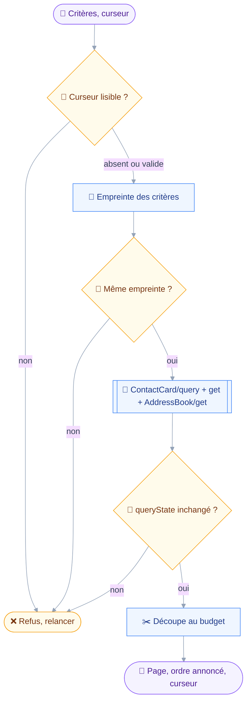
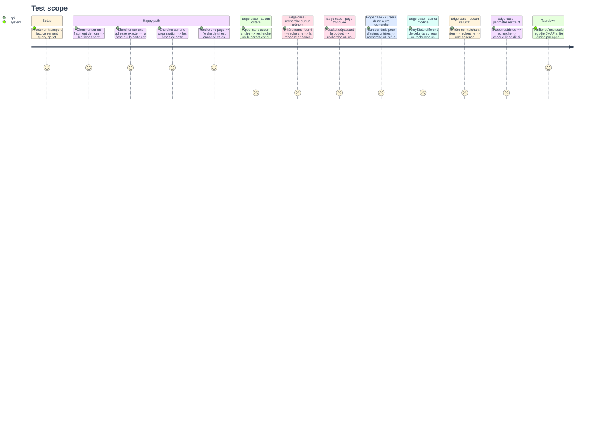

# Instruction: `contacts_search`

## Architecture projection

> Tree of the final files. ✅ create · ✏️ modify · ❌ delete

```txt
.
├── src
│   └── domains
│       └── contacts
│           ├── search.ts                     ✅ recherche, pagination, légende des carnets
│           └── index.ts                      ✏️ le manifeste expose son premier outil
└── tests
    ├── fixtures
    │   ├── contact-card-query.json           ✅ réponse de query, total et queryState
    │   └── contact-cards-summary.json        ✅ fiches réduites aux propriétés de la ligne
    └── unit
        └── contacts-search.test.ts           ✅ filtres, ordre annoncé, curseur, périmètre
```

## User Journey

Le diagramme suit une recherche, du critère à la page rendue.
Les trois appels JMAP voyagent dans une seule requête : la recherche coûte un aller-retour quel que soit le nombre de fiches.



## Test Scope



## Tasks to do

### `1)` Poser le schéma d'entrée et ses avertissements

> Deux écarts du serveur doivent se lire avant l'appel, pas se deviner après.

1. Créer `src/domains/contacts/search.ts` sur le patron de `src/domains/mail/search.ts`.
2. Déclarer `name`, `email`, `phone`, `organization`, `note`, `text`, `kind`, `addressBookId`, `limit`, `cursor`.
3. Décrire `addressBookId` comme venant de la légende que la recherche elle-même rend.
4. Écrire dans la description que le tri par nom est refusé par le serveur, et que les fiches sortent par date de création.
5. Écrire dans la description que `name` interroge un index partagé par le nom complet, le prénom et le nom de famille.
6. Borner `limit` à cent, valeur par défaut `DEFAULT_PAGE_SIZE`, comme `mail_search`.
7. Classer l'outil : `classes: ["read"]`, `classify` rendant `read` quels que soient les arguments.

### `2)` Construire le filtre et l'appel

> Sans critère, l'outil parcourt le carnet : c'est le geste normal sur un carnet, pas un cas dégradé.

1. Écrire `buildFilter` mappant chaque entrée sur sa condition RFC 9610, `addressBookId` devenant `inAddressBook`.
2. Rendre `undefined` quand aucune condition n'est posée, et omettre alors `filter` de la requête.
3. Ne jamais refuser un appel sans critère : contrairement à `mail_search`, l'absence de filtre est une consultation légitime.
4. Poser `sort` à `created` croissant, et `calculateTotal` à vrai.
5. Émettre trois appels dans une seule requête : `ContactCard/query`, `ContactCard/get` par back-référence sur `/ids`, `AddressBook/get` avec `ids: null`.
6. Demander explicitement les propriétés de la ligne : `id`, `kind`, `name`, `emails`, `organizations`, `addressBookIds`.
7. Restaurer l'ordre de la query sur la réponse du `get`, qui ne le promet pas.

### `3)` Paginer et rendre

> Une page qui déborde le contexte du client coûte plus cher qu'un aller-retour de plus.

1. Réutiliser `fingerprint`, `encodeCursor`, `decodeCursor` et `takeWithinBudget` de `src/shared/pagination.ts`.
2. Refuser un curseur illisible, un curseur émis pour d'autres critères, et un `queryState` qui a changé, avec les trois messages distincts de `mail_search`.
3. Fixer un budget de rendu propre à la recherche de fiches, une ligne de fiche étant plus courte qu'une ligne de message.
4. Rendre un en-tête portant le total, la position, l'ordre de tri annoncé, et la légende des carnets de `card.ts`.
5. Ajouter la phrase sur l'index de nom partagé seulement quand `name` a été fourni : une phrase servie à chaque appel n'est plus lue.
6. Rendre les colonnes `name`, `email`, `organization`, `books`, `id`, plus la colonne de périmètre quand le scope est restreint.
7. Ne pas rendre de curseur quand la page épuise le résultat, en réutilisant le double test de `mail_search`.

### `4)` Exposer et couvrir

> Un outil qu'aucun manifeste ne cite est du code mort.

1. Dans `src/domains/contacts/index.ts`, ajouter `contactsSearch` à `tools`, `requires` restant sur la seule capacité contacts.
2. Écrire les deux fixtures, `contact-card-query.json` portant `queryState`, `total` et des identifiants stables.
3. Écrire `tests/unit/contacts-search.test.ts` couvrant les onze cas du Test Scope.
4. Asserter sur les arguments réellement émis : filtre construit, `sort` sur `created`, propriétés demandées.
5. Asserter qu'un appel n'émet qu'une seule requête JMAP, en lisant `requests.length` du transport factice.

## Test acceptance criteria

| Task | Acceptance criteria                                                                                          |
| ---- | ---------------------------------------------------------------------------------------------------------------- |
| 1    | La description nomme les deux écarts du serveur, et aucun argument ne fait sortir `classify` de `read`             |
| 2    | Un appel sans aucun critère rend des fiches, et la requête émise ne porte alors aucune clé `filter`                |
| 3    | Une page tronquée rend un curseur, et ce curseur rejoué avec d'autres critères est refusé sans requête émise       |
| 4    | `contacts_search` est enregistré sur une session annonçant les contacts, et un appel coûte exactement un aller-retour |
