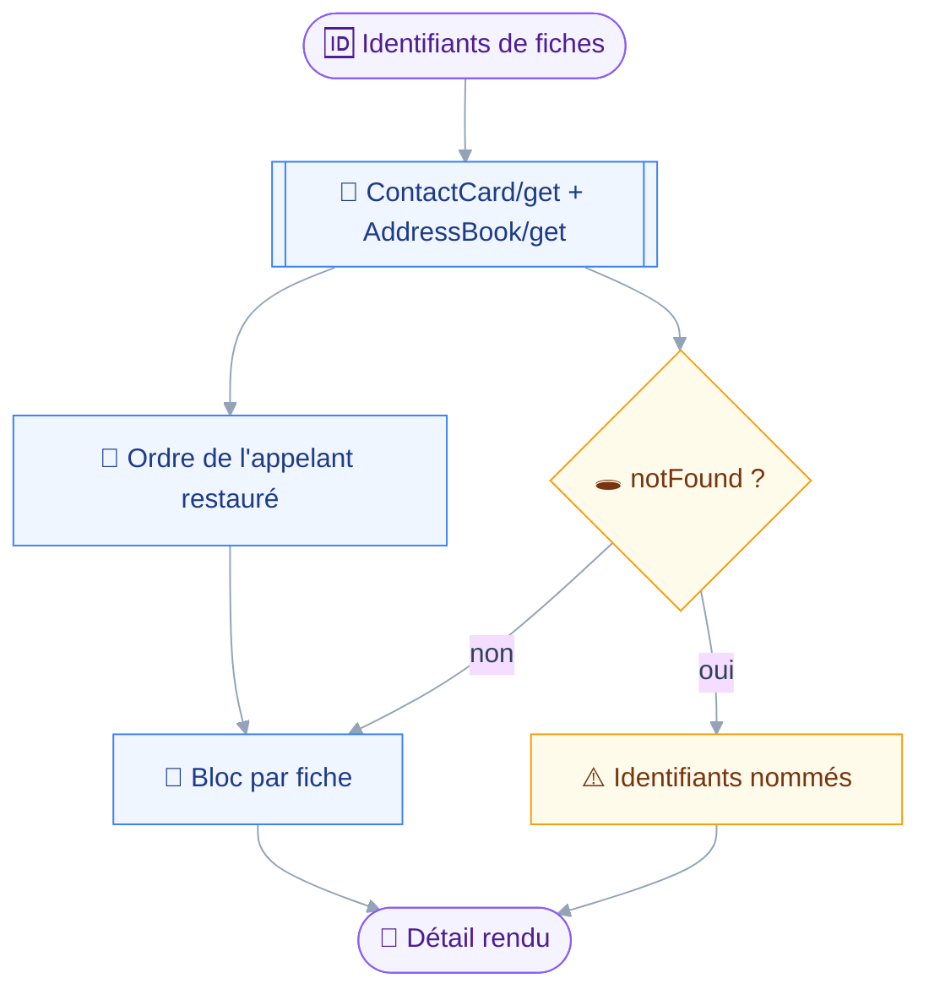
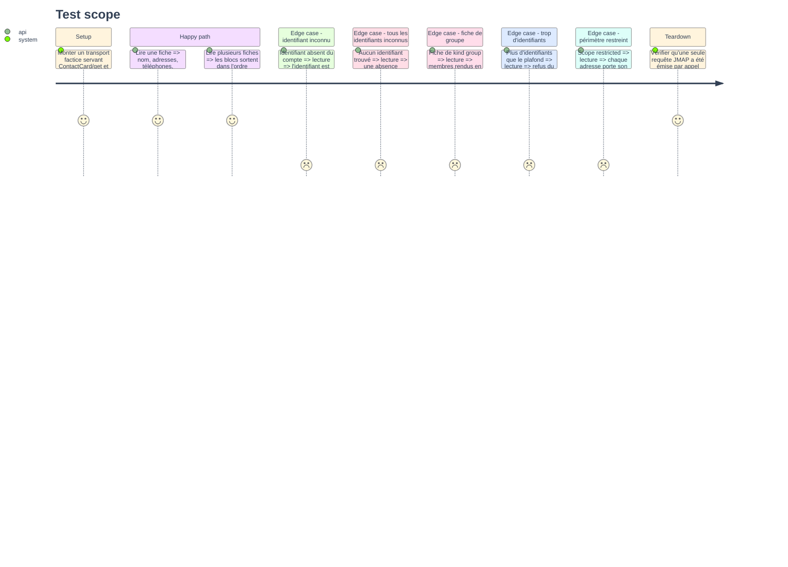

# Instruction: `contacts_read`

## Architecture projection

> Tree of the final files. ✅ create · ✏️ modify · ❌ delete

```txt
.
├── src
│   └── domains
│       └── contacts
│           ├── read.ts                       ✅ lecture par identifiant, détail complet
│           └── index.ts                      ✏️ le manifeste expose son second outil
└── tests
    └── unit
        └── contacts-read.test.ts             ✅ détail, identifiant inconnu, groupe, périmètre
```

## User Journey

Le diagramme suit une lecture, de l'identifiant au bloc de détail.
La lecture prend des identifiants, jamais un critère : les identifiants viennent de `contacts_search`.



## Test Scope



## Tasks to do

### `1)` Poser l'outil de lecture

> Lire prend des identifiants vus dans une recherche : un outil qui refiltre lui-même rend autre chose que ce qui a été vu.

1. Créer `src/domains/contacts/read.ts` sur le patron de `src/domains/mail/read.ts`.
2. Déclarer `ids`, tableau non vide, borné par un plafond exporté ; une fiche pèse bien moins qu'un corps de message.
3. Écrire dans la description que l'outil ne prend aucun critère et renvoie vers `contacts_search`.
4. Classer l'outil : `classes: ["read"]`, `classify` rendant `read` quels que soient les arguments.
5. Écrire `summarize` rendant le nombre de fiches lues, comme `mail_read`.

### `2)` Lire et rendre le détail

> Un carnet répond en un aller-retour : les noms de carnets voyagent avec les fiches.

1. Émettre `ContactCard/get` et `AddressBook/get` dans une seule requête, sans back-référence, les deux appels étant indépendants.
2. Demander explicitement les propriétés du détail : `id`, `kind`, `uid`, `name`, `nicknames`, `organizations`, `titles`, `emails`, `phones`, `onlineServices`, `addresses`, `notes`, `members`, `addressBookIds`, `created`, `updated`.
3. Restaurer l'ordre des identifiants demandés, `ContactCard/get` ne promettant aucun ordre.
4. Rendre chaque fiche par `renderCard` de `card.ts`, séparées par le même séparateur que `mail_read`.
5. Rendre la liste des `notFound` en la nommant, à la suite des blocs.
6. Rendre une absence explicite quand aucun identifiant n'a été trouvé, jamais une chaîne vide.

### `3)` Exposer et couvrir

> Le second outil ferme le module : la surface est complète à la fin de cette phase.

1. Dans `src/domains/contacts/index.ts`, ajouter `contactsRead` à `tools`, après `contactsSearch`.
2. Vérifier que les deux noms portent le préfixe `contacts_`, ce que la phase 4 asserte.
3. Écrire `tests/unit/contacts-read.test.ts` couvrant les sept cas du Test Scope.
4. Réutiliser `tests/fixtures/contact-cards-detail.json` et `tests/fixtures/address-book-get.json` de la phase 1.
5. Asserter sur les propriétés demandées dans la requête émise, pas seulement sur le texte rendu.

## Test acceptance criteria

| Task | Acceptance criteria                                                                                     |
| ---- | ----------------------------------------------------------------------------------------------------------- |
| 1    | Un tableau d'identifiants dépassant le plafond est refusé par le schéma, en nommant le plafond                |
| 2    | Une fiche connue rend ses six familles de champs, et un identifiant inconnu est nommé dans la même réponse    |
| 3    | `pnpm test` passe, et une lecture de trois fiches coûte exactement un aller-retour                            |
