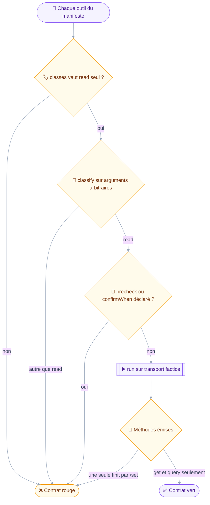
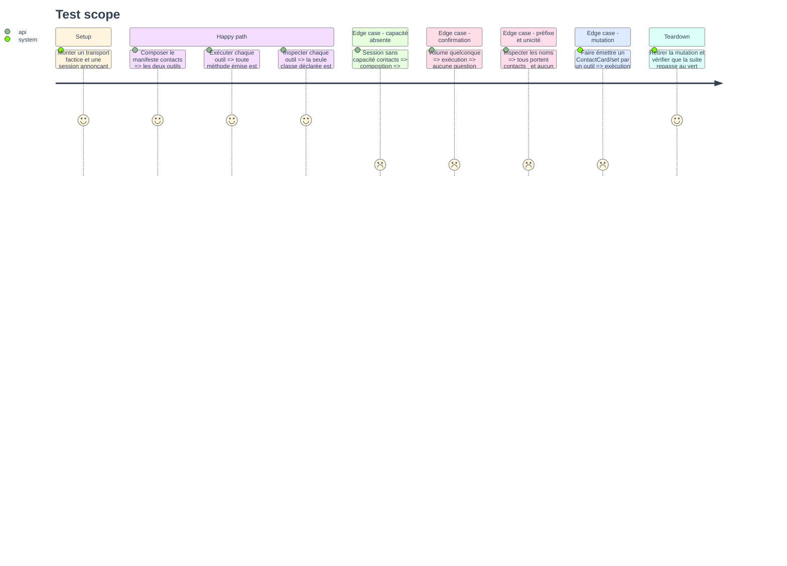

# Instruction: Contrat de lecture seule et gating de capacité

## Architecture projection

> Tree of the final files. ✅ create · ✏️ modify · ❌ delete

```txt
.
└── tests
    └── contract
        └── contacts-read-only.test.ts        ✅ aucune écriture émise, aucune confirmation, gating de capacité
```

## User Journey

Le diagramme suit ce que le contrat traverse pour chaque outil du manifeste.
La déclaration de classe est vérifiée, puis l'exécution réelle : dire qu'on lit et ne rien écrire sont deux affirmations distinctes.



## Test Scope



## Tasks to do

### `1)` Asserter la déclaration

> Une classe déclarée est ce que le registre lit pour décider : elle se vérifie en premier.

1. Créer `tests/contract/contacts-read-only.test.ts` sur le patron de `tests/contract/read-only-surface.test.ts`.
2. Écrire en tête du fichier l'invariant qu'il tient, comme les huit contrats existants.
3. Asserter que chaque outil de `contactsDomain` déclare `classes` égal à `["read"]`.
4. Asserter que `classify` rend `read` sur des arguments arbitraires, y compris des clés d'écriture inventées.
5. Asserter qu'aucun outil ne déclare `precheck` ni `confirmWhen` : rien ici ne se confirme, quel que soit le volume.
6. Asserter que les noms portent le préfixe `contacts_` et qu'aucun n'apparaît deux fois.

### `2)` Asserter l'exécution

> Le contrat qui compte n'est pas ce que l'outil déclare, c'est ce qu'il envoie sur le fil.

1. Exécuter chaque outil du manifeste contre le transport factice de `tests/fixtures/client.ts`.
2. Servir à chacun des arguments minimaux valides, tirés de son propre schéma zod.
3. Collecter les noms de méthode de toutes les requêtes émises, sur tous les outils.
4. Asserter que chaque nom finit par `/get` ou `/query`, et qu'aucun ne finit par `/set`, `/copy` ou `/parse`.
5. Faire porter l'assertion sur `tool.name` dans le message d'échec : un contrat qui tombe doit nommer le coupable.
6. Écrire l'assertion sur le manifeste itéré, jamais sur une liste d'outils recopiée : le contrat doit grandir avec le domaine.

### `3)` Asserter le gating

> Un outil proposé sur un serveur qui ne le sert pas est une promesse qui échouera à l'usage.

1. Composer avec une session n'annonçant pas la capacité contacts, sur le patron de `read-only-surface.test.ts`.
2. Asserter qu'aucun outil de contacts n'est enregistré.
3. Asserter que le rapport de composition signale le manifeste sauté, avec la capacité manquante.
4. Composer avec une session qui l'annonce, et asserter que les deux outils sont enregistrés.

### `4)` Valider par mutation

> Un contrat qui passe sans jamais pouvoir tomber ne tient rien.

1. Faire temporairement émettre un `ContactCard/set` par un outil, et vérifier que le contrat tombe au rouge.
2. Retirer temporairement `requires` du manifeste contacts, et vérifier que le gating tombe au rouge.
3. Retirer les deux mutations et vérifier que `pnpm test` repasse au vert.
4. Consigner dans le message de commit que la validation par mutation a été faite, sans laisser la mutation dans le dépôt.

## Test acceptance criteria

| Task | Acceptance criteria                                                                                    |
| ---- | ---------------------------------------------------------------------------------------------------------- |
| 1    | Un outil de contacts déclarant une autre classe que `read` fait échouer la suite                            |
| 2    | Une méthode d'écriture émise par n'importe quel outil du manifeste fait échouer la suite, en le nommant      |
| 3    | Une session sans capacité contacts n'enregistre aucun outil, et le rapport nomme la capacité manquante       |
| 4    | Les deux mutations font tomber le contrat au rouge, et le dépôt final n'en contient aucune                   |
