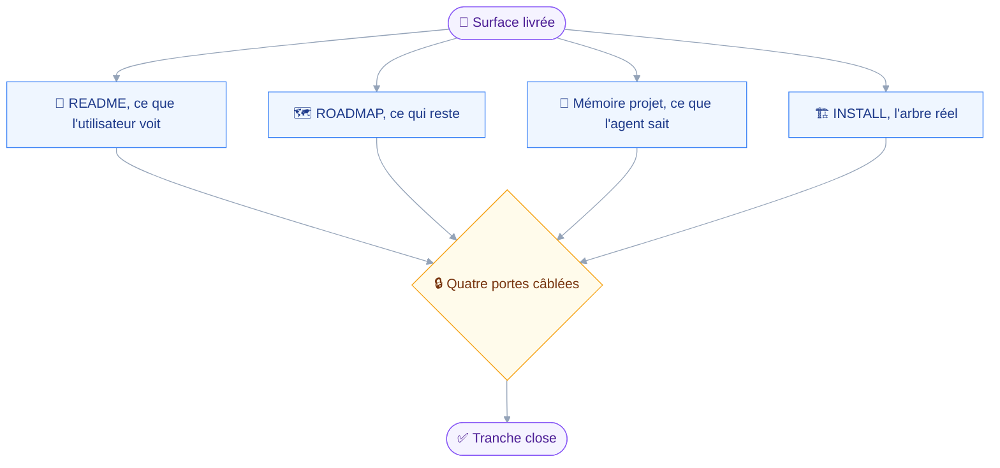
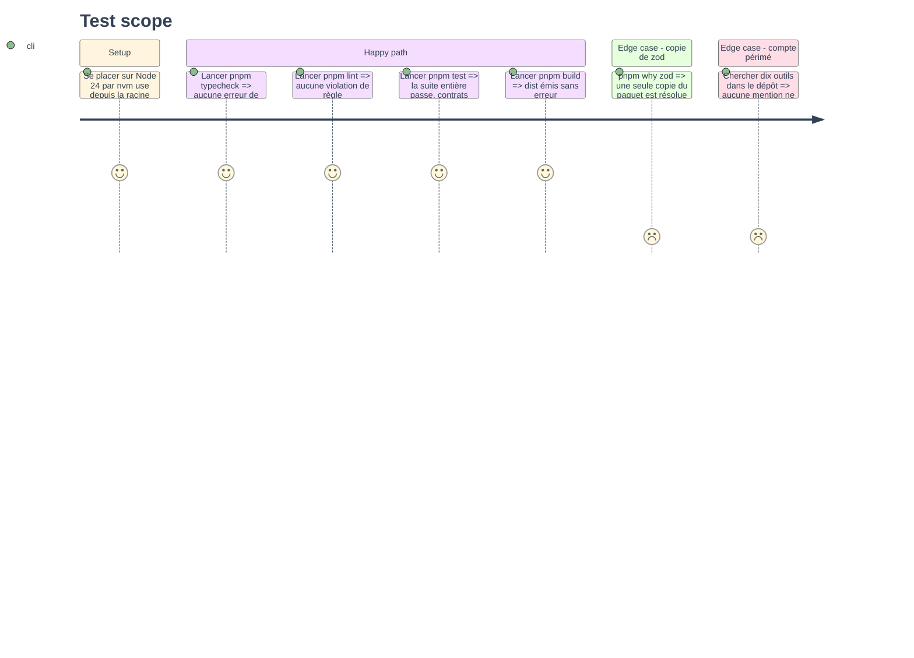

# Instruction: Documentation et mémoire projet

## Architecture projection

> Tree of the final files. ✅ create · ✏️ modify · ❌ delete

```txt
.
├── README.md                                 ✏️ douze outils, deux domaines, périmètre observable
└── aidd_docs
    ├── INSTALL.md                            ✏️ arbre de fichiers du domaine contacts
    ├── ROADMAP.md                            ✏️ module 5 livré, budget à douze
    └── memory
        ├── architecture.md                   ✏️ le périmètre se lit désormais depuis un outil
        ├── codebase-map.md                   ✏️ le domaine contacts n'est plus un manifeste vide
        └── testing.md                        ✏️ contrat de lecture seule des contacts, comptes réels
```

## User Journey

Aucun code ne bouge dans cette phase : elle aligne ce que le dépôt raconte sur ce qu'il fait.



## Test Scope



## Tasks to do

### `1)` Mettre le README à la surface réelle

> Le README annonce encore que le mail est le seul domaine implémenté.

1. Porter la table des outils à douze, en ajoutant `contacts_search` et `contacts_read`, tous deux en classe `read`.
2. Corriger la phrase d'introduction de la table : douze outils, sur deux domaines et non plus un seul.
3. Corriger l'encadré d'état : les contacts se lisent, quatre domaines n'exposent encore rien.
4. Ajouter, sous la section du périmètre des destinataires, que `contacts_search` dit désormais si une adresse y figure.
5. Y dire que le périmètre est figé au démarrage, donc qu'une fiche créée en cours de session s'y trouve seulement après redémarrage.

### `2)` Refermer le module 5 de la feuille de route

> Une feuille de route qui annonce comme à faire ce qui est livré ne se lit plus.

1. Marquer le module 5 comme livré, à la façon du module 4.
2. Y consigner l'arbitrage de la question ouverte : deux outils, la liste des carnets tenant dans la recherche.
3. Y consigner le second arbitrage : une fiche de groupe est rendue telle quelle, le dépliage revenant au module 6.
4. Corriger la table du budget : douze outils exposés sur vingt-six, la tranche contacts n'en ayant consommé que deux sur quatre.
5. Corriger la phrase de bas de page qui énumère les outils exposés.

### `3)` Rafraîchir la mémoire projet

> Une mémoire qui décrit un état révolu coûte plus qu'elle ne rend.

1. Dans `codebase-map.md`, retirer le domaine contacts de la liste des manifestes vides.
2. Y ajouter le manifeste `contactsDomain` à la table des manifestes, avec sa capacité et ses deux outils.
3. Y citer `src/domains/contacts/card.ts` comme le fichier que les deux outils partagent.
4. Dans `architecture.md`, ajouter que le périmètre est désormais observable par un outil, sans cesser d'être figé au démarrage.
5. Y noter le piège du serveur : le tri des fiches par nom est refusé, et les trois champs de nom partagent un index.
6. Dans `testing.md`, ajouter le contrat de lecture seule des contacts à la table des invariants.
7. Y corriger le compte de tests et de fichiers, relevé sur la sortie réelle de `pnpm test`.
8. Dans `INSTALL.md`, compléter l'arbre du domaine contacts avec les trois fichiers réellement écrits.

### `4)` Passer les portes câblées

> Le module n'est fini que lorsque les quatre commandes sont vertes.

1. Lancer `nvm use` depuis la racine avant toute commande.
2. Exécuter `pnpm typecheck`, `pnpm lint`, `pnpm test`, `pnpm build`.
3. Corriger chaque assertion tombée avant de passer à la suivante.
4. Vérifier `pnpm why zod` : une seule copie du paquet, comme le veut la règle de versionnage.
5. Relever le compte final de tests et le reporter dans `testing.md`.

## Test acceptance criteria

| Task | Acceptance criteria                                                                              |
| ---- | ---------------------------------------------------------------------------------------------------- |
| 1    | Le README liste douze outils et dit comment vérifier qu'une adresse est dans le périmètre             |
| 2    | Aucune ligne du dépôt n'annonce encore dix outils exposés, ni le module 5 comme à faire                |
| 3    | Les quatre fichiers de mémoire et d'installation décrivent la surface réelle, sans compte périmé       |
| 4    | Les quatre portes câblées passent au vert, et `pnpm why zod` ne rend qu'une copie                      |
