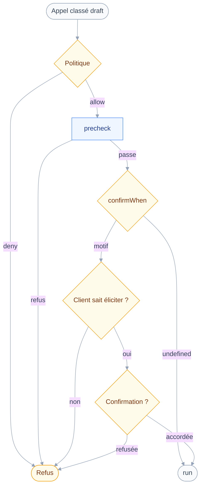
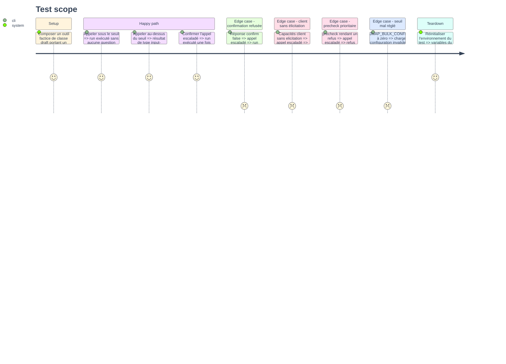

# Instruction: Escalade de confirmation et seuil configurable

## Architecture projection

> Tree of the final files. ✅ create · ✏️ modify · ❌ delete

```txt
.
├── src
│   ├── config
│   │   ├── schema.ts                          ✏️ clé bulkConfirmAbove, défaut à vingt
│   │   └── load.ts                            ✏️ JMAP_BULK_CONFIRM_ABOVE, lu en entier
│   └── registry
│       ├── define-tool.ts                     ✏️ hook confirmWhen, bulkConfirmAbove sur le contexte
│       └── compose.ts                         ✏️ escalade allow vers confirm, message porteur du motif
└── tests
    ├── contract
    │   └── elicitation-required.test.ts       ✏️ un appel escaladé sans élicitation refuse
    └── unit
        ├── config-load.test.ts                ✅ seuil : défaut, environnement, valeur invalide
        └── confirm-escalation.test.ts         ✅ escalade, refus, exécution sous le seuil
```

## User Journey

Le diagramme suit un appel de classe `draft` que son propre volume fait passer par la confirmation.



## Test Scope



## Tasks to do

### `1)` Porter le seuil dans la configuration

> Une prudence personnelle se règle, elle ne se code pas en dur.

1. Dans `src/config/schema.ts`, exporter `DEFAULT_BULK_CONFIRM_ABOVE` à vingt.
2. Ajouter `bulkConfirmAbove` au `configSchema` : entier, minimum un, défaut sur la constante.
3. Dans `src/config/load.ts`, lire `JMAP_BULK_CONFIRM_ABOVE` et le convertir en nombre.
4. Laisser une valeur illisible échouer dans le schéma plutôt que de la replier sur le défaut.
5. Documenter par `describe` que le seuil ne concerne que les gestes réversibles de masse.

### `2)` Ouvrir un second chemin vers la confirmation

> Un déplacement de masse reste un déplacement : le classer en `destroy` mentirait.

1. Dans `src/registry/define-tool.ts`, ajouter `confirmWhen` optionnel à `ToolDefinition`.
2. Lui donner la signature de `precheck` : entrée et contexte, motif ou `undefined`, lecture autorisée.
3. Commenter qu'il n'écrit jamais et qu'il ne remplace pas `classify`, qui reste la classe vraie.
4. Ajouter `bulkConfirmAbove` à `ToolContext`, alimenté par la composition.
5. Ajouter `bulkConfirmAbove` à `CompositionInput`, avec repli sur le défaut quand il est absent.

### `3)` Escalader dans le registre, au bon rang

> Un appel voué au refus ne devient pas une question parce qu'il est volumineux.

1. Dans `src/registry/compose.ts`, appeler `confirmWhen` après `precheck`, jamais avant.
2. Ne l'appeler que si le niveau vaut `allow` : un `confirm` l'est déjà, un `deny` a rendu la main.
3. Poser le niveau effectif à `confirm` dès que le motif est défini.
4. Faire porter le motif par le message d'élicitation, à la place de la phrase de classe d'opération.
5. Refuser, sans exécuter, quand le client n'expose pas l'élicitation, y compris sur un appel escaladé.
6. Ne toucher ni à `selectTools` ni à `ToolSelection` : l'escalade est une décision d'appel, pas d'exposition.

### `4)` Tester le mécanisme sans outil réel

> Le mécanisme se vérifie sur un outil factice : aucun message n'est nécessaire pour cela.

1. Écrire `tests/unit/confirm-escalation.test.ts` sur un outil factice de classe `draft`.
2. Couvrir les quatre chemins : sous le seuil, escaladé sans réponse, escaladé refusé, escaladé accordé.
3. Ajouter au test un cas où `precheck` refuse : le refus prime, aucune question n'est posée.
4. Étendre `tests/contract/elicitation-required.test.ts` au cas escaladé sur un client muet.
5. Écrire `tests/unit/config-load.test.ts` : défaut, valeur d'environnement, valeur invalide.
6. Vérifier par mutation : retirer l'escalade dans `compose.ts` doit faire tomber le contrat au rouge.

## Test acceptance criteria

| Task | Acceptance criteria                                                                              |
| ---- | -------------------------------------------------------------------------------------------------- |
| 1    | `JMAP_BULK_CONFIRM_ABOVE` fixe le seuil, et une valeur non entière fait échouer le démarrage en nommant la clé |
| 2    | Un outil sans `confirmWhen` se comporte exactement comme avant, aucun test existant ne bouge         |
| 3    | Un appel escaladé rend un résultat d'entrée requise dont le message cite le motif, jamais la classe   |
| 4    | `pnpm test` passe, et retirer l'appel à `confirmWhen` fait échouer au moins un test                  |
