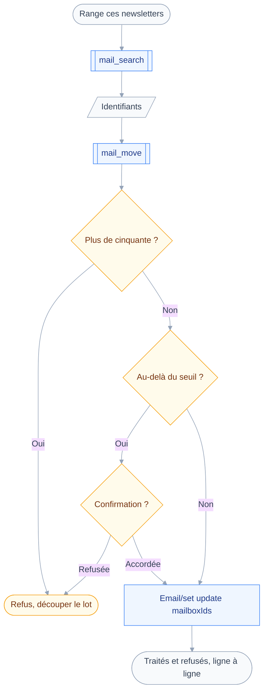
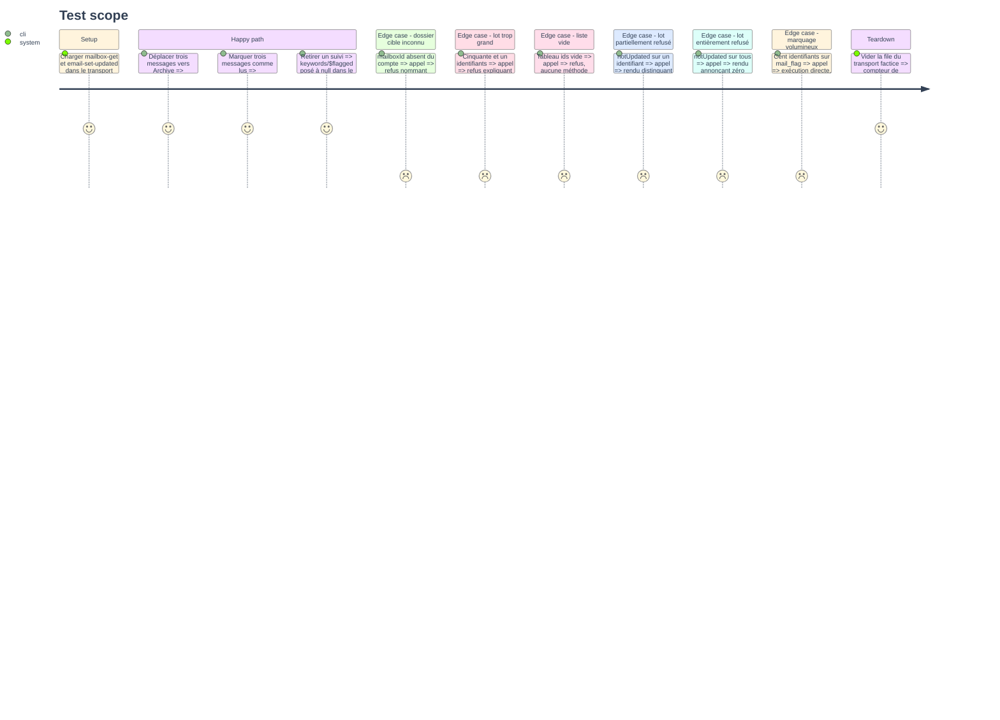

# Instruction: Socle de rangement, `mail_move` et `mail_flag`

## Architecture projection

> Tree of the final files. ✅ create · ✏️ modify · ❌ delete

```txt
.
├── src
│   ├── domains
│   │   ├── index.ts                           ✏️ le manifeste de rangement rejoint ALL_DOMAINS
│   │   └── mail
│   │       ├── organize.ts                    ✅ plafond de lot, dossiers résolus, rendu du lot
│   │       ├── move.ts                        ✅ outil mail_move, classe draft
│   │       ├── flag.ts                        ✅ outil mail_flag, classe draft
│   │       └── index.ts                       ✏️ mailOrganizingDomain sur la seule capacité mail
│   └── jmap
│       └── types
│           └── mail.ts                        ✏️ EmailSetUpdate, mots-clés standards
└── tests
    ├── contract
    │   ├── organizing-takes-ids.test.ts       ✅ aucun outil d'écriture n'accepte de critère
    │   ├── bulk-confirmation.test.ts          ✅ au-delà du seuil, on demande ; marquer jamais
    │   └── read-only-surface.test.ts          ✏️ le manifeste de rangement s'expose sans submission
    ├── fixtures
    │   ├── mailbox-get.json                   ✏️ ajout d'un dossier de rôle trash
    │   └── email-set-updated.json             ✅ updated et notUpdated mêlés
    └── unit
        ├── mail-move.test.ts                  ✅ remplacement de mailboxIds, refus, lot partiel
        ├── mail-flag.test.ts                  ✅ patch de keywords, add et remove, refus
        └── organize.test.ts                   ✅ plafond, rendu du traité et du refusé
```

## User Journey

Le diagramme suit un classement, de la recherche qui produit les identifiants au lot rendu message par message.



## Test Scope



## Tasks to do

### `1)` Poser le socle partagé du rangement

> Trois outils vont refuser les mêmes choses et rendre le même genre de compte.

1. Créer `src/domains/mail/organize.ts` et y exporter `MAX_IDS_PER_CALL` à cinquante.
2. Écrire `refuseOversizedBatch` : liste vide ou au-delà du plafond, en indiquant comment découper.
3. Écrire `resolveMailboxes`, un `Mailbox/get` complet mis en cache par `context.once`.
4. Y demander `id`, `name`, `parentId`, `role`, `totalEmails`, jamais plus.
5. Écrire `describeUpdateOutcome` : lire `updated` et `notUpdated`, rendre une ligne par identifiant.
6. Ne jamais annoncer un succès global quand `notUpdated` porte au moins une entrée, ni quand il les porte toutes.

### `2)` Écrire `mail_move`

> Classer, c'est changer de dossier, pas s'ajouter à un second.

1. Créer `src/domains/mail/move.ts` avec `classes: ["draft"]` et un `classify` constant.
2. Entrée : `ids` en tableau de chaînes, `mailboxId` en chaîne. Aucun critère de recherche.
3. Décrire dans la description que les identifiants viennent de `mail_search`, jamais d'une requête.
4. Écrire `precheck` : plafond de lot, puis dossier cible absent du compte, refusé en le nommant.
5. Écrire `confirmWhen` : au-delà de `bulkConfirmAbove`, rendre un motif citant le nombre et le nom du dossier.
6. Dans `run`, émettre un `Email/set` dont chaque `update` réécrit `mailboxIds` sur le seul dossier cible.
7. Rendre le compte par `describeUpdateOutcome`.

### `3)` Écrire `mail_flag`

> Marquer ne perd rien, donc marquer ne demande jamais rien.

1. Créer `src/domains/mail/flag.ts` avec `classes: ["draft"]` et un `classify` constant.
2. Entrée : `ids`, plus `add` et `remove`, deux tableaux d'un `enum` de mots-clés standards.
3. Exposer `seen`, `flagged`, `answered`, `forwarded`, `junk`, `notjunk`, `phishing`, et rien d'autre.
4. Laisser `$draft` hors de l'énumération, avec le commentaire qui dit pourquoi.
5. Refiner le schéma : au moins un des deux tableaux non vide, sinon il n'y a rien à faire.
6. Écrire `precheck` sur le seul plafond de lot, et ne définir aucun `confirmWhen`.
7. Dans `run`, patcher `keywords/$<mot-clé>` à vrai pour `add` et à `null` pour `remove`.

### `4)` Exposer le manifeste de rangement

> Un serveur qui n'expédie pas doit ranger quand même.

1. Dans `src/domains/mail/index.ts`, définir `mailOrganizingDomain` sur la seule capacité `mail`.
2. Y placer `mailMove` et `mailFlag`, les deux outils restants suivront aux phases suivantes.
3. Ajouter le manifeste à `ALL_DOMAINS` dans `src/domains/index.ts`.
4. Vérifier que `mailDomain` reste inchangé, son invariant de pureté en lecture n'ayant pas à bouger.
5. Mettre à jour `tests/contract/read-only-surface.test.ts` : la capacité `mail` seule expose les deux manifestes.
6. Y étendre le contrôle de préfixe `mail_` au manifeste de rangement.

### `5)` Fixtures, contrats et tests

> Ce que le lot rend quand il échoue à moitié vaut le test que ce qu'il rend quand il réussit.

1. Ajouter un dossier de rôle `trash` à `tests/fixtures/mailbox-get.json`, la phase suivante en dépend.
2. Écrire `tests/fixtures/email-set-updated.json` avec `updated` et `notUpdated` mêlés.
3. Écrire `tests/contract/organizing-takes-ids.test.ts` : aucun schéma d'outil de rangement ne porte de critère.
4. Y lister les clés interdites : `from`, `to`, `subject`, `text`, `before`, `after`, `cursor`, `filter`, `deliveredTo`.
5. Y ajouter qu'une liste vide est refusée sans qu'aucune méthode JMAP ne soit émise.
6. Écrire `tests/contract/bulk-confirmation.test.ts` : au-delà du seuil on demande, `mail_flag` jamais.
7. Écrire les trois fichiers unitaires, et vérifier par mutation que chaque contrat tombe quand sa ligne disparaît.

## Test acceptance criteria

| Task | Acceptance criteria                                                                             |
| ---- | ------------------------------------------------------------------------------------------------- |
| 1    | Un lot de cinquante et un identifiants est refusé avant toute écriture, en disant comment le découper |
| 2    | Après un déplacement, le message est dans le dossier cible et absent de tous les autres             |
| 3    | Marquer cent messages comme lus s'exécute sans qu'aucune confirmation soit demandée                 |
| 4    | Une session annonçant `mail` sans `submission` expose `mail_move` et `mail_flag`                    |
| 5    | Un lot dont une partie est refusée rend le détail par identifiant et n'annonce aucun succès global   |
