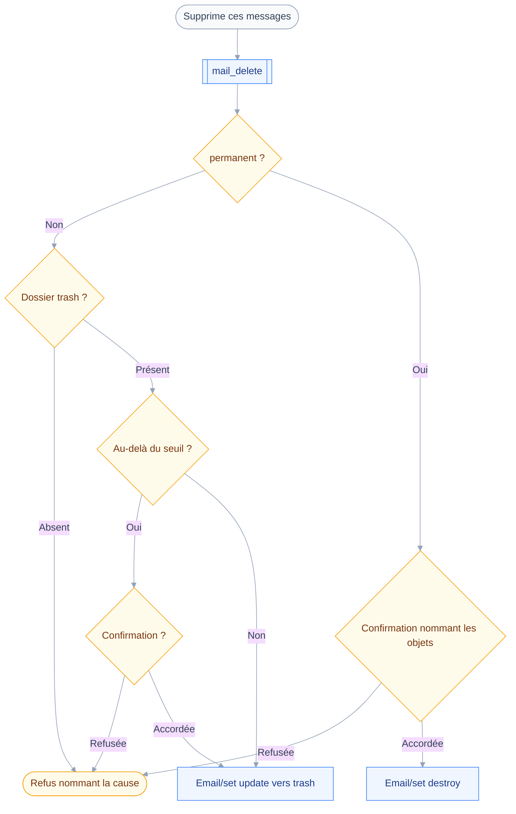
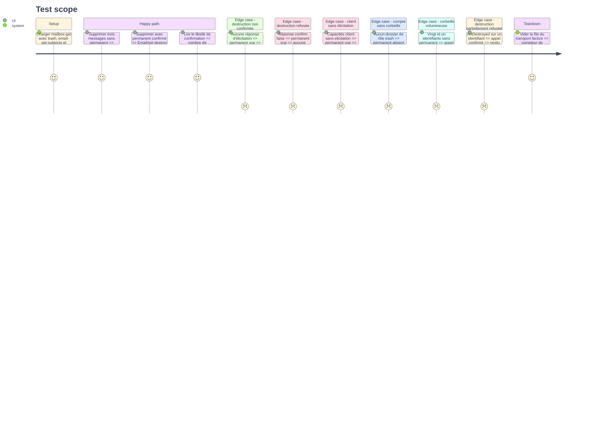

# Instruction: `mail_delete`, corbeille et destruction

## Architecture projection

> Tree of the final files. ✅ create · ✏️ modify · ❌ delete

```txt
.
├── src
│   └── domains
│       └── mail
│           ├── delete.ts                      ✅ outil mail_delete, classes draft et destroy
│           ├── organize.ts                    ✏️ rendu du destroy, résolution du dossier trash
│           └── index.ts                       ✏️ mail_delete rejoint le manifeste de rangement
└── tests
    ├── contract
    │   └── destroy-needs-confirmation.test.ts ✅ aucune destruction sans confirmation ni élicitation
    ├── fixtures
    │   ├── email-get-subjects.json            ✅ objets des messages pour le libellé de confirmation
    │   └── email-set-destroyed.json           ✅ destroyed et notDestroyed mêlés
    └── unit
        └── mail-delete.test.ts                ✅ corbeille, destruction, absence de trash
```

## User Journey

Le diagramme suit une suppression, de l'intention exprimée aux deux issues que l'argument `permanent` sépare.



## Test Scope



## Tasks to do

### `1)` Séparer les deux gestes sur un seul argument

> Mettre à la corbeille et détruire ne diffèrent pas par le geste, mais par ce qu'on peut défaire.

1. Créer `src/domains/mail/delete.ts` avec `classes: ["draft", "destroy"]`.
2. Entrée : `ids`, plus `permanent` en booléen optionnel, faux par défaut.
3. Écrire `classify` : `destroy` quand `permanent` vaut vrai, `draft` sinon.
4. Décrire l'outil en disant que par défaut le message reste retrouvable dans la corbeille.
5. Y dire aussi que `permanent` ne se rattrape pas, et que rien ne le défait.
6. Ajouter `mailDelete` aux `tools` de `mailOrganizingDomain`.

### `2)` Refuser ce qui doit l'être avant toute question

> Faire confirmer une mise à la corbeille qu'aucun dossier ne peut recevoir est une question pour rien.

1. Écrire `precheck` : plafond de lot d'abord, sur les deux branches.
2. Sur la branche corbeille, résoudre le dossier de rôle `trash` par `resolveMailboxes`.
3. Refuser en nommant la cause quand ce dossier manque, sans rien détruire ni créer.
4. Ne jamais créer un dossier de corbeille manquant : l'outil n'écrit pas dans l'arborescence.
5. Sur la branche `permanent`, ne rien refuser de plus : la confirmation est le garde-fou.

### `3)` Nommer ce qui part dans la confirmation

> Une confirmation qui ne cite qu'un compte ne permet pas de mesurer ce qu'on autorise.

1. Écrire `summarize` : lire les objets par `Email/get`, mis en cache par `context.once`.
2. Demander `id` et `subject` seulement, aucune propriété lente.
3. Citer le nombre de messages, puis les premiers objets, et clore par le reste comptabilisé.
4. Rendre un libellé lisible quand la lecture échoue, sans transformer l'erreur en refus.
5. Écrire `confirmWhen` sur la seule branche corbeille, au-delà de `bulkConfirmAbove`.
6. Y citer le nombre de messages et le mot « corbeille », jamais le mot « détruire ».

### `4)` Écrire les deux chemins d'exécution

> Un `Email/set` destroy retire le message de tous les dossiers, définitivement.

1. Sur la branche corbeille, émettre un `update` réécrivant `mailboxIds` sur le seul dossier `trash`.
2. Sur la branche `permanent`, émettre un `destroy` portant les identifiants tels quels.
3. Ne jamais mêler les deux dans une même requête, ni détruire après avoir déplacé.
4. Étendre `describeUpdateOutcome` ou lui adjoindre `describeDestroyOutcome`, lisant `destroyed` et `notDestroyed`.
5. Rendre le détail par identifiant sur les deux branches, sans annoncer un succès global partiel.

### `5)` Contrat et tests

> C'est la première destruction réelle du projet : le contrat compte plus que le test unitaire.

1. Écrire `tests/fixtures/email-get-subjects.json` et `tests/fixtures/email-set-destroyed.json`.
2. Écrire `tests/contract/destroy-needs-confirmation.test.ts` sur l'outil réel, pas sur un factice.
3. Y assert que sans réponse d'élicitation, aucune méthode JMAP n'est émise du tout.
4. Y assert qu'un client sans capacité d'élicitation reçoit un refus nommant la cause.
5. Y assert qu'une confirmation refusée laisse la boîte strictement inchangée.
6. Écrire `tests/unit/mail-delete.test.ts` : corbeille, destruction, absence de `trash`, lot partiel.
7. Vérifier par mutation : forcer `classify` à rendre `draft` doit faire tomber le contrat au rouge.

## Test acceptance criteria

| Task | Acceptance criteria                                                                          |
| ---- | ---------------------------------------------------------------------------------------------- |
| 1    | Un appel sans `permanent` laisse le message consultable dans le dossier de rôle `trash`          |
| 2    | Sur un compte sans dossier `trash`, l'appel est refusé en nommant la cause, sans rien écrire     |
| 3    | Le libellé de confirmation d'une destruction cite le nombre de messages et leurs objets          |
| 4    | Une destruction confirmée émet un `Email/set` destroy et aucun `update`                          |
| 5    | `pnpm test` passe, et une destruction non confirmée n'émet aucune méthode JMAP                   |
