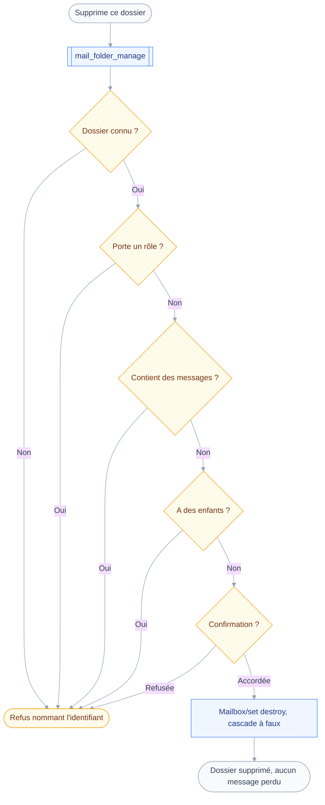
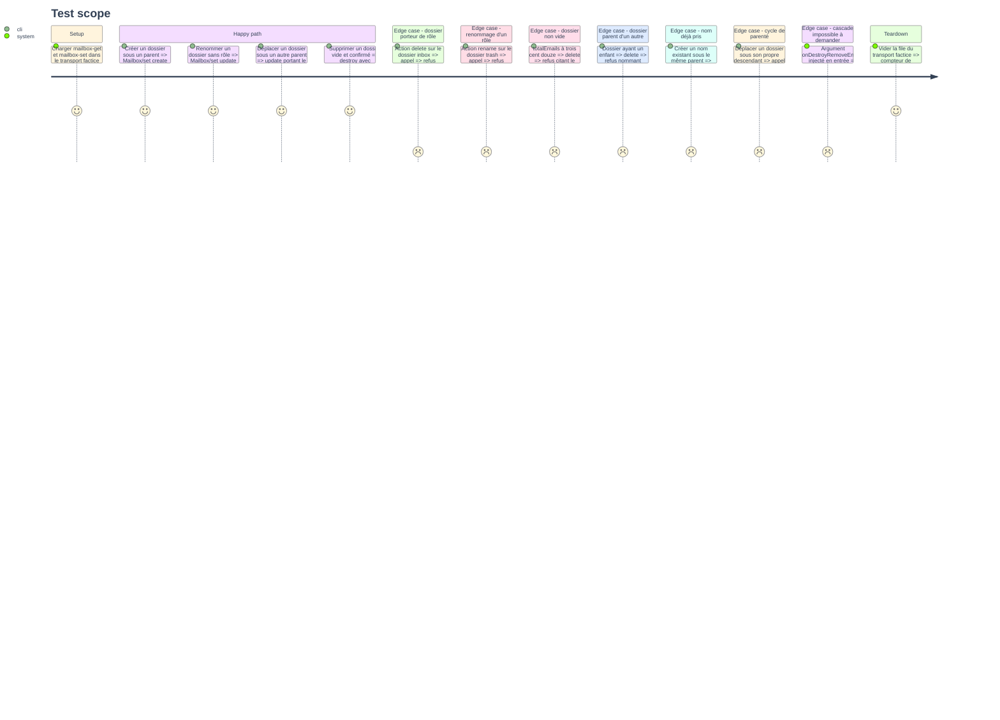

# Instruction: `mail_folder_manage`

## Architecture projection

> Tree of the final files. ✅ create · ✏️ modify · ❌ delete

```txt
.
├── src
│   ├── domains
│   │   └── mail
│   │       ├── folder-manage.ts               ✅ créer, renommer, déplacer, supprimer un dossier
│   │       └── index.ts                       ✏️ mail_folder_manage rejoint le manifeste de rangement
│   └── jmap
│       └── types
│           └── mail.ts                        ✏️ MailboxCreate, MailboxSetArguments
└── tests
    ├── contract
    │   └── no-cascade-destroy.test.ts         ✅ onDestroyRemoveEmails jamais vrai
    ├── fixtures
    │   └── mailbox-set.json                   ✅ created, updated, destroyed et leurs refus
    └── unit
        └── mail-folder-manage.test.ts         ✅ quatre actions, refus de rôle, de contenu, de doublon
```

## User Journey

Le diagramme suit la suppression d'un dossier, le seul des quatre gestes qui puisse faire perdre quelque chose.



## Test Scope



## Tasks to do

### `1)` Typer l'écriture de dossier

> Le domaine ne connaît aujourd'hui que la lecture des `Mailbox`.

1. Dans `src/jmap/types/mail.ts`, ajouter `MailboxCreate` : `name`, `parentId` optionnel et nullable.
2. Ne pas y déclarer `role` : l'outil ne pose jamais de rôle, il refuse d'y toucher.
3. Ajouter `MailboxSetArguments` en alias de type, avec `create`, `update`, `destroy`.
4. Y déclarer `onDestroyRemoveEmails` en booléen optionnel, commenté comme toujours émis à faux.
5. Compléter `Mailbox` si une propriété manque au refus par contenu, sans en ajouter d'inutile.

### `2)` Écrire l'outil et ses quatre actions

> Un seul outil, quatre intentions, une seule qui bascule la classe.

1. Créer `src/domains/mail/folder-manage.ts` avec `classes: ["draft", "destroy"]`.
2. Entrée : `action` en `enum` de `create`, `rename`, `move`, `delete`, puis `mailboxId`, `name`, `parentId`.
3. Refiner le schéma par action : `name` exigé en création et renommage, `mailboxId` sur les trois autres.
4. Écrire `classify` : `destroy` sur `delete`, `draft` partout ailleurs.
5. Dans `run`, émettre le `Mailbox/set` correspondant, un seul objet par appel.
6. Sur `create`, ne poser que `name` et `parentId` ; sur `rename`, que `name` ; sur `move`, que `parentId`.
7. Sur `delete`, émettre `destroy` avec `onDestroyRemoveEmails` posé explicitement à faux.

### `3)` Refuser avant d'écrire, et avant de demander

> Supprimer un dossier ne doit jamais emporter son contenu, et c'est l'outil qui le garantit.

1. Écrire `precheck` en s'appuyant sur `resolveMailboxes`, mis en cache par `context.once`.
2. Refuser un `mailboxId` absent du compte, en le nommant.
3. Refuser `rename` et `delete` sur un dossier portant un rôle, en citant ce rôle.
4. Refuser `delete` sur un dossier dont `totalEmails` dépasse zéro, en citant ce nombre.
5. Refuser `delete` sur un dossier ayant au moins un enfant, en nommant cet enfant.
6. Refuser `create` et `rename` sur un nom déjà porté sous le même parent, en le nommant.
7. Refuser `move` vers un parent inconnu, vers le dossier lui-même, ou vers l'un de ses descendants.

### `4)` Contrat et tests

> La cascade est la seule ligne dont l'oubli détruit des messages sans qu'aucun test unitaire ne s'en aperçoive.

1. Écrire `tests/fixtures/mailbox-set.json` avec `created`, `updated`, `destroyed` et leurs refus.
2. Écrire `tests/contract/no-cascade-destroy.test.ts` : inspecter tout corps émis portant `Mailbox/set`.
3. Y exiger `onDestroyRemoveEmails` à faux, jamais absent, jamais vrai.
4. Y ajouter un appel injectant l'argument en entrée, pour prouver qu'il ne traverse pas le schéma.
5. Écrire `tests/unit/mail-folder-manage.test.ts` : les quatre actions et les sept refus.
6. Vérifier par mutation : passer `onDestroyRemoveEmails` à vrai doit faire tomber le contrat au rouge.
7. Ajouter `mailFolderManage` au manifeste de rangement, et vérifier que le contrat de préfixe passe.

## Test acceptance criteria

| Task | Acceptance criteria                                                                     |
| ---- | ----------------------------------------------------------------------------------------- |
| 1    | Aucun type n'ouvre la pose d'un `role`, et `onDestroyRemoveEmails` est déclaré et commenté  |
| 2    | Créer, renommer et déplacer un dossier aboutit, et le résultat cite le dossier concerné     |
| 3    | Supprimer un dossier non vide échoue en citant son nombre de messages, sans en détruire un, et un dossier de rôle `inbox`, `drafts`, `sent` ou `trash` ne peut être ni renommé ni supprimé |
| 4    | `pnpm test` passe, et tout `Mailbox/set` émis porte `onDestroyRemoveEmails` à faux          |
