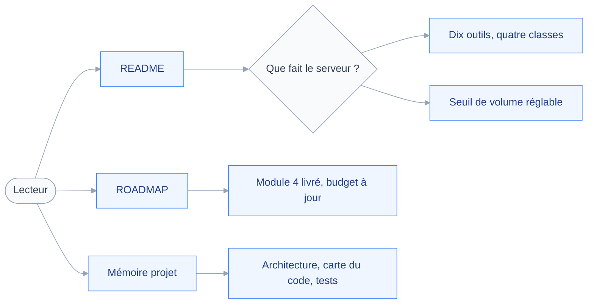
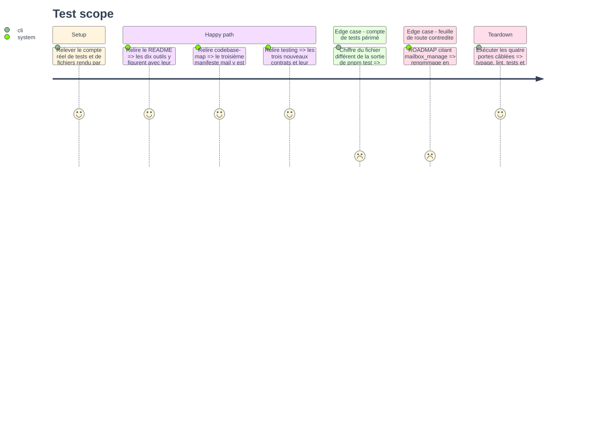

# Instruction: Documentation et mémoire projet

## Architecture projection

> Tree of the final files. ✅ create · ✏️ modify · ❌ delete

```txt
.
├── README.md                                  ✏️ dix outils, seuil de volume, plafond de lot
└── aidd_docs
    ├── ROADMAP.md                             ✏️ module 4 livré, budget à dix, outil renommé
    └── memory
        ├── architecture.md                    ✏️ second chemin vers la confirmation
        ├── codebase-map.md                    ✏️ troisième manifeste mail, dix outils
        └── testing.md                         ✏️ trois contrats de plus, compte de tests
```

## User Journey

Le diagramme suit ce qu'une personne découvrant le dépôt doit pouvoir apprendre sans lire le code.



## Test Scope



## Tasks to do

### `1)` Mettre le README à jour

> Le README est le seul document qu'un utilisateur lit avant d'installer.

1. Décrire les quatre outils de rangement, avec la classe d'opération de chacun.
2. Dire que `mail_delete` met à la corbeille par défaut, et ne détruit que sur `permanent`.
3. Documenter `bulkConfirmAbove` et son équivalent `JMAP_BULK_CONFIRM_ABOVE`, défaut à vingt.
4. Dire que le plafond de cinquante identifiants par appel n'est pas réglable.
5. Dire que le marquage ne demande jamais de confirmation, quel que soit le volume.

### `2)` Refléter le module livré dans la feuille de route

> La feuille de route porte encore un nom d'outil que la tranche a changé.

1. Marquer le module 4 comme livré, à la façon du module 3.
2. Y renommer `mailbox_manage` en `mail_folder_manage`, et dire pourquoi en une ligne.
3. Corriger la table du budget : dix outils exposés sur vingt-six.
4. Noter l'écart assumé : `Email/copy` n'est pas utilisé, le multi-compte restant hors périmètre.
5. Vérifier qu'aucune autre ligne de la feuille de route ne cite l'ancien nom.

### `3)` Rafraîchir la mémoire projet

> Une mémoire qui décrit un état révolu coûte plus qu'elle ne rend.

1. Dans `architecture.md`, décrire le second chemin vers la confirmation, ouvert par l'outil.
2. Y dire que l'escalade suit `precheck` et jamais l'inverse, et pourquoi.
3. Dans `codebase-map.md`, décrire le troisième manifeste `mail` et son unique capacité.
4. Y porter le compte d'outils à dix, et lister les quatre nouveaux.
5. Dans `testing.md`, ajouter les contrats de rangement à la table des invariants.
6. Y corriger le compte de tests et de fichiers, relevé sur la sortie réelle de `pnpm test`.

### `4)` Passer les portes câblées

> Le module n'est fini que lorsque les quatre commandes sont vertes.

1. Lancer `nvm use` depuis la racine avant toute commande.
2. Exécuter `pnpm typecheck`, `pnpm lint`, `pnpm test`, `pnpm build`.
3. Corriger chaque assertion tombée avant de passer à la suivante.
4. Vérifier `pnpm why zod` : une seule copie du paquet, comme le veut la règle de versionnage.
5. Relever le compte final de tests et le reporter dans `testing.md`.

## Test acceptance criteria

| Task | Acceptance criteria                                                                   |
| ---- | --------------------------------------------------------------------------------------- |
| 1    | Le README liste les dix outils et documente le seuil ainsi que le plafond de lot          |
| 2    | Aucune occurrence de `mailbox_manage` ne subsiste dans le dépôt                           |
| 3    | Les trois fichiers de mémoire décrivent la surface réelle, sans compte périmé             |
| 4    | Les quatre portes câblées passent au vert, et `pnpm why zod` ne rend qu'une copie          |
