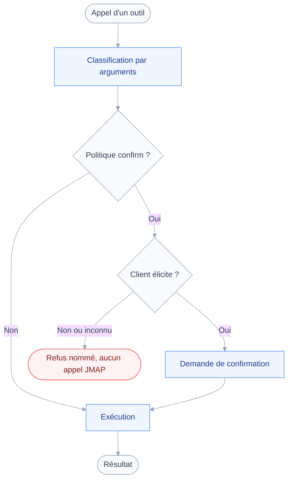
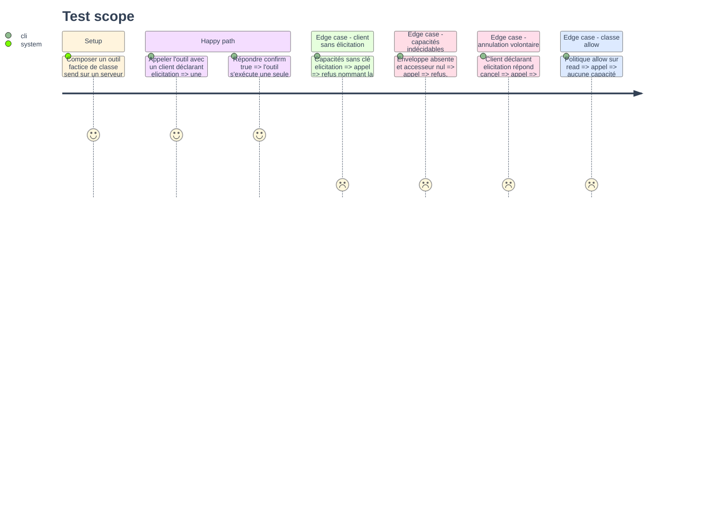

# Instruction: Refus quand le client ne sait pas confirmer

## Architecture projection

> Tree of the final files. ✅ create · ✏️ modify · ❌ delete

```txt
.
├── src
│   └── registry
│       ├── elicitation.ts                ✅ lecture de la capacité client, échec fermé
│       └── compose.ts                    ✏️ refuse une classe confirm sans élicitation
└── tests
    └── contract
        ├── elicitation-required.test.ts  ✅ aucun appel JMAP émis sans élicitation
        └── policy-guard.test.ts          ✏️ le serveur factice déclare la capacité
```

## User Journey

Le diagramme suit un appel de classe `send` jusqu'au point où la capacité du client décide.



## Test Scope



## Tasks to do

### `1)` Lire la capacité d'élicitation du client

> Une seule fonction sait où l'information se trouve, et elle ne devine jamais.

1. Créer `src/registry/elicitation.ts` avec `clientCanElicit(server, mcpReq): boolean`.
2. Y déclarer localement la constante `"io.modelcontextprotocol/clientCapabilities"` : le SDK ne l'exporte pas.
3. Lire d'abord `mcpReq.envelope?.[CLIENT_CAPABILITIES_META_KEY]`, chemin recommandé par le SDK.
4. À défaut, retomber sur `server.server.getClientCapabilities()`, déprécié mais réalimenté par requête.
5. Rendre `true` seulement si la clé `elicitation` est présente ; toute absence, tout `undefined`, rend `false`.
6. Ne jamais inspecter la réponse d'une élicitation : un `action: cancel` n'est pas une incapacité.

### `2)` Refuser avant tout appel JMAP

> Le refus se décide en amont de `tool.run`, sinon la requête est déjà partie.

1. Dans `src/registry/compose.ts`, injecter le `McpServer` dans la portée du gestionnaire d'appel.
2. Dans la branche `level === "confirm"`, appeler `clientCanElicit` avant de construire la demande.
3. Rendre `errorResult` quand la réponse est `false`, en nommant la classe d'opération et la cause.
4. Formuler le message pour l'utilisateur : son client ne sait pas demander confirmation, l'opération est donc refusée.
5. Laisser la branche `deny` et la branche `allow` intactes : aucune capacité client n'y est consultée.

### `3)` Prouver qu'aucune requête n'est émise

> Un test de contrat, pas une revue : la garde doit échouer bruyamment si elle régresse.

1. Écrire `tests/contract/elicitation-required.test.ts` avec un `run` qui incrémente un compteur.
2. Composer un outil de classe `send`, l'appeler avec un serveur factice sans capacité, exiger le compteur à zéro.
3. Ajouter le cas indécidable : ni enveloppe, ni accesseur, même exigence.
4. Vérifier que le résultat est bien une erreur d'outil et non une demande d'entrée.
5. Dans `tests/contract/policy-guard.test.ts`, faire déclarer `elicitation` au serveur factice existant.
6. Sans cette retouche, les quatre tests de confirmation basculeraient en refus de capacité.

## Test acceptance criteria

| Task | Acceptance criteria                                                                          |
| ---- | ---------------------------------------------------------------------------------------------- |
| 1    | La fonction rend `false` sur une enveloppe absente comme sur des capacités sans `elicitation`   |
| 2    | Un client sans élicitation obtient un message citant la classe de l'opération et sa cause       |
| 3    | `pnpm test` passe, et le compteur d'exécutions reste à zéro sur les deux cas de refus           |
