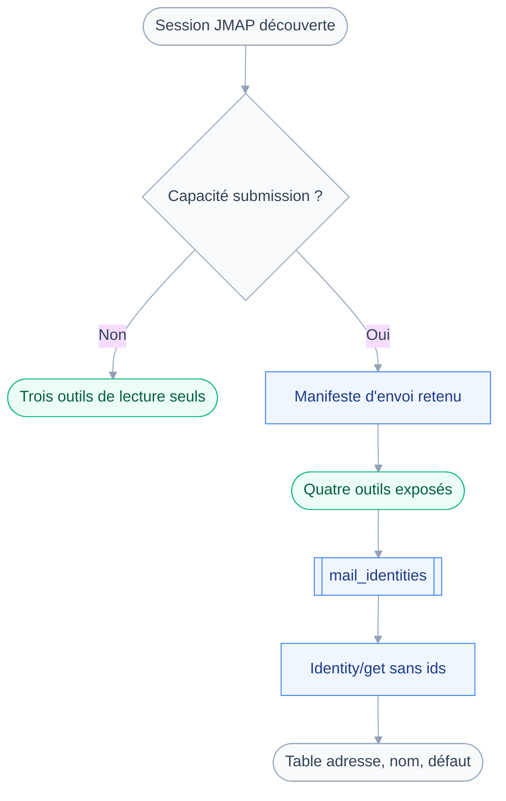
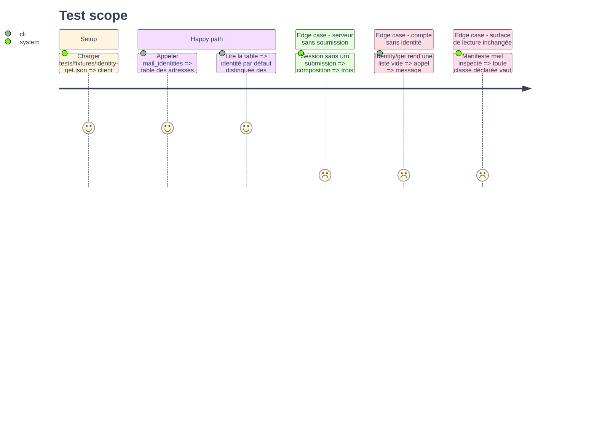

# Instruction: Types d'envoi, manifeste et `mail_identities`

## Architecture projection

> Tree of the final files. ✅ create · ✏️ modify · ❌ delete

```txt
.
├── src
│   ├── domains
│   │   ├── index.ts                    ✏️ ALL_DOMAINS accueille le manifeste d'envoi
│   │   └── mail
│   │       ├── identities.ts           ✅ outil mail_identities, classe read
│   │       └── index.ts                ✏️ second manifeste exigeant submission
│   └── jmap
│       └── types
│           └── mail.ts                 ✏️ Identity, Address, Envelope, EmailSubmission
└── tests
    ├── contract
    │   └── read-only-surface.test.ts   ✏️ portée réduite au manifeste de lecture
    ├── fixtures
    │   └── identity-get.json           ✅ deux identités du compte
    └── unit
        └── mail-identities.test.ts     ✅ rendu et identité par défaut
```

## User Journey

Le diagramme montre comment la capacité annoncée par le serveur décide de la surface exposée.



## Test Scope



## Tasks to do

### `1)` Typer les objets de soumission

> Seulement ce que les phases 3 et 4 consomment : un type inutilisé est une dette.

1. Dans `src/jmap/types/mail.ts`, déclarer `Identity` : `id`, `name`, `email`, `replyTo`, `bcc`, `textSignature`, `htmlSignature`, `mayDelete`.
2. Déclarer `Address` avec `email` et `parameters` optionnel, puis `Envelope` avec `mailFrom` et `rcptTo`.
3. Déclarer `EmailSubmission` : `id`, `identityId`, `emailId`, `threadId`, `envelope`, `sendAt`, `undoStatus`.
4. Déclarer `EmailCreate` pour la création : `mailboxIds`, `keywords`, `from`, `to`, `cc`, `bcc`, `subject`, `inReplyTo`, `references`, `bodyValues`, `textBody`.
5. Typer `IdentityGetArguments`, `EmailSetArguments` et `EmailSubmissionSetArguments` en alias, jamais en interface.
6. Sans alias, l'index signature implicite manque et la charge ne voyage pas comme `Invocation`.

### `2)` Ouvrir un second manifeste pour l'envoi

> Exiger `submission` sur le manifeste existant ferait taire trois outils de lecture.

1. Dans `src/domains/mail/index.ts`, ajouter `mailSendingDomain` avec `requires: [CAPABILITY_MAIL, CAPABILITY_SUBMISSION]`.
2. Garder `name: "mail"` sur les deux manifestes : c'est un même domaine, découpé par capacité.
3. Y placer `mailIdentities`, bien que sa classe soit `read` : l'objet `Identity` relève de `submission`.
4. Ajouter le manifeste à `ALL_DOMAINS` dans `src/domains/index.ts`.
5. Noter en commentaire que `requires` se vérifie au niveau session, pas au niveau compte.

### `3)` Écrire `mail_identities`

> Savoir depuis quelles adresses écrire, avant de choisir laquelle engage son nom.

1. Créer `src/domains/mail/identities.ts` avec `defineTool`, `classes: ["read"]`, `classify` constant.
2. Entrée : un objet vide, aucun argument n'ayant de sens ici.
3. Appeler `Identity/get` sans `ids`, avec `properties` explicites.
4. Rendre par `renderTable` sur `email`, `name`, `id`, et une colonne marquant l'identité par défaut.
5. Traiter la liste vide par un message nommé, jamais par une table sans ligne.
6. Écrire une `description` qui dit que l'`id` rendu alimente l'argument `identityId` de la rédaction.

### `4)` Fixtures, tests et portée du contrat de lecture

> Le test de lecture seule doit continuer à protéger ce qu'il protégeait, sans plus.

1. Écrire `tests/fixtures/identity-get.json` avec deux identités, dont une par défaut.
2. Écrire `tests/unit/mail-identities.test.ts` sur le rendu, l'ordre, et la liste vide.
3. Dans `tests/contract/read-only-surface.test.ts`, restreindre le parcours à `mailDomain`.
4. Y ajouter l'assertion inverse : une session sans `submission` ne compose aucun outil du manifeste d'envoi.
5. Vérifier que `tests/fixtures/session.json` annonce déjà `urn:ietf:params:jmap:submission`.

## Test acceptance criteria

| Task | Acceptance criteria                                                                        |
| ---- | -------------------------------------------------------------------------------------------- |
| 1    | `pnpm typecheck` passe et chaque type déclaré est consommé par une phase du plan               |
| 2    | Une session annonçant `mail` sans `submission` expose exactement les trois outils de lecture   |
| 3    | L'appel rend une table où l'identité par défaut se distingue des autres                        |
| 4    | `pnpm test` passe, et le contrat de lecture seule échoue toujours si un outil `mail` écrit     |
