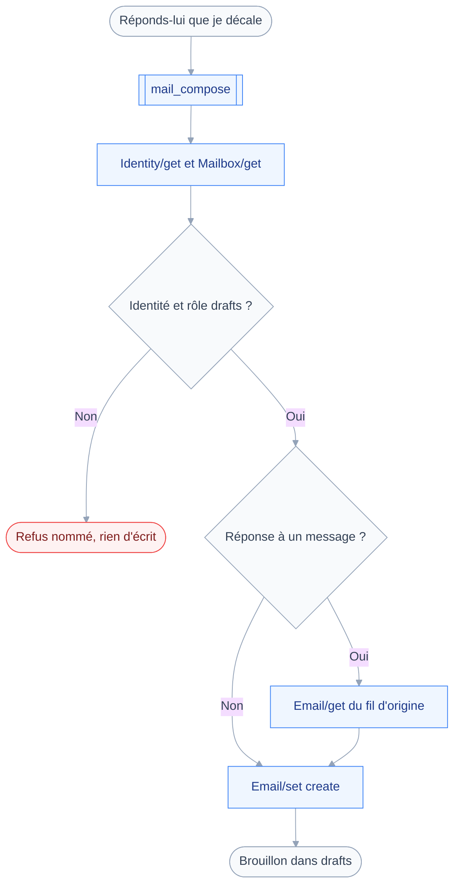
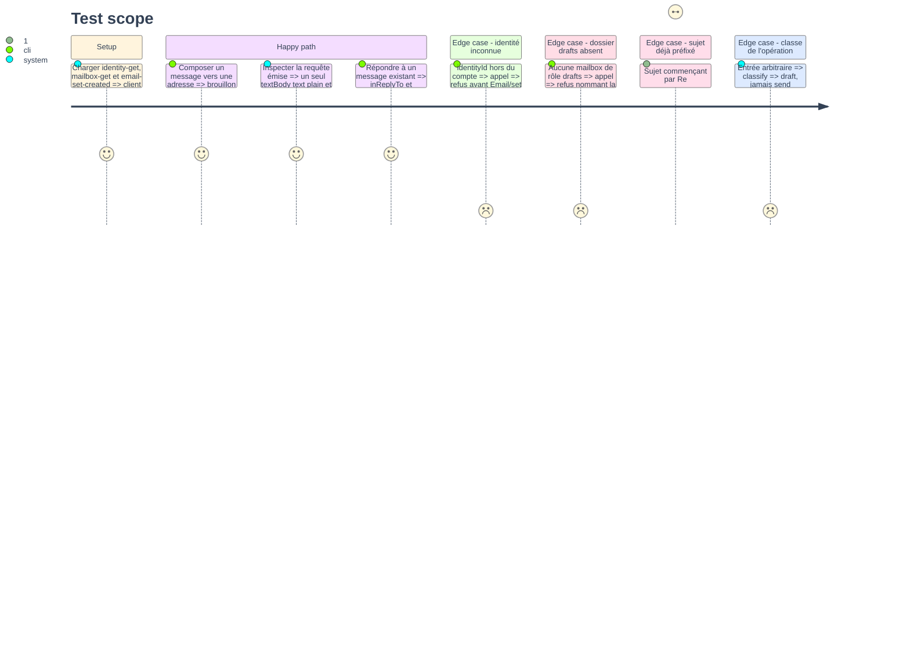

# Instruction: `mail_compose`

## Architecture projection

> Tree of the final files. ✅ create · ✏️ modify · ❌ delete

```txt
.
├── src
│   └── domains
│       └── mail
│           ├── compose.ts             ✅ outil mail_compose, classe draft
│           └── index.ts               ✏️ l'outil rejoint le manifeste d'envoi
└── tests
    ├── fixtures
    │   ├── email-set-created.json     ✅ réponse de création d'un brouillon
    │   └── email-reply-source.json    ✅ message d'origine, messageId et references
    └── unit
        └── mail-compose.test.ts       ✅ corps, fil, sujet, validation d'identité
```

## User Journey

Le diagramme suit une rédaction, de la demande au brouillon visible dans le client mail.



## Test Scope



## Tasks to do

### `1)` Fixer la signature d'entrée

> Ce que l'assistant doit fournir, et rien de plus : la phase 4 y ajoutera l'envoi.

1. Créer `src/domains/mail/compose.ts` avec `defineTool`, `classes: ["draft"]`, `classify` constant.
2. Entrée : `to` obligatoire en tableau non vide, `cc` et `bcc` optionnels, `subject`, `body`.
3. Ajouter `identityId` optionnel, `replyToEmailId` optionnel.
4. Refuser les pièces jointes explicitement dans la `description` : le module 9 les porte.
5. Écrire `summarize` pour qu'il rende une phrase citant destinataires et sujet, utile dès la phase 4.

### `2)` Résoudre l'identité et le dossier des brouillons

> Deux résolutions serveur avant toute écriture, et un refus plutôt qu'un choix arbitraire.

1. Appeler `Identity/get` et `Mailbox/get` dans une même requête, sans `ids`.
2. Retenir l'identité demandée, ou l'unique identité du compte quand `identityId` est absent.
3. Refuser quand `identityId` ne correspond à aucune identité, en nommant l'adresse rejetée.
4. Refuser quand plusieurs identités existent et qu'aucune n'est désignée, plutôt qu'en choisir une.
5. Retenir la mailbox de `role: "drafts"`, et refuser si aucune ne le porte.
6. Poser `from` depuis l'identité retenue, jamais depuis une adresse fournie en entrée.

### `3)` Construire le brouillon

> Un seul corps, en texte brut : la RFC interdit `headers` à la création.

1. Appeler `Email/set` avec un `create` sous un identifiant de création stable.
2. Poser `mailboxIds` sur la mailbox `drafts` et `keywords` sur `{ "$draft": true }`.
3. Poser `bodyValues: { body: { value } }` et `textBody: [{ partId: "body", type: "text/plain" }]`.
4. Ne poser ni `charset`, ni `size`, ni encodage de transfert : le serveur les calcule.
5. Ne jamais poser `headers` ni une propriété `header:*` : la RFC les refuse en création.

### `4)` Rattacher une réponse à son fil

> Le fil se reconstitue par deux en-têtes, que les propriétés de convenance portent.

1. Quand `replyToEmailId` est fourni, lire `messageId`, `references`, `subject`, `from`, `replyTo` du message d'origine.
2. Poser `inReplyTo` sur le `messageId` d'origine.
3. Poser `references` sur les `references` d'origine suivies de son `messageId`.
4. Préfixer le sujet par `Re:` seulement s'il ne l'est pas déjà, comparaison insensible à la casse.
5. Quand `to` est absent, viser `replyTo` d'origine, sinon `from`.
6. Ne jamais modifier le message d'origine : la lecture est la seule opération qui le touche.

### `5)` Rendu, erreurs et tests

> Un `SetError` de Stalwart doit se lire, pas se deviner.

1. Rendre l'identifiant du brouillon créé, le sujet, et les destinataires retenus.
2. Traduire `notCreated` en message d'erreur citant le `type` et la `description` du `SetError`.
3. Écrire `tests/fixtures/email-set-created.json` et `tests/fixtures/email-reply-source.json`.
4. Écrire `tests/unit/mail-compose.test.ts` : requête émise, corps unique, fil, préfixe, refus.
5. Y assérer que `classify` rend `draft` sur toute entrée de cette phase.
6. Ajouter `mailCompose` aux `tools` du manifeste d'envoi.

## Test acceptance criteria

| Task | Acceptance criteria                                                                         |
| ---- | --------------------------------------------------------------------------------------------- |
| 1    | L'outil est enregistré sans confirmation, la politique valant `allow` sur `draft`               |
| 2    | Une identité inconnue et un compte sans dossier `drafts` sont refusés avant toute écriture      |
| 3    | La requête émise porte exactement un `textBody` en `text/plain` et aucun `headers`              |
| 4    | Une réponse porte `inReplyTo` et un `references` qui se termine par le `messageId` d'origine    |
| 5    | `pnpm test` passe, et un `notCreated` produit un message citant le type d'erreur du serveur     |
