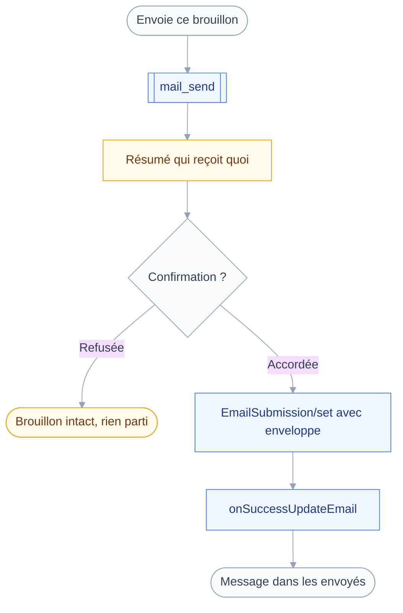
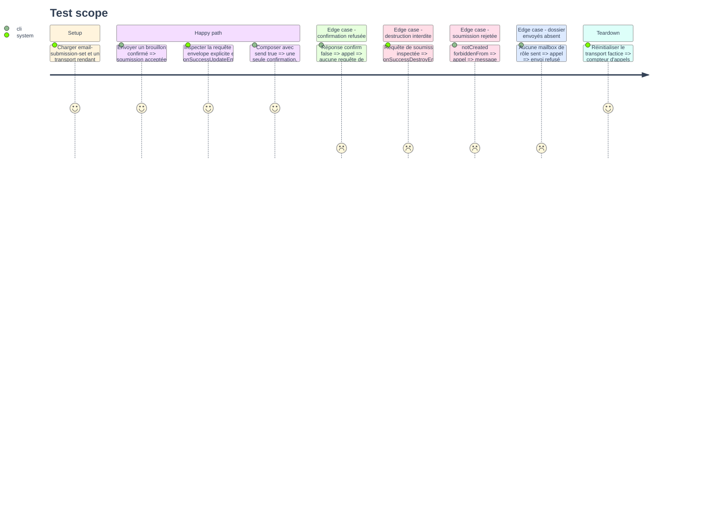

# Instruction: `mail_send` et l'envoi d'un trait

## Architecture projection

> Tree of the final files. ✅ create · ✏️ modify · ❌ delete

```txt
.
├── src
│   ├── domains
│   │   └── mail
│   │       ├── compose.ts                  ✏️ argument send, classes draft et send
│   │       ├── send.ts                     ✅ outil mail_send, classe send
│   │       └── index.ts                    ✏️ mail_send rejoint le manifeste d'envoi
│   └── jmap
│       └── errors.ts                       ✏️ traduction des SetError de soumission
└── tests
    ├── contract
    │   └── send-never-destroys.test.ts     ✅ onSuccessDestroyEmail jamais émis
    ├── fixtures
    │   ├── client.ts                       ✏️ réponse Email/set implicite
    │   └── email-submission-set.json       ✅ soumission acceptée
    └── unit
        └── mail-send.test.ts               ✅ enveloppe, déplacement, erreurs
```

## User Journey

Le diagramme suit un envoi, de la confirmation demandée au message rangé dans les envoyés.



## Test Scope



## Tasks to do

### `1)` Écrire `mail_send`

> Envoyer un brouillon déjà relu, jamais en composer un.

1. Créer `src/domains/mail/send.ts` avec `defineTool`, `classes: ["send"]`, `classify` constant.
2. Entrée : `emailId` obligatoire, `identityId` optionnel.
3. Lire `from`, `to`, `cc`, `bcc`, `subject`, `mailboxIds` du message par `Email/get`.
4. Refuser un message qui n'est pas dans les brouillons, plutôt que de réexpédier un reçu.
5. Écrire `summarize` pour que la confirmation cite l'expéditeur, les destinataires et le sujet.
6. Ajouter `mailSend` aux `tools` du manifeste d'envoi.

### `2)` Poser une enveloppe explicite

> Laisser le serveur déduire l'enveloppe revient à ne pas savoir qui reçoit.

1. Appeler `EmailSubmission/set` avec un `create` portant `identityId`, `emailId` et `envelope`.
2. Poser `envelope.mailFrom` sur l'adresse de l'identité retenue, sans `parameters`.
3. Poser `envelope.rcptTo` sur l'union de `to`, `cc` et `bcc`, dédoublonnée.
4. Ne poser ni `sendAt`, ni `undoStatus` : la RFC les réserve au serveur.
5. Réserver `parameters` à un futur envoi différé, hors de cette tranche.

### `3)` Déplacer le brouillon vers les envoyés

> Le message est déplacé, jamais détruit : c'est la trace de ce qui est parti.

1. Résoudre les mailbox de rôle `drafts` et `sent`, et refuser avant soumission si `sent` manque.
2. Poser `onSuccessUpdateEmail` avec `mailboxIds/<drafts>: null`, `mailboxIds/<sent>: true`, `keywords/$draft: null`.
3. Ne jamais émettre `onSuccessDestroyEmail`, quelle que soit l'entrée.
4. Attendre une réponse `Email/set` implicite après celle de la soumission, imposée par la RFC.
5. Rendre l'identifiant de soumission, le sujet, et la liste des destinataires effectifs.

### `4)` Rédiger et envoyer d'un trait

> Un argument fait basculer la rédaction en envoi, sans quatrième outil.

1. Dans `src/domains/mail/compose.ts`, ajouter `send` en booléen optionnel, faux par défaut.
2. Passer `classes` à `["draft", "send"]` et `classify` à la lecture de cet argument.
3. Quand `send` vaut vrai, enchaîner création puis soumission dans une même requête JMAP.
4. Référencer le brouillon créé par `#<creationId>` dans `emailId` de la soumission.
5. N'émettre qu'une seule demande de confirmation, la garde classant l'appel une seule fois.
6. Vérifier que `summarize` cite bien l'envoi et pas seulement la rédaction, sur cette branche.

### `5)` Fixtures, contrat et tests

> Le transport factice ne sait pas encore rendre plus de réponses que d'appels.

1. Étendre `fakeTransport` dans `tests/fixtures/client.ts` pour porter des réponses supplémentaires.
2. Écrire `tests/fixtures/email-submission-set.json` avec un `created` et un cas `notCreated`.
3. Écrire `tests/contract/send-never-destroys.test.ts` : inspecter le corps émis, exiger l'absence de `onSuccessDestroyEmail`.
4. Y couvrir les deux chemins, `mail_send` et `mail_compose` avec `send` à vrai.
5. Écrire `tests/unit/mail-send.test.ts` : enveloppe, patch de déplacement, refus, `SetError`.
6. Traduire dans `src/jmap/errors.ts` les types `forbiddenFrom`, `forbiddenToSend`, `tooManyRecipients`.

## Test acceptance criteria

| Task | Acceptance criteria                                                                            |
| ---- | ------------------------------------------------------------------------------------------------ |
| 1    | Un appel sur un message hors brouillons est refusé, en citant le dossier où il se trouve           |
| 2    | La requête émise porte une `envelope` dont `rcptTo` couvre `to`, `cc` et `bcc` sans doublon         |
| 3    | Après envoi, le message n'est plus dans les brouillons et reste lisible dans les envoyés           |
| 4    | `send` à vrai déclenche exactement une confirmation et produit le même état qu'en deux gestes      |
| 5    | `pnpm test` passe, et le test de contrat échoue si `onSuccessDestroyEmail` apparaît dans le corps  |
