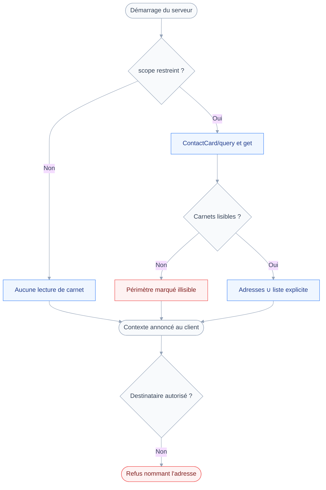
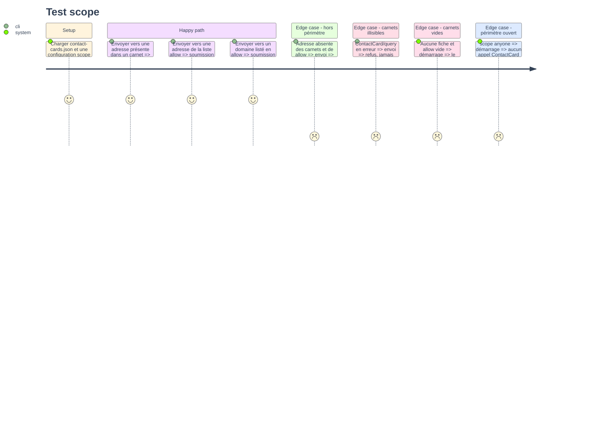

# Instruction: Périmètre des destinataires

## Architecture projection

> Tree of the final files. ✅ create · ✏️ modify · ❌ delete

```txt
.
├── README.md                            ✏️ réglage recipients documenté
├── aidd_docs
│   ├── ROADMAP.md                       ✏️ module 3 livré, budget à six outils
│   └── memory/*.md                      ✏️ architecture, codebase-map, testing
├── src
│   ├── config
│   │   ├── load.ts                      ✏️ variables d'environnement du périmètre
│   │   ├── recipients.ts                ✅ checkRecipients, fonction pure
│   │   └── schema.ts                    ✏️ recipients, scope et allow
│   ├── jmap/types/contacts.ts           ✅ AddressBook et ContactCard, lecture seule
│   ├── registry
│   │   ├── compose.ts                   ✏️ le périmètre entre dans le contexte d'outil
│   │   ├── define-tool.ts               ✏️ ToolContext porte le périmètre résolu
│   │   └── instructions.ts              ✏️ phrase annonçant le périmètre
│   └── server.ts                        ✏️ résolution des carnets au démarrage
└── tests
    ├── contract/recipient-scope.test.ts ✅ hors périmètre, aucune émission
    ├── fixtures/contact-cards.json      ✅ deux fiches, trois adresses
    └── unit/recipients.test.ts          ✅ carnets, liste explicite, domaines
```

## User Journey

Le diagramme montre où le périmètre se résout, et où il refuse.



## Test Scope



## Tasks to do

### `1)` Régler le périmètre par la configuration

> Ouvert à l'installation, restreint sur décision : personne ne paie une lecture qu'il n'a pas demandée.

1. Dans `src/config/schema.ts`, ajouter `recipients` avec `scope` en `"anyone" | "contacts"`, défaut `"anyone"`.
2. Ajouter `allow` en tableau de chaînes, défaut vide, acceptant une adresse ou un `@domaine`.
3. Valider chaque entrée d'`allow` : une adresse contient un `@` non initial, un domaine commence par `@`.
4. Dans `src/config/load.ts`, lire `JMAP_RECIPIENT_SCOPE` et `JMAP_RECIPIENT_ALLOW`, cette dernière séparée par virgules.
5. Documenter le réglage dans la section Configuration du `README.md`, avec les deux valeurs de `scope`.

### `2)` Résoudre les adresses autorisées au démarrage

> Une seule lecture, au lancement, et seulement quand le périmètre est restreint.

1. Créer `src/jmap/types/contacts.ts` avec `AddressBook` et `ContactCard`, en lecture seule.
2. Dans `src/server.ts`, quand `scope` vaut `"contacts"`, appeler `ContactCard/query` puis `ContactCard/get` avec `properties: ["emails"]`.
3. Extraire l'`address` de chaque entrée de la map `emails`, propriété obligatoire de JSContact.
4. Paginer sur `maxObjectsInGet`, et poser un plafond dur au-delà duquel le périmètre devient illisible.
5. Rendre un état à trois valeurs : résolu, vide, illisible. Une erreur ne rend jamais un ensemble vide.
6. Ne jamais appeler les contacts quand `scope` vaut `"anyone"`, ni quand la capacité `contacts` manque.

### `3)` Décider par une fonction pure

> La décision se teste sans serveur, sans réseau, sans session.

1. Créer `src/config/recipients.ts` avec `checkRecipients(addresses, scope): Result`.
2. Comparer en minuscules, sur l'adresse seule, jamais sur le nom d'affichage.
3. Autoriser une adresse présente dans les carnets, ou dans `allow`, ou dont le domaine y figure.
4. Refuser dès qu'une adresse de la liste échoue, et nommer celle qui échoue.
5. Refuser tout quand l'état est illisible : l'échec est fermé, sans exception ni contournement.
6. Ne prévoir aucun argument, aucune variable, aucun réglage permettant de passer outre.

### `4)` Refuser dans la garde et annoncer dans le contexte

> L'utilisateur apprend la restriction à l'ouverture, pas en essayant d'écrire.

1. Ajouter le périmètre résolu à `ToolContext` dans `src/registry/define-tool.ts`.
2. Le transmettre depuis `compose` dans `src/registry/compose.ts`, à côté du client et de la session.
3. Appeler `checkRecipients` dans `mail_compose` et `mail_send`, avant toute requête d'écriture.
4. Placer le contrôle avant la demande de confirmation : ne pas faire confirmer un envoi voué au refus.
5. Dans `src/registry/instructions.ts`, ajouter une phrase quand le périmètre est restreint, vide ou illisible.
6. Laisser `scopeSentence` inchangé : il bascule déjà hors de la promesse de lecture seule.

### `5)` Tests et remise à jour de la mémoire

> Le dépôt décrit encore six domaines vides et une surface en lecture seule.

1. Écrire `tests/fixtures/contact-cards.json` avec deux fiches et trois adresses distinctes.
2. Écrire `tests/unit/recipients.test.ts` sur les carnets, `allow`, le domaine, la casse, l'état illisible.
3. Écrire `tests/contract/recipient-scope.test.ts` : hors périmètre, `run` n'est jamais atteint.
4. Mettre `aidd_docs/memory/codebase-map.md` au réel : les domaines ne sont plus des manifestes vides.
5. Recenser dans `aidd_docs/memory/testing.md` les trois contrats d'envoi ajoutés par cette tranche.
6. Inscrire dans `aidd_docs/memory/architecture.md` la garde d'élicitation et le périmètre des destinataires.
7. Marquer le module 3 livré dans `aidd_docs/ROADMAP.md`, budget porté à six outils sur vingt-six.

## Test acceptance criteria

| Task | Acceptance criteria                                                                              |
| ---- | -------------------------------------------------------------------------------------------------- |
| 1    | Une configuration sans clé `recipients` démarre avec un périmètre ouvert et aucun appel de contacts  |
| 2    | Un périmètre restreint sur des carnets illisibles rend un état d'erreur, jamais un ensemble vide     |
| 3    | Une adresse hors périmètre produit un refus qui la cite, et aucun réglage ne permet de l'outrepasser |
| 4    | À l'ouverture, un périmètre restreint aux carnets vides est signalé dans le contexte du client       |
| 5    | `pnpm test`, `pnpm typecheck` et `pnpm lint` passent, et la mémoire projet décrit la surface réelle  |
