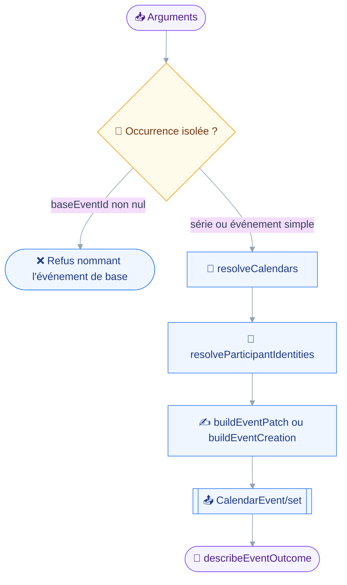
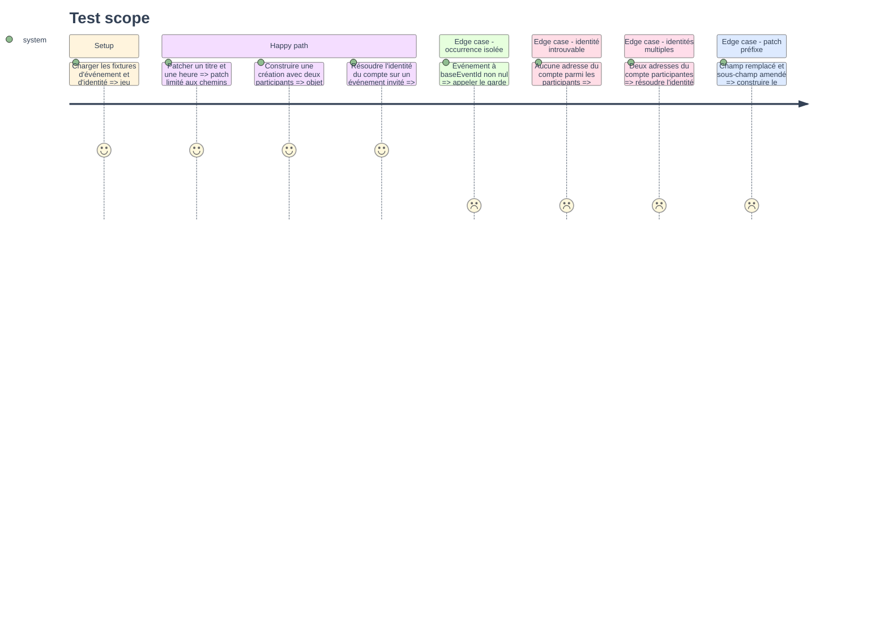

# Instruction — Socle d'écriture des agendas

Phase sans outil exposé.
Elle pose les types d'écriture, ouvre la politique au contexte d'outil, et rassemble dans `edit.ts` ce que les trois outils des phases suivantes partageront.

## 🗂️ Architecture projection

> Arbre des fichiers en fin de phase. ✅ créer · ✏️ modifier · ❌ supprimer

```txt
.
├── src
│   ├── domains
│   │   └── calendar
│   │       └── edit.ts                          ✅
│   ├── jmap
│   │   └── types
│   │       └── calendars.ts                     ✏️
│   └── registry
│       ├── compose.ts                           ✏️
│       └── define-tool.ts                       ✏️
└── tests
    ├── fixtures
    │   ├── calendar-event-set.json              ✅
    │   ├── calendar-event-writable.json         ✅
    │   ├── client.ts                            ✏️
    │   └── participant-identity-get.json        ✅
    └── unit
        └── calendar-edit.test.ts                ✅
```

## 🚶 User Journey

Le parcours interne qu'un appel d'écriture suivra, une fois les trois outils posés.



## 🧪 Test Scope



## 📝 Tasks to do

### `1)` Types d'écriture des agendas

> Décrire ce que `CalendarEvent/set` et `ParticipantIdentity/get` acceptent, sans toucher aux types de lecture.

1. Ajouter `CalendarEventSetArguments` : `accountId`, `create`, `update`, `destroy`, `sendSchedulingMessages`, ce dernier requis dans le type et non optionnel.
2. Ajouter les propriétés d'écriture manquantes sur `CalendarEvent` : `start`, `duration`, `timeZone`, `showWithoutTime`, `status`, `freeBusyStatus`, `organizerCalendarAddress`, `baseEventId`, `isDraft`.
3. Compléter `CalendarParticipant` des champs d'écriture : `calendarAddress`, `sendTo`, `expectReply`, `participationStatus`, `participationComment`, `roles`, `kind`.
4. Ajouter `ParticipantIdentity`, `ParticipantIdentityGetArguments` et le type `EventPatch = Record<string, unknown>`.
5. Étendre le commentaire de tête du fichier des deux règles qui portent l'écriture : `sendSchedulingMessages` toujours écrit, `utcStart` jamais combiné à `start`.

### `2)` La politique dans le contexte d'outil

> Donner au `precheck` de quoi refuser une suppression qui expédie, sur une configuration qui refuse d'expédier.

1. Ajouter `policy: WritePolicy` au `ToolContext` de `src/registry/define-tool.ts`, en lecture seule.
2. Le renseigner dans `compose.ts`, qui tient déjà la politique résolue.
3. Compléter `fakeTransport` de `tests/fixtures/client.ts` pour qu'il fournisse `DEFAULT_POLICY` par défaut et accepte une politique explicite.

### `3)` Le module partagé d'écriture

> Rassembler dans `src/domains/calendar/edit.ts` ce que les trois outils répéteraient.

1. `buildEventPatch` : un `PatchObject` sur les seuls chemins nommés, refusant un patch préfixe d'un autre, comme `refusePrefixCollision` le fait pour les contacts.
2. `buildEventCreation` : l'objet complet, seul cas d'écriture entière, `isDraft` jamais posé.
3. `buildParticipants` : une adresse devient un participant `calendarAddress` en `mailto:`, `expectReply` à vrai, `participationStatus` à `needs-action`.
4. `resolveCalendars` : `Calendar/get` mis en cache par `context.once`, sur le patron de `resolveBooks`.
5. `resolveParticipantIdentities` : `ParticipantIdentity/get` à `ids: null`, mis en cache, et `matchingParticipantKey` qui replie `mailto:` et la casse avant de comparer.
6. `refuseIsolatedOccurrence` : un `baseEventId` non nul refuse l'écriture en nommant l'événement de base, l'occurrence isolée étant hors périmètre du module.
7. `describeEventOutcome` et `describeEventSetError` : le rendu par identifiant, réussite et refus séparés.
8. `CALENDAR_EVENTS` : le `BatchSubject` que `refuseOversizedBatch` consomme.

### `4)` Fixtures et couverture unitaire

> Prouver les fonctions pures sans serveur.

1. `calendar-event-writable.json` : un événement simple, un événement récurrent, un événement invité, une occurrence isolée à `baseEventId` renseigné.
2. `participant-identity-get.json` : deux identités du compte, une par défaut.
3. `calendar-event-set.json` : une réponse mêlant `created`, `updated`, `notUpdated` et `notDestroyed`.
4. `tests/unit/calendar-edit.test.ts` : patch, création, participants, identités, occurrence isolée, rendu des refus.

## ✅ Test acceptance criteria

| Tâche | Critère d'acceptation |
| --- | --- |
| 1 | Un `CalendarEvent/set` construit sans `sendSchedulingMessages` ne compile pas |
| 2 | Un outil lit `context.policy` sans que le domaine ait à recharger la configuration |
| 3.1 | Corriger l'heure d'un événement ne produit aucun chemin de patch touchant les participants, la description ou la récurrence |
| 3.1 | Un patch remplaçant `participants` et amendant `participants/xyz/roles` dans le même appel est refusé avant toute requête |
| 3.2 | Une création ne porte jamais `isDraft` |
| 3.5 | Une adresse du compte écrite `Bryan@Example.COM` reconnaît le participant `mailto:bryan@example.com` |
| 3.5 | Zéro identité correspondante, ou deux, refuse au lieu de choisir |
| 3.6 | Un identifiant d'occurrence isolée est refusé en nommant son événement de base, aucune méthode n'étant émise |
| 3.7 | Une réponse mêlant réussites et refus rend les deux par identifiant, sans succès global |
