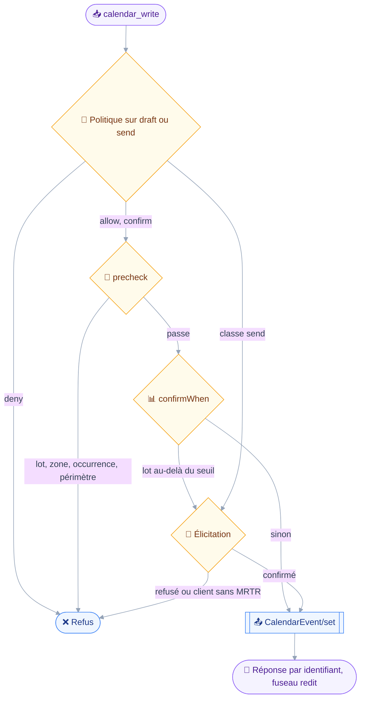
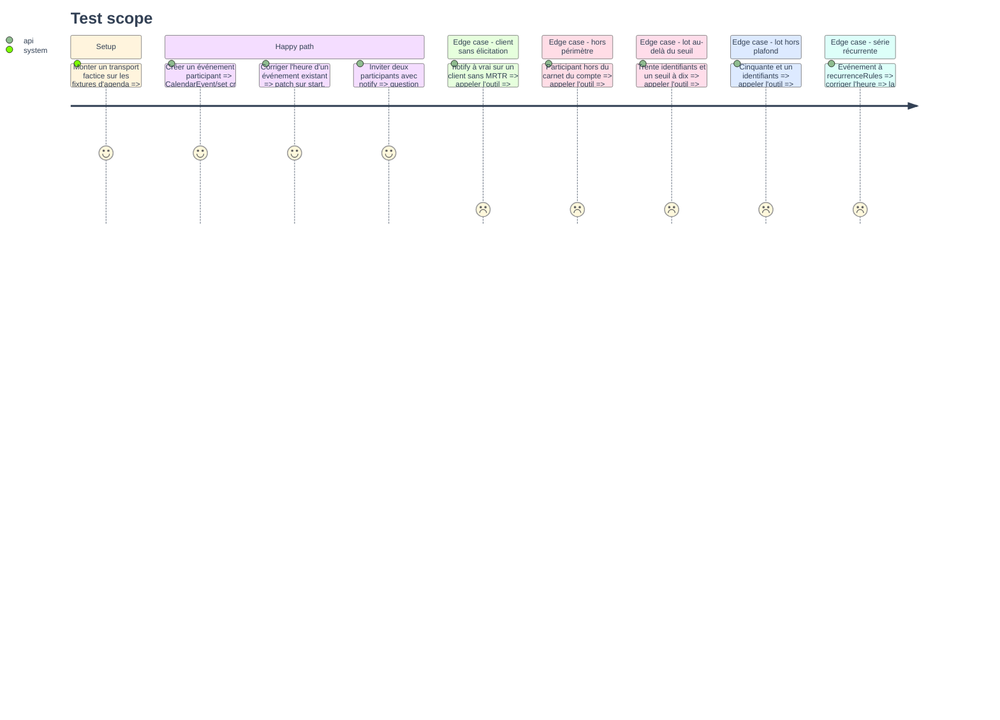

# Instruction — calendar_write

Créer un événement ou en corriger un, avec ou sans invitation.
Un seul argument, `notify`, décide si l'appel reste local ou expédie : c'est lui que `classify` lit, et rien d'autre.

## 🗂️ Architecture projection

> Arbre des fichiers en fin de phase. ✅ créer · ✏️ modifier · ❌ supprimer

```txt
.
├── src
│   └── domains
│       ├── calendar
│       │   ├── index.ts                         ✏️
│       │   └── write.ts                         ✅
│       └── index.ts                             ✏️
└── tests
    ├── contract
    │   └── calendar-write-guard.test.ts         ✅
    └── unit
        └── calendar-write.test.ts               ✅
```

## 🚶 User Journey



## 🧪 Test Scope



## 📝 Tasks to do

### `1)` Schéma et classification

> La classe se lit sur les arguments, jamais sur la méthode.

1. Écrire le schéma : `eventIds` optionnel, `calendarId`, `title`, `description`, `start`, `duration`, `timeZone`, `allDay`, `location`, `status`, `freeBusyStatus`, `participantsAdd`, `participantsRemove`, `notify` par défaut à faux.
2. Déclarer `classes: ["draft", "send"]` et `classify: (input) => (input.notify === true ? "send" : "draft")`.
3. Décrire dans le texte de l'outil ce que le module ne fait pas : pas d'occurrence isolée, pas de gestion d'agenda, pas d'écriture chez un tiers.
4. Nommer le fuseau attendu dans la description de `timeZone` : identifiant IANA, jamais un décalage.

### `2)` Les refus qui précèdent la question

> `precheck` refuse tout ce qu'une confirmation ne rattraperait pas.

1. Plafond de lot par `refuseOversizedBatch(input.eventIds, CALENDAR_EVENTS)`.
2. Fuseau inconnu ou borne mal formée, par `isValidTimeZone` et `normalizeBound`, avant toute requête.
3. Création incomplète : sans `eventIds`, exiger `title`, `start` et l'une des deux bornes de durée.
4. Champs individuels étalés sur un lot : `title`, `start` et `duration` sont refusés au-delà d'un identifiant, seuls `status`, `freeBusyStatus` et les listes de participants ont un sens collectif.
5. Occurrence isolée : lire les événements visés et refuser par `refuseIsolatedOccurrence`.
6. Périmètre des destinataires sur `participantsAdd`, que `notify` soit vrai ou faux, par `checkRecipients`.

### `3)` Escalade de lot et résumé

> Le volume pose une question que la classe n'exige pas.

1. `confirmWhen` rend une raison quand le nombre d'identifiants dépasse `context.bulkConfirmAbove`, sans changer la classe.
2. `summarize` nomme jusqu'à cinq événements, l'heure écrite avec son fuseau, et, quand `notify` est vrai, les destinataires et leur nombre.
3. Sur une série récurrente, le résumé dit que le geste porte sur toute la série.

### `4)` Exécution

> Écrire, puis dire ce qui a été demandé, jamais ce que le serveur a expédié.

1. Lire les événements sur `EVENT_WRITE_PROPERTIES`, jamais `utcStart` ni `utcEnd`.
2. Construire patch ou création par `edit.ts`, refaire le contrôle de périmètre sur les participants réellement écrits.
3. Émettre un `CalendarEvent/set` portant `sendSchedulingMessages` explicitement, égal à `notify`.
4. Rendre la réponse par identifiant, en redisant le fuseau, et sans écrire qu'une invitation est partie : trois conditions serveur peuvent l'avaler en silence.

### `5)` Manifeste et contrat

> La lecture reste prouvablement pure, l'écriture est gardée.

1. Créer `calendarWritingDomain` dans `src/domains/calendar/index.ts`, sur `[CAPABILITY_CALENDARS]`, et l'enregistrer dans `src/domains/index.ts`.
2. Écrire `tests/contract/calendar-write-guard.test.ts` qui parcourt le manifeste : classes déclarées, refus sans élicitation, plafond de lot, périmètre avant confirmation, `sendSchedulingMessages` présent sur chaque `CalendarEvent/set` émis.
3. Vérifier le gating : sans la capacité agendas, le manifeste d'écriture n'enregistre rien et le rapport de composition la nomme.
4. Valider le contrat par mutation : retirer `sendSchedulingMessages` de l'appel doit le faire tomber au rouge.

## ✅ Test acceptance criteria

| Tâche | Critère d'acceptation |
| --- | --- |
| 1 | Une écriture sans `notify` classe `draft` et ne pose aucune question d'envoi |
| 1 | Une écriture avec `notify` classe `send` et se fait toujours confirmer |
| 2.1 | Cinquante et un identifiants sont refusés sans question ni requête |
| 2.4 | Une suppression de créneau étalée sur trente événements est refusée si elle nomme une heure unique |
| 2.5 | Un identifiant d'occurrence isolée est refusé en nommant son événement de base |
| 2.6 | Un participant hors périmètre fait refuser avant que la confirmation soit posée |
| 3.1 | Au-delà du seuil, la question est posée et la classe reste `draft` |
| 3.2 | La question nomme les destinataires et leur nombre |
| 3.3 | Corriger une série récurrente dit explicitement que le geste porte sur toute la série |
| 4.1 | Une correction d'heure ne perd ni les participants, ni la description, ni la récurrence |
| 4.3 | Tout `CalendarEvent/set` émis porte `sendSchedulingMessages`, y compris quand il vaut faux |
| 4.4 | La réponse redit le fuseau dans lequel l'heure a été comprise, et ne dit jamais qu'une invitation est partie |
| 5.2 | Sur un client sans élicitation, une écriture avec `notify` refuse et n'émet aucune méthode |
| 5.3 | Sans la capacité agendas, aucun outil du module n'est exposé |
