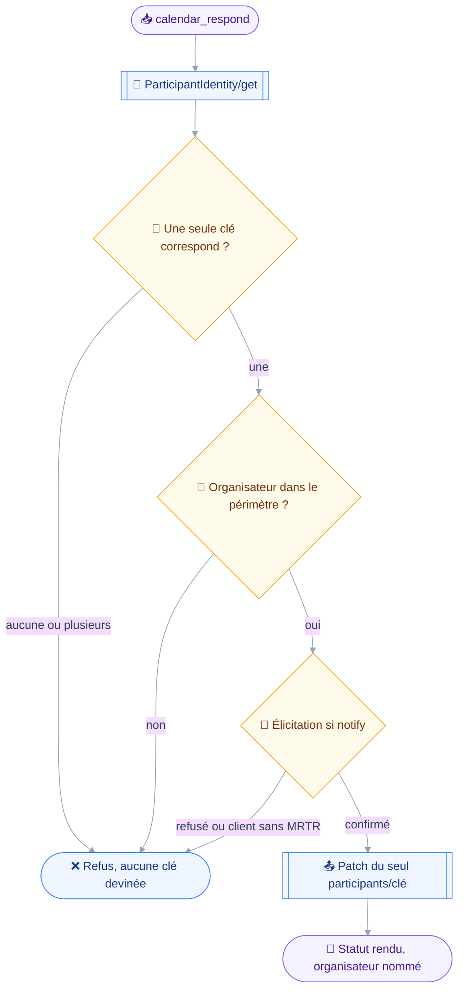
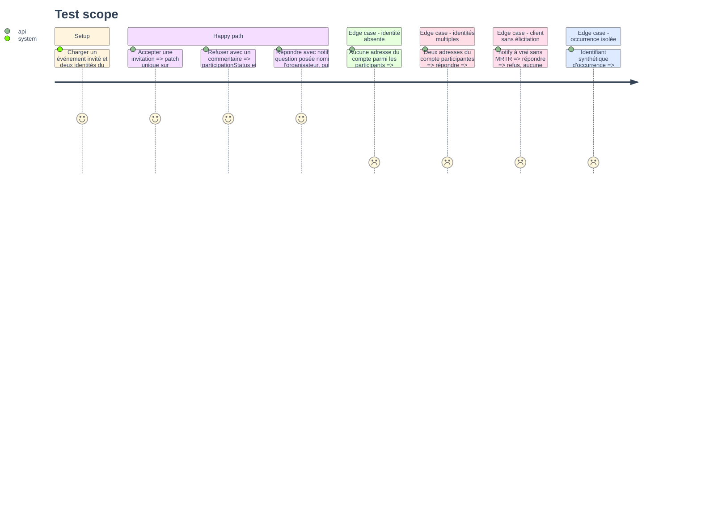

# Instruction — calendar_respond

Accepter, refuser ou marquer comme provisoire une invitation reçue.
L'outil n'écrit qu'un chemin de patch, sous la clé du participant que le compte occupe : c'est cette contrainte, pas une validation, qui garantit qu'aucun autre statut ne bouge.

## 🗂️ Architecture projection

> Arbre des fichiers en fin de phase. ✅ créer · ✏️ modifier · ❌ supprimer

```txt
.
├── src
│   └── domains
│       └── calendar
│           ├── index.ts                         ✏️
│           └── respond.ts                       ✅
└── tests
    ├── contract
    │   └── calendar-write-guard.test.ts         ✏️
    └── unit
        └── calendar-respond.test.ts             ✅
```

## 🚶 User Journey



## 🧪 Test Scope



## 📝 Tasks to do

### `1)` Schéma et classification

> Un RSVP qui ne remonte pas à l'organisateur ne répond à rien : `notify` vaut vrai par défaut, et la classe le suit.

1. Schéma : `eventIds` non vide, `status` parmi `accepted`, `declined`, `tentative`, `comment` optionnel, `notify` par défaut à vrai.
2. `classes: ["draft", "send"]`, `classify: (input) => (input.notify === false ? "draft" : "send")`.
3. Décrire dans le texte de l'outil ce que la réponse touche : le seul statut du compte, jamais celui d'un autre participant.

### `2)` Résolution de l'identité du compte

> La clé du participant ne se devine pas, elle se prouve.

1. Lire les identités par `resolveParticipantIdentities`, mises en cache pour l'invocation.
2. Rapprocher par `matchingParticipantKey`, en repliant le préfixe `mailto:` et la casse.
3. Refuser en nommant le problème quand aucune identité ne correspond, et quand plusieurs correspondent.
4. Refuser une occurrence isolée par `refuseIsolatedOccurrence` avant toute écriture.

### `3)` Périmètre et confirmation

> Une réponse est un mail expédié : la même règle vaut.

1. `precheck` sort tôt quand `context.recipients.kind` vaut `anyone`, sur le patron de `mail_send`.
2. Sinon, contrôler l'adresse de l'organisateur par `checkRecipients`, une lecture en échec ne devenant pas un refus.
3. Plafond de lot par `refuseOversizedBatch`, et escalade par `confirmWhen` au-delà du seuil.
4. `summarize` nomme l'événement, le statut visé, l'organisateur prévenu, et dit si la réponse part.

### `4)` Écriture du seul statut

> Un patch, un chemin.

1. Construire `participants/{clé}/participationStatus`, et `participants/{clé}/participationComment` quand un commentaire est donné.
2. Émettre `CalendarEvent/set` avec `sendSchedulingMessages` égal à `notify`, toujours écrit.
3. Rendre le résultat par identifiant, en redisant le statut posé et l'organisateur visé.

### `5)` Contrat

> L'invariant du module 8 le plus facile à casser sans s'en apercevoir.

1. Étendre `calendar-write-guard.test.ts` : tout chemin de patch émis par `calendar_respond` commence par `participants/` suivi de la clé du compte, et par rien d'autre.
2. Vérifier qu'aucun patch ne touche `participants` en entier, ce qui écraserait les autres invités.
3. Valider par mutation : rapprocher sur la première clé au lieu de l'identité doit faire tomber le contrat.

## ✅ Test acceptance criteria

| Tâche | Critère d'acceptation |
| --- | --- |
| 1.1 | Répondre sans `notify` reste local et ne pose pas de question d'envoi |
| 1.2 | Répondre avec le défaut classe `send` et se fait confirmer |
| 2.3 | Zéro identité correspondante refuse ; deux identités correspondantes refusent en les nommant |
| 2.4 | Un identifiant d'occurrence isolée est refusé en nommant l'événement de base |
| 3.2 | Un organisateur hors périmètre fait refuser avant la question |
| 4.1 | Le statut d'un autre participant est inchangé après l'appel |
| 4.2 | Tout `CalendarEvent/set` émis porte `sendSchedulingMessages` |
| 4.3 | Un refus serveur par identifiant est rendu tel quel, sans succès global |
| 5.1 | Aucun chemin de patch émis ne sort de `participants/{clé du compte}/` |
