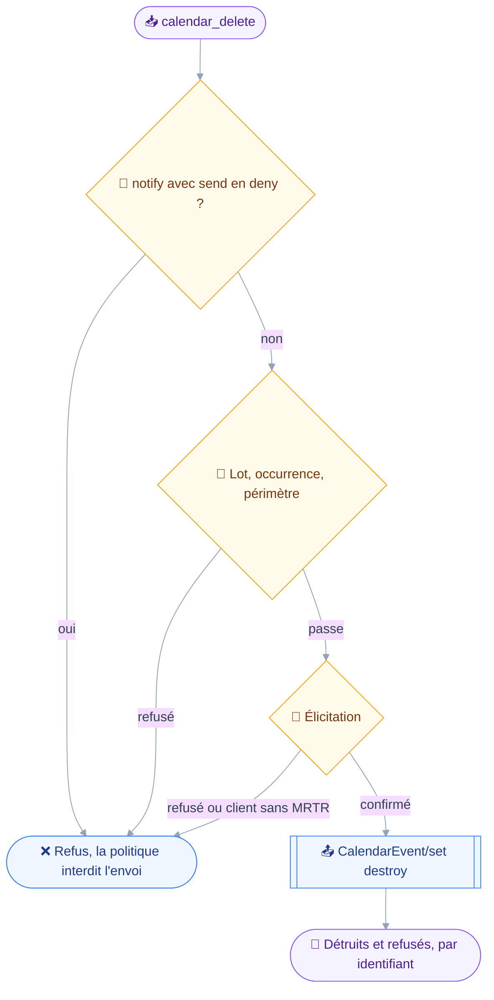
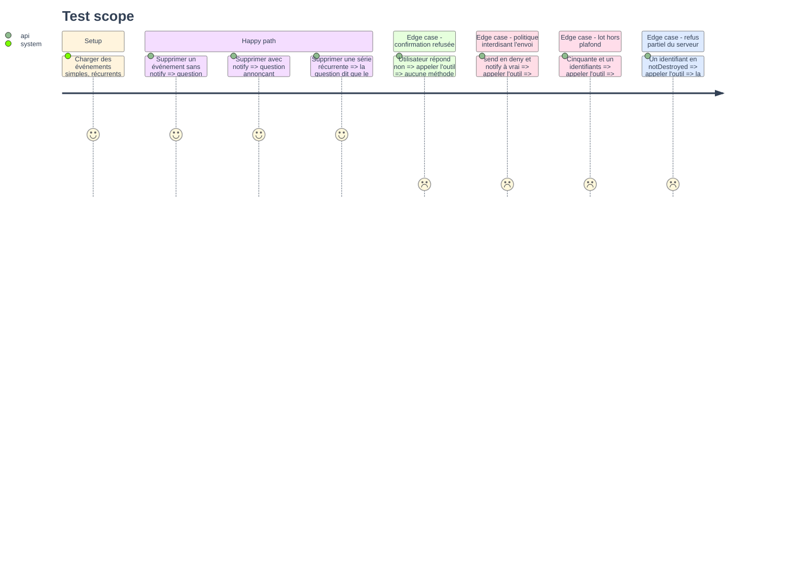

# Instruction — calendar_delete

Annuler un événement, en silence par défaut, ou en prévenant les participants sur demande.
C'est le premier appel du projet dont la classe est `destroy` alors que son effet de bord est un envoi : la politique doit être en main avant d'agir.

## 🗂️ Architecture projection

> Arbre des fichiers en fin de phase. ✅ créer · ✏️ modifier · ❌ supprimer

```txt
.
├── README.md                                    ✏️
├── aidd_docs
│   └── memory
│       ├── architecture.md                      ✏️
│       ├── codebase-map.md                      ✏️
│       └── testing.md                           ✏️
├── src
│   └── domains
│       └── calendar
│           ├── delete.ts                        ✅
│           └── index.ts                         ✏️
└── tests
    ├── contract
    │   └── calendar-write-guard.test.ts         ✏️
    └── unit
        └── calendar-delete.test.ts              ✅
```

## 🚶 User Journey



## 🧪 Test Scope



## 📝 Tasks to do

### `1)` Schéma et classe

> Le silence est le défaut : prévenir est un geste demandé.

1. Schéma : `ids` non vide, `notify` par défaut à faux.
2. `classes: ["destroy"]`, `classify` rendant toujours `destroy` : une annulation notifiée reste une destruction, `notify` n'en change que la portée.
3. Décrire dans le texte de l'outil que la suppression porte sur la série entière, et que l'occurrence isolée est hors périmètre.

### `2)` Le trou de politique que ce module ouvre

> Une classe `destroy` ne doit pas expédier un mail qu'une politique refuse.

1. Dans `precheck`, refuser un appel où `notify` vaut vrai alors que `context.policy.send` vaut `deny`, en nommant la clé de configuration en cause.
2. Contrôler le périmètre des destinataires sur les participants quand `notify` vaut vrai, une lecture en échec ne devenant pas un refus.
3. Plafond de lot par `refuseOversizedBatch`, et refus d'une occurrence isolée par `refuseIsolatedOccurrence`.

### `3)` Une question qui dit ce qu'elle engage

> Le critère 4 du PRD : annoncer l'annulation avant, jamais après.

1. `summarize` lit les événements visés et nomme jusqu'à cinq titres avec leur date dans le fuseau résolu.
2. Il annonce si une annulation part, et à combien de participants.
3. Il dit qu'un événement récurrent est supprimé en entier, série comprise.
4. Une lecture en échec dégrade vers un décompte, jamais vers un refus, sur le patron de `contacts_delete`.

### `4)` Exécution

> Détruire, et rendre compte identifiant par identifiant.

1. Émettre `CalendarEvent/set` avec `destroy` et `sendSchedulingMessages` égal à `notify`, toujours écrit.
2. Rendre `destroyed` et `notDestroyed` séparément, chaque refus portant son identifiant et sa cause.
3. Ne jamais écrire qu'une annulation est partie : le serveur peut l'avaler sans erreur.

### `5)` Durcissement du contrat

> Ce que le contrat des contacts a appris : une table de branches destructrices ne reste honnête que si elle est vérifiée.

1. Étendre `calendar-write-guard.test.ts` d'une table d'arguments atteignant la branche destructrice de chaque outil qui déclare `destroy`.
2. Ajouter le test d'exhaustivité : un outil déclarant `destroy` sans figurer dans la table fait tomber le contrat.
3. Vérifier qu'aucun outil du module n'émet jamais `Calendar/set` : la gestion d'agenda est hors périmètre, et rien ne doit y toucher par accident.
4. Vérifier qu'une destruction non confirmée n'émet aucune méthode.

### `6)` Mise à jour de la mémoire projet

> Trois documents décrivent un état que cette tranche change.

1. `codebase-map.md` : le manifeste `calendarWritingDomain`, ses trois outils, le rôle de `edit.ts`, et le compte d'outils porté à 21.
2. `architecture.md` : `policy` dans le contexte d'outil, `sendSchedulingMessages` écrit systématiquement, l'occurrence isolée refusée côté client, et l'asymétrie entre un `set` réussi et un mail réellement expédié.
3. `testing.md` : le nouveau contrat et le compte de tests, après exécution réelle de `pnpm test`.
4. `README.md` : les trois outils dans la table, avec la classe lue sur `notify` et l'écart assumé sur l'occurrence isolée.

## ✅ Test acceptance criteria

| Tâche | Critère d'acceptation |
| --- | --- |
| 1.1 | Une suppression sans `notify` n'expédie aucune annulation |
| 2.1 | `notify` à vrai sous une politique `send: deny` est refusé avant toute question |
| 2.2 | Un participant hors périmètre fait refuser une suppression notifiante |
| 2.3 | Cinquante et un identifiants sont refusés sans question ni requête |
| 3.2 | La question dit, avant confirmation, si une annulation part et à combien de participants |
| 3.3 | Supprimer un événement récurrent annonce que la série entière disparaît |
| 4.1 | Tout `CalendarEvent/set` émis porte `sendSchedulingMessages` |
| 4.2 | Un `notDestroyed` serveur est rendu par identifiant, jamais fondu dans un succès global |
| 5.3 | Aucun outil du module n'émet `Calendar/set` |
| 5.4 | Une confirmation refusée n'émet aucune méthode JMAP |
| 6.3 | `pnpm typecheck`, `pnpm lint`, `pnpm test` et `pnpm build` passent au vert |
