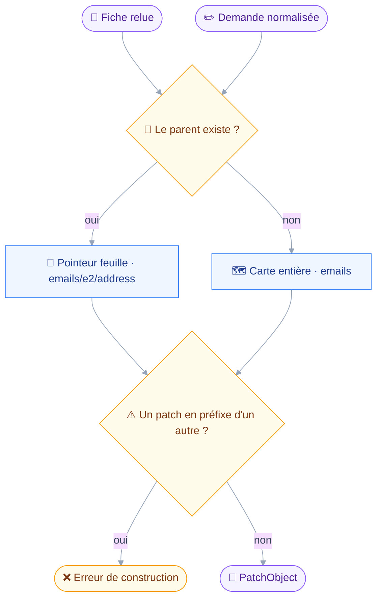
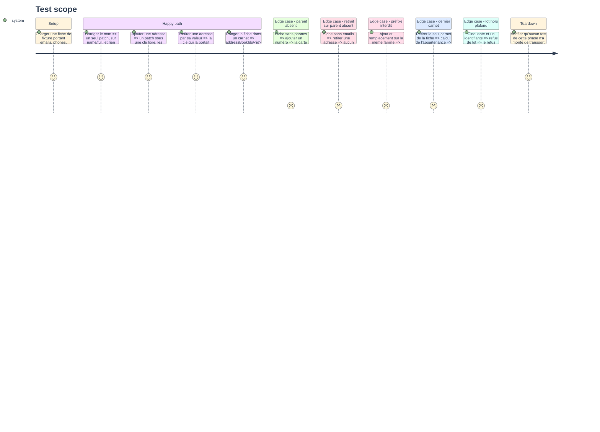

# Instruction: Types d'écriture, plafond partagé, constructeur de patch

## Architecture projection

> Tree of the final files. ✅ create · ✏️ modify · ❌ delete

```txt
.
├── src
│   ├── domains
│   │   ├── contacts
│   │   │   └── edit.ts                      ✅ patch, carnets, uid, issues, note de périmètre
│   │   └── mail
│   │       └── organize.ts                  ✏️ le refus mail s'écrit sur le plafond partagé
│   ├── jmap
│   │   └── types
│   │       └── contacts.ts                  ✏️ arguments des deux méthodes `/set`
│   └── shared
│       └── batch.ts                         ✅ plafond de lot et refus, hors du domaine mail
└── tests
    └── unit
        ├── batch.test.ts                    ✅ plafond, liste vide, mot du refus
        └── contacts-edit.test.ts            ✅ patch, clés fraîches, retraits, carnets, membres
```

## User Journey

Le diagramme suit une demande de correction, de la fiche lue au `PatchObject` émis.
Rien ici n'écrit ni ne lit le réseau : `buildPatch` est une fonction pure de la fiche et de la demande, comme `checkRecipients` l'est du périmètre et des adresses.



## Test Scope



## Tasks to do

### `1)` Hisser le plafond de lot hors du mail

> Une constante importée depuis `domains/mail` par les contacts serait une dépendance entre deux domaines qui ne se connaissent pas.

1. Créer `src/shared/batch.ts` et y déplacer `MAX_IDS_PER_CALL`, valeur 50, avec le commentaire qui explique ce qu'il protège : le serveur accepte 500 objets par `/set`, et c'est aussi le rayon maximal d'un appel erroné.
2. Y écrire `refuseOversizedBatch(ids, { noun, plural, discoveredBy })`, rendant le même texte que la version mail mais paramétré par le nom d'objet et l'outil qui distribue les identifiants.
3. Dans `src/domains/mail/organize.ts`, réexporter `MAX_IDS_PER_CALL` et écrire `refuseOversizedBatch` par-dessus la version partagée, avec `noun: "message"` et `discoveredBy: "mail_search"`.
4. Vérifier que le texte rendu pour le mail est inchangé au mot près : `tests/contract/bulk-confirmation.test.ts` asserte sur `batches of ${MAX_IDS_PER_CALL}`.

### `2)` Déclarer les arguments d'écriture JMAP

> Le fichier de types ne portait que la tranche lecture ; il porte maintenant ce que les trois outils émettent, et rien de plus.

1. Dans `src/jmap/types/contacts.ts`, ajouter `ContactCardSetArguments` : `accountId`, `create`, `update`, `destroy`.
2. Typer `update` comme une carte d'identifiant vers `PatchObject`, soit `Record<string, unknown>` sous un alias nommé, jamais comme un `Partial<ContactCard>` — un patch n'est pas un objet partiel, ses clés sont des pointeurs.
3. Ajouter `AddressBookSetArguments` avec `onDestroyRemoveContents`, déclaré obligatoire dans le type et non optionnel, pour que l'omettre ne compile pas.
4. Documenter en tête du fichier que `members` est clé par `uid`, jamais par identifiant JMAP, et que `addressBookIds` ne peut jamais devenir vide.

### `3)` Écrire le constructeur de patch

> C'est la pièce qui tient l'objectif le plus exigeant du PRD : ce qui n'est pas nommé n'est pas touché.

1. Créer `src/domains/contacts/edit.ts` et y déclarer `CardEdit`, la demande normalisée : `name`, `organization`, `title`, `nickname`, `note`, `kind`, `emails`, `phones`, `addressBooks`, `members`.
2. Écrire `buildPatch(card, edit)` rendant un `PatchObject` : pointeur feuille quand la carte parente existe sur la fiche, carte entière quand elle est absente, jamais les deux pour une même famille.
3. Traiter les champs simples par leur chemin JSContact : `name/full`, `organizations/<clé>/name`, `titles/<clé>/name`, `nicknames/<clé>/name`, `notes/<clé>/note`, `kind`.
4. Traiter `emails.add` et `phones.add` sous une clé libre calculée par `freshKey`, jamais sous une clé déjà prise ; un ajout n'écrase jamais une entrée.
5. Traiter `emails.remove` et `phones.remove` par la valeur : les clés dont l'adresse ou le numéro correspond, comparées repliées en minuscules, passent à `null`.
6. Traiter `addressBooks` et `members` par pointeur feuille, `addressBookIds/<id>` et `members/<uid>` à vrai ou à `null`.
7. Lever une erreur si deux patchs construits ont l'un pour préfixe de l'autre : la RFC 8620 l'interdit, et le serveur rendrait `invalidPatch` sur une requête qu'on savait mal formée.
8. Écrire `buildCreation(edit, bookIds)` rendant l'objet JSContact d'une création, avec `addressBookIds` toujours peuplé.
9. Écrire `resultingBooks(card, edit)` rendant l'ensemble des carnets après application : c'est ce que le `precheck` de la phase 2 lira pour refuser de laisser une fiche sans carnet.

### `4)` Poser les pièces d'écriture partagées

> Ce que les trois outils ont en commun vit ici, comme `organize.ts` porte ce que les quatre outils de rangement partagent.

1. Écrire `resolveBooks(context)` sur `context.once`, émettant `AddressBook/get` avec `ids: null` et les propriétés du carnet, y compris `isDefault`.
2. Écrire `defaultBook(books)` : le carnet marqué par défaut, sinon l'unique carnet du compte, sinon rien — la RFC n'en garantit pas un.
3. Écrire `resolveUids(context, cardIds)` émettant `ContactCard/get` sur `["id", "uid"]`, pour traduire des identifiants de membres en `uid`.
4. Écrire `describeCardOutcome(response, ids, done)` sur le patron de `describeUpdateOutcome` du mail : une ligne par identifiant, le mot du serveur sur chaque refus, et un titre qui ne réclame jamais un succès non accordé.
5. Écrire `outsidePerimeterNote(addresses, scope)` : la phrase que doit une adresse écrite hors du périmètre, disant que l'envoi restera refusé jusqu'au prochain démarrage, et `undefined` sous un scope `anyone`.
6. Bâtir cette dernière sur `isWithinScope`, jamais sur une comparaison recopiée : c'est déjà la règle de `card.ts`.

### `5)` Couvrir la phase

> Aucun de ces tests ne monte de transport : tout ce que la phase produit se juge sans serveur.

1. Écrire `tests/unit/batch.test.ts` : plafond franchi, liste vide, et le nom d'objet du domaine présent dans le refus.
2. Écrire `tests/unit/contacts-edit.test.ts` couvrant les huit cas du Test Scope.
3. Ajouter la fixture `tests/fixtures/contact-card-editable.json` : une fiche portant `emails`, `organizations` et `addressBookIds`, et une seconde sans `phones` ni `notes`.
4. Asserter sur les clés du patch, pas seulement sur ses valeurs : c'est la forme du pointeur qui décide si le serveur écrase ou corrige.

## Test acceptance criteria

| Task | Acceptance criteria                                                                                                    |
| ---- | -------------------------------------------------------------------------------------------------------------------------- |
| 1    | `pnpm test` passe sans modification des tests mail existants, et aucun fichier de `domains/contacts` n'importe `domains/mail` |
| 2    | `pnpm typecheck` refuse un `AddressBook/set` construit sans `onDestroyRemoveContents`                                        |
| 3    | Corriger un nom sur une fiche de dix champs produit un patch d'une seule clé, et les neuf autres champs n'y figurent pas     |
| 4    | Un compte sans carnet par défaut et à plusieurs carnets rend `undefined`, jamais un carnet choisi au hasard                  |
| 5    | Les huit cas du Test Scope passent, et aucun test de la phase n'appelle `fakeTransport`                                     |
