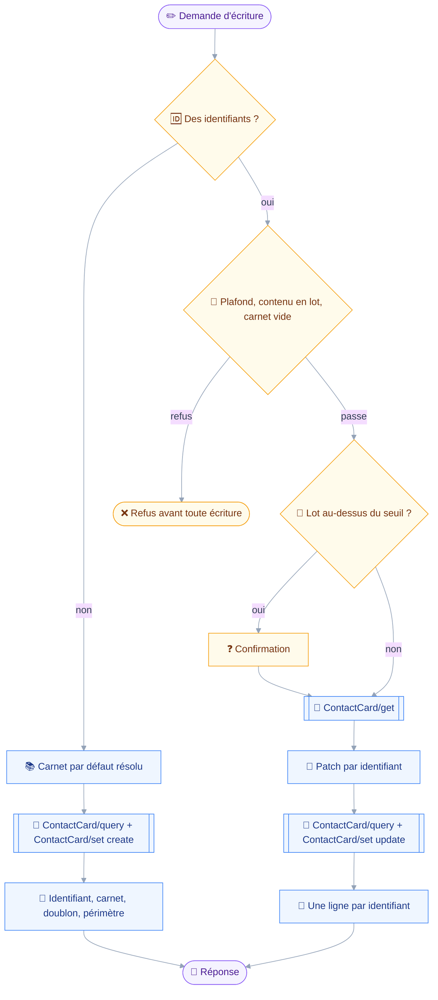
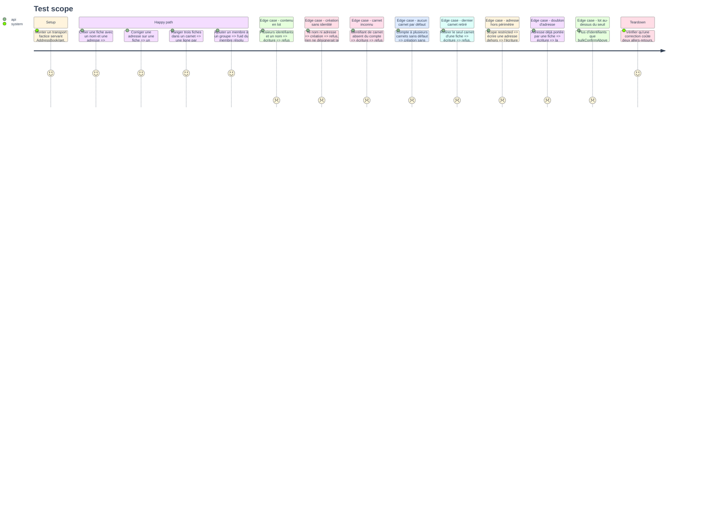

# Instruction: `contacts_write`

## Architecture projection

> Tree of the final files. ✅ create · ✏️ modify · ❌ delete

```txt
.
├── src
│   ├── domains
│   │   ├── contacts
│   │   │   ├── write.ts                     ✅ créer une fiche, la corriger, la ranger, ses membres
│   │   │   └── index.ts                     ✏️ second manifeste, `contactsWritingDomain`
│   │   └── index.ts                         ✏️ le manifeste d'écriture entre dans `ALL_DOMAINS`
└── tests
    ├── fixtures
    │   └── contact-card-set.json            ✅ réponses `created`, `updated`, refus partiel
    └── unit
        └── contacts-write.test.ts           ✅ création, correction, rangement, lot, doublon
```

## User Journey

Le diagramme suit une correction de fiche, de la demande au rendu.
La branche création ne relit rien : il n'y a pas encore de fiche dont les champs pourraient être perdus.



## Test Scope



## Tasks to do

### `1)` Poser l'outil et son schéma

> Un même outil crée et corrige, parce que la différence tient à la présence d'identifiants et à rien d'autre.

1. Créer `src/domains/contacts/write.ts` sur le patron de `src/domains/mail/move.ts` pour le lot et de `folder-manage.ts` pour les refus nommés.
2. Déclarer `cardIds`, tableau optionnel : absent, l'appel crée une fiche ; présent, il corrige les fiches nommées.
3. Déclarer les champs de contenu : `name`, `organization`, `title`, `nickname`, `note`, `kind`.
4. Déclarer `emails` et `phones` en `{ add, remove }`, en décrivant dans le schéma que `remove` prend la valeur à retirer, jamais une clé interne.
5. Déclarer `addressBooks` en `{ set, add, remove }` et `members` en `{ add, remove }`, ce dernier prenant des identifiants de fiches.
6. Écrire dans la description que l'outil ne prend aucun critère de recherche et renvoie vers `contacts_search`, et qu'un ajout n'écrase jamais une coordonnée existante.
7. Classer : `classes: ["draft"]`, `classify` rendant `draft` quels que soient les arguments — rien ici ne détruit ni n'envoie.

### `2)` Refuser avant de demander

> Le `precheck` porte tout ce qui rend l'appel vain, pour qu'aucune question ne soit posée sur une écriture condamnée.

1. Refuser un lot hors plafond avec `refuseOversizedBatch` de `src/shared/batch.ts`, en `noun: "contact card"` et `discoveredBy: "contacts_search"`.
2. Refuser un champ de contenu accompagné de plusieurs identifiants, en nommant les champs fautifs : écrire la même adresse sur trente fiches n'est pas un geste de lot.
3. Refuser une création sans nom ni adresse : rien ne désignerait la fiche créée, et `displayName` retomberait sur `(unnamed)`.
4. Refuser un identifiant de carnet absent du compte, lu par `resolveBooks`, en nommant le carnet et en renvoyant vers la légende de `contacts_search`.
5. Refuser une création sans carnet quand `defaultBook` ne rend rien, en listant les carnets du compte à choisir.
6. Refuser une correction qui viderait `addressBookIds`, `resultingBooks` rendant l'ensemble vide : une fiche appartient toujours à un carnet.
7. Refuser `members` sur une fiche dont le `kind` lu n'est pas `group`, en renvoyant vers le champ `kind` du même outil.

### `3)` Écrire, et dire ce que l'écriture a changé

> Deux allers-retours au plus : relire ce qu'on va patcher, puis écrire.

1. Sur la branche création, appeler `buildCreation` avec le carnet résolu, et émettre `ContactCard/set` sous une clé de création fixe.
2. Sur la branche correction, relire les fiches par `ContactCard/get` sur les propriétés que le patch touche, en passant par `context.once` pour que `summarize` et `run` ne la paient pas deux fois.
3. Résoudre les `members` par `resolveUids` avant de construire le patch : la clé de `members` est un `uid`.
4. Émettre dans une même requête `ContactCard/query` filtré sur chaque adresse écrite, puis `ContactCard/set` : la requête voit l'état d'avant l'écriture, et ne coûte pas d'aller-retour.
5. Rendre la création par son identifiant et le nom du carnet où elle a atterri, jamais par un simple « fait ».
6. Rendre la correction par `describeCardOutcome`, une ligne par identifiant, avec le mot du serveur sur chaque refus.
7. Ajouter la note de doublon quand la requête a trouvé une fiche portant l'adresse écrite, sans jamais bloquer.
8. Ajouter `outsidePerimeterNote` quand une adresse écrite tombe hors du périmètre.

### `4)` Confirmer le lot, exposer l'outil

> La classe dit ce que l'appel fait, jamais combien il en fait : le volume passe par `confirmWhen`.

1. Écrire `confirmWhen` rendant sa raison au-delà de `context.bulkConfirmAbove` identifiants, en nommant le nombre et le seuil.
2. Écrire `summarize` nommant les fiches visées, lues par `context.once`, et dégradant sur le compte si la lecture échoue — le patron de `mail_delete`.
3. Dans `src/domains/contacts/index.ts`, créer `contactsWritingDomain` sur `CAPABILITY_CONTACTS`, avec `contactsWrite` pour seul outil.
4. Dans `src/domains/index.ts`, ajouter `contactsWritingDomain` à `ALL_DOMAINS`, après `contactsDomain`.
5. Laisser `contactsDomain` intact : c'est ce qui garde le contrat de lecture seule vrai.

### `5)` Couvrir l'outil

> Les onze cas du Test Scope, plus la forme des requêtes émises.

1. Écrire `tests/unit/contacts-write.test.ts` couvrant les onze cas.
2. Ajouter `tests/fixtures/contact-card-set.json` avec trois réponses : une création, une mise à jour, et un lot dont un identifiant est dans `notUpdated`.
3. Asserter sur les arguments émis, pas seulement sur le texte rendu : les clés du patch décident si le serveur corrige ou écrase.
4. Asserter qu'aucun appel émis ne porte `destroy`, quel que soit l'argument passé.

## Test acceptance criteria

| Task | Acceptance criteria                                                                                                       |
| ---- | ----------------------------------------------------------------------------------------------------------------------------- |
| 1    | Un appel sans `cardIds` crée, un appel avec en corrige, et aucune clé de recherche n'existe dans le schéma                     |
| 2    | Les sept refus tombent avant toute méthode JMAP, et chacun nomme ce qui manque plutôt qu'un code d'erreur                      |
| 3    | Créer une fiche rend son identifiant et le nom du carnet ; une correction de trois fiches coûte exactement deux allers-retours |
| 4    | Un lot au-dessus du seuil rend une demande de confirmation, et `classify` continue de rendre `draft`                          |
| 5    | `pnpm test` passe, et une correction de nom n'émet qu'un seul chemin dans le `PatchObject`                                    |
