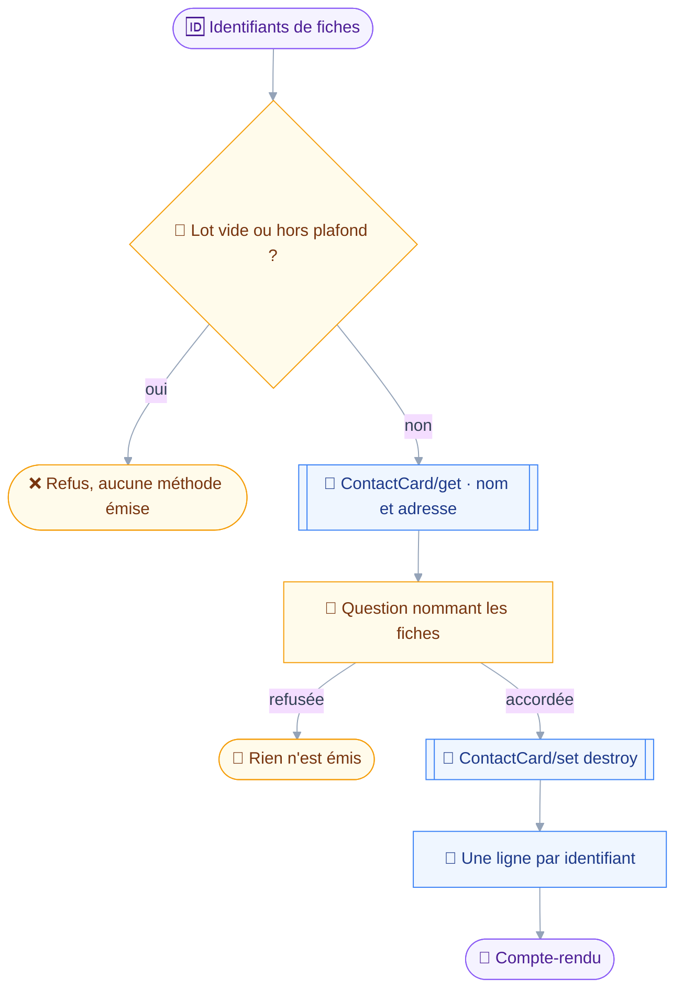
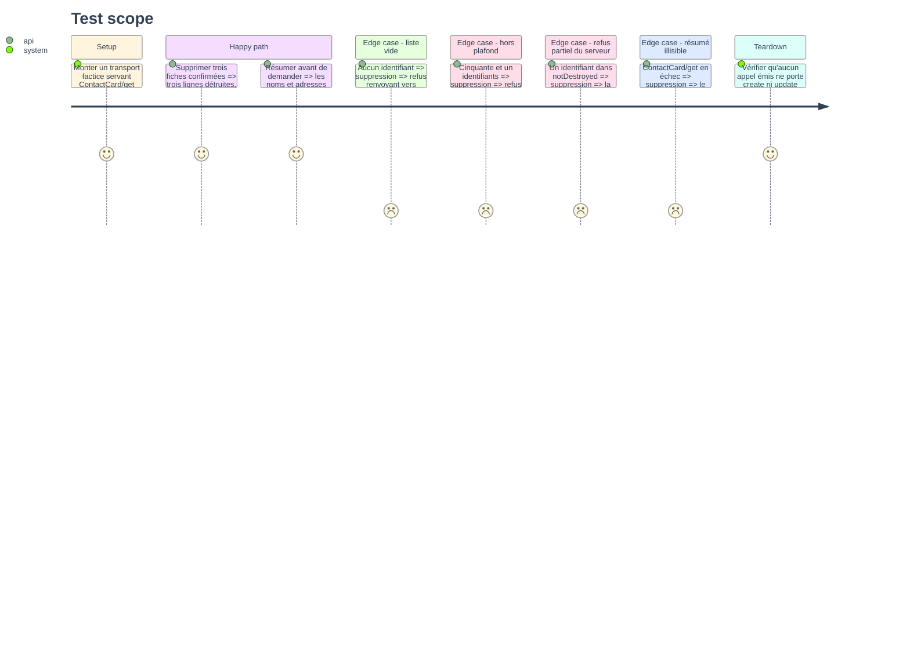

# Instruction: `contacts_delete`

## Architecture projection

> Tree of the final files. ✅ create · ✏️ modify · ❌ delete

```txt
.
├── src
│   └── domains
│       └── contacts
│           ├── delete.ts                    ✅ destruction de fiches, par identifiant
│           └── index.ts                     ✏️ le manifeste d'écriture expose son second outil
└── tests
    ├── fixtures
    │   └── contact-card-set.json            ✏️ une réponse `destroyed` et un refus partiel
    └── unit
        └── contacts-delete.test.ts          ✅ destruction, refus partiel, plafond, résumé
```

## User Journey

Le diagramme suit une suppression, de la liste d'identifiants au compte-rendu.
Il n'y a pas de branche réversible : les contacts n'ont pas de corbeille, donc l'outil n'a qu'un seul chemin et il passe toujours par la question.



## Test Scope



## Tasks to do

### `1)` Poser l'outil de destruction

> Aucune corbeille n'existe pour les contacts : il n'y a pas de branche douce à offrir, et la description doit le dire.

1. Créer `src/domains/contacts/delete.ts` sur le patron de `src/domains/mail/delete.ts`, branche `permanent` uniquement.
2. Déclarer `ids`, tableau d'identifiants de fiches, sans aucun critère de recherche.
3. Classer : `classes: ["destroy"]`, `classify` rendant `destroy` quels que soient les arguments.
4. Écrire dans la description que la destruction est définitive, qu'aucune corbeille ne la rattrape, et qu'un groupe qui comptait la fiche parmi ses membres garde son `uid` sans fiche derrière.
5. Renvoyer vers `contacts_search` pour obtenir les identifiants, comme le fait `contacts_read`.

### `2)` Refuser, résumer, détruire

> Le refus de lot passe avant la question ; le résumé la rend arbitrable.

1. Écrire `precheck` sur `refuseOversizedBatch`, en `noun: "contact card"` et `discoveredBy: "contacts_search"`, ce qui couvre la liste vide et le dépassement.
2. Écrire `summarize` lisant `ContactCard/get` sur `["id", "name", "emails"]` par `context.once`, et nommant les fiches par `displayName` et `primaryEmail`.
3. Dégrader le résumé sur le compte quand la lecture échoue : un incident de transport ne doit pas se transformer en verdict sur l'appel.
4. Émettre `ContactCard/set` avec `destroy` seul, jamais accompagné d'un `update` ni d'un `create`.
5. Rendre le compte-rendu par `describeCardOutcome` sur la moitié `notDestroyed` de la réponse.

### `3)` Exposer et couvrir

1. Ajouter `contactsDelete` à `contactsWritingDomain`, après `contactsWrite`.
2. Compléter `tests/fixtures/contact-card-set.json` d'une réponse `destroyed` et d'une réponse portant un `notDestroyed`.
3. Écrire `tests/unit/contacts-delete.test.ts` couvrant les six cas du Test Scope.
4. Asserter que la requête émise ne porte ni `create` ni `update`.

## Test acceptance criteria

| Task | Acceptance criteria                                                                                        |
| ---- | -------------------------------------------------------------------------------------------------------------- |
| 1    | `classify` rend `destroy` sur tout argument, et la description nomme l'absence de corbeille                     |
| 2    | Le résumé cite le nom et l'adresse des fiches ; une lecture en échec le fait retomber sur le compte sans refuser |
| 3    | `pnpm test` passe, et une suppression de trois fiches émet exactement un `ContactCard/set` ne portant qu'un `destroy` |
