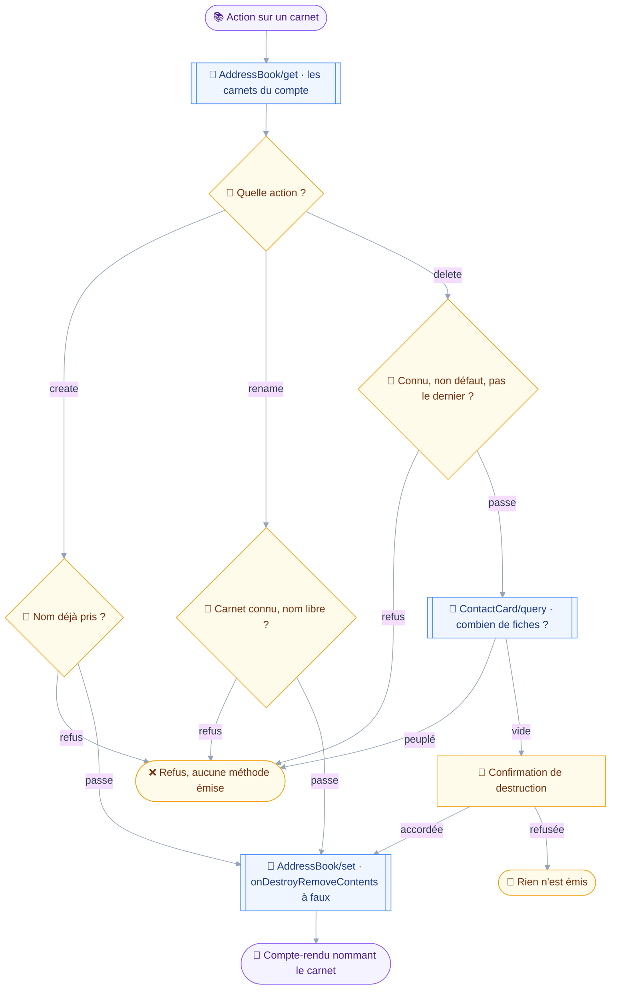
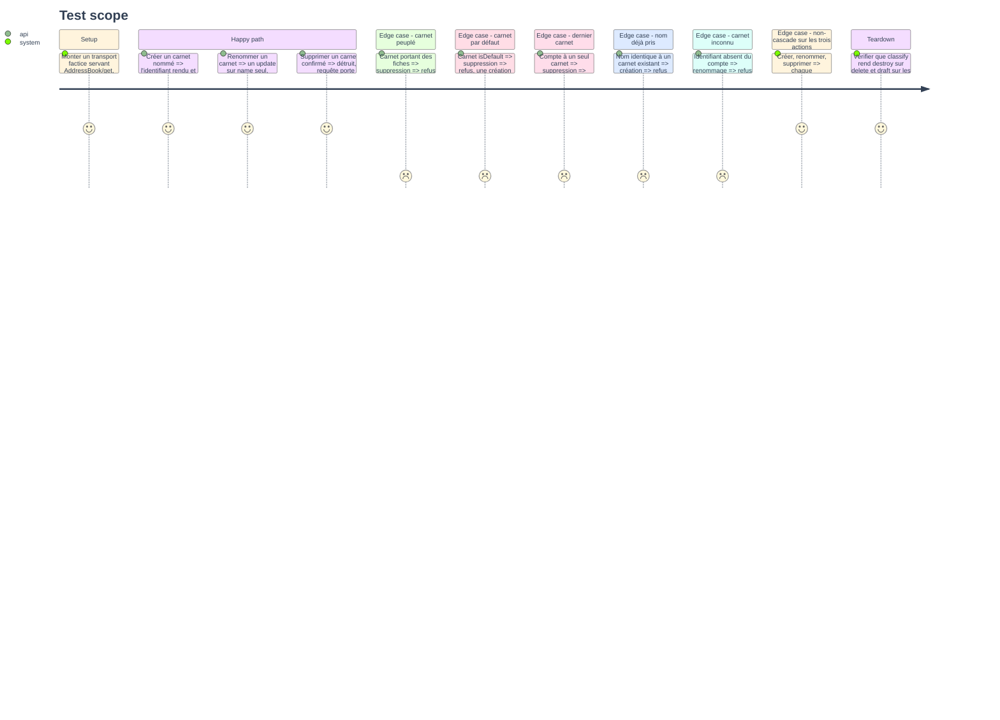

# Instruction: `contacts_book_manage`

## Architecture projection

> Tree of the final files. ✅ create · ✏️ modify · ❌ delete

```txt
.
├── src
│   └── domains
│       └── contacts
│           ├── book-manage.ts               ✅ créer, renommer, supprimer un carnet
│           └── index.ts                     ✏️ le manifeste d'écriture est complet
└── tests
    ├── fixtures
    │   └── address-book-set.json            ✅ réponses `created`, `updated`, `destroyed`
    └── unit
        └── contacts-book-manage.test.ts     ✅ trois actions, quatre refus, non-cascade
```

## User Journey

Le diagramme suit les trois actions du carnet.
La branche de suppression est la seule à changer de classe, et la seule à compter ce que le carnet contient avant de poser la question.



## Test Scope



## Tasks to do

### `1)` Poser l'outil sur le patron du mail

> `mail_folder_manage` a tranché cette forme au module 4 ; la reprendre évite d'inventer une seconde grammaire pour le même geste.

1. Créer `src/domains/contacts/book-manage.ts` sur le patron de `src/domains/mail/folder-manage.ts`.
2. Déclarer `action` en énumération `create | rename | delete`, avec `bookId` et `name` selon l'action.
3. Ne pas déclarer d'action `move` : les carnets d'adresses n'ont pas de hiérarchie, contrairement aux dossiers de mail.
4. Classer : `classes: ["draft", "destroy"]`, `classify` rendant `destroy` sur `delete` et `draft` sinon.
5. Écrire dans la description que supprimer un carnet ne supprime jamais les fiches qu'il porte, et qu'un carnet doit être vidé avant d'être supprimé.

### `2)` Poser la non-cascade sur chaque requête

> C'est l'invariant du module, et il ne se tient pas par le défaut du serveur.

1. Construire une base `AddressBookSetArguments` portant `onDestroyRemoveContents: false`, avec le commentaire disant qu'elle est énoncée sur toute requête, pas seulement sur celle qui détruit.
2. Étendre cette base pour les trois actions, jamais construire un `AddressBook/set` à côté d'elle.
3. Vérifier que le type de la phase 1 rend l'omission non compilable : c'est la deuxième barrière, la première étant le contrat de la phase 5.

### `3)` Refuser ce qui ne doit pas partir

> Cinq refus, tous dans `precheck`, tous avant la question de destruction.

1. Résoudre les carnets du compte par `resolveBooks` de `edit.ts`, et refuser un `bookId` absent en nommant l'identifiant.
2. Refuser une création ou un renommage dont le nom est déjà porté, sur le patron de `refuseDuplicateName` du mail, comparaison repliée en minuscules.
3. Refuser la suppression du carnet par défaut : une création sans carnet explicite n'aurait plus de destination.
4. Refuser la suppression du dernier carnet du compte : une fiche appartient toujours à au moins un carnet.
5. Refuser la suppression d'un carnet peuplé, le nombre de fiches venant d'un `ContactCard/query` filtré sur `inAddressBook` avec `calculateTotal` et `limit: 0`, et renvoyer vers `contacts_write` pour les déplacer.
6. Nommer le nombre de fiches dans ce dernier refus : `addressBookHasContents` rendu par le serveur ne dirait pas combien.

### `4)` Rendre, exposer, couvrir

1. Rendre chaque action par le nom du carnet touché, et la suppression par une ligne disant explicitement qu'aucune fiche n'a été supprimée.
2. Ajouter `contactsBookManage` à `contactsWritingDomain`, qui compte alors ses trois outils.
3. Ajouter `tests/fixtures/address-book-set.json` avec les réponses `created`, `updated` et `destroyed`.
4. Écrire `tests/unit/contacts-book-manage.test.ts` couvrant les neuf cas du Test Scope.
5. Asserter sur les arguments émis pour la non-cascade, sur les trois actions, et pas seulement sur la suppression.

## Test acceptance criteria

| Task | Acceptance criteria                                                                                     |
| ---- | ----------------------------------------------------------------------------------------------------------- |
| 1    | `classify` rend `destroy` sur `delete` et `draft` sur `create` et `rename`, et aucun `move` n'est déclaré     |
| 2    | Les trois actions émettent un `AddressBook/set` portant `onDestroyRemoveContents: false`                     |
| 3    | Les cinq refus tombent avant toute question de destruction, et le refus de carnet peuplé nomme le nombre de fiches |
| 4    | `pnpm test` passe, et la réponse d'une suppression dit qu'aucune fiche n'a été supprimée                      |
