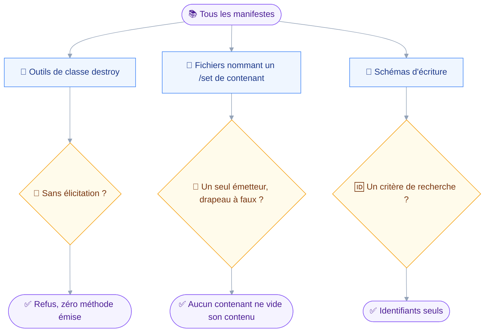
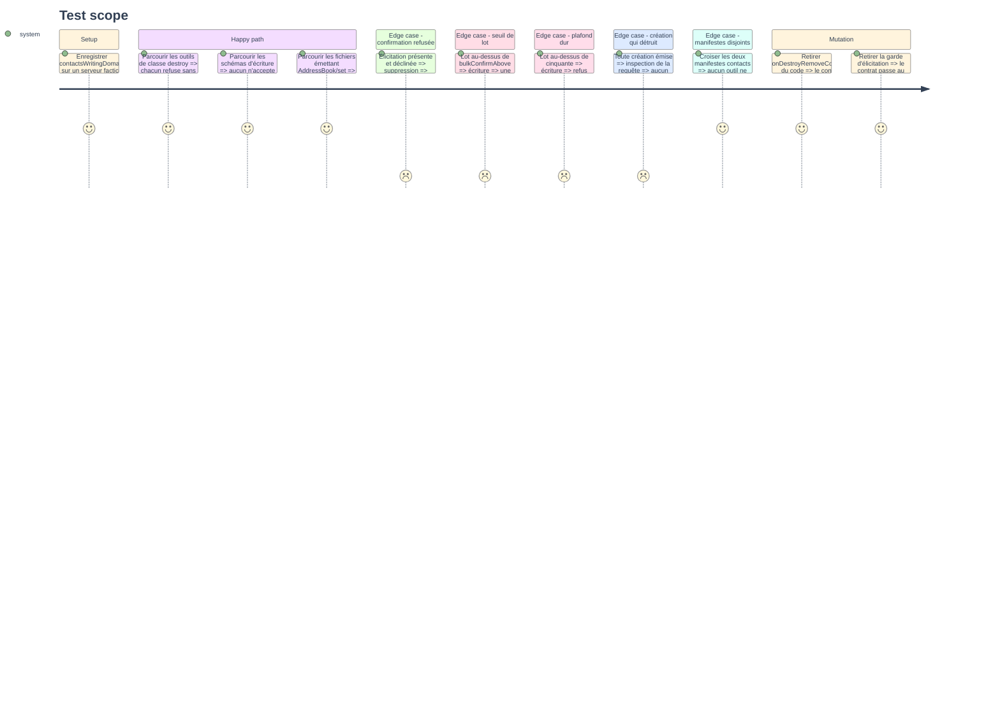

# Instruction: Contrats d'écriture et non-cascade

## Architecture projection

> Tree of the final files. ✅ create · ✏️ modify · ❌ delete

```txt
.
└── tests
    └── contract
        ├── contacts-write-guard.test.ts     ✅ confirmation, identifiants, lot, création sans destruction
        ├── contacts-read-only.test.ts       ✏️ les deux manifestes sont disjoints
        └── no-cascade-destroy.test.ts       ✏️ l'invariant couvre aussi `AddressBook/set`
```

## User Journey

Le diagramme suit ce qu'un contrat parcourt : non pas un appel d'utilisateur, mais la surface entière du serveur.
C'est ce qui le distingue d'un test unitaire, qui ne juge qu'un outil nommé à l'avance.



## Test Scope



## Tasks to do

### `1)` Étendre l'invariant de non-cascade au carnet

> Un contenant supprimé ne prend jamais son contenu : le mail le tient déjà, et l'invariant est le même mot pour mot.

1. Dans `tests/contract/no-cascade-destroy.test.ts`, généraliser `filesNamingMailboxSet` en une recherche paramétrée par le nom de la méthode.
2. Asserter que `AddressBook/set` n'est nommé que par `domains/contacts/book-manage.ts` : le jour où un second émetteur apparaît, le contrat tombe et force sa relecture.
3. Asserter que chacune des trois actions du carnet émet `onDestroyRemoveContents: false`, y compris `create` et `rename` qui ne détruisent rien.
4. Asserter qu'aucun argument d'entrée ne permet de faire monter le drapeau à vrai : le drapeau n'est pas dérivé de l'entrée, il est constant.
5. Garder les assertions existantes sur `Mailbox/set` intactes : le fichier tient désormais deux contenants, pas un remplacé par l'autre.

### `2)` Écrire le contrat d'écriture des contacts

> Cinq affirmations qu'aucun test unitaire ne peut tenir, parce qu'elles portent sur tous les outils du manifeste, y compris ceux qu'on ajoutera.

1. Créer `tests/contract/contacts-write-guard.test.ts`, parcourant `contactsWritingDomain.tools` plutôt qu'une liste écrite à la main.
2. Asserter que tout outil de classe `destroy` refuse sans élicitation, et qu'aucune méthode JMAP n'a été émise dans ce cas.
3. Asserter qu'une élicitation déclinée n'émet rien non plus : refuser n'est pas laisser passer.
4. Asserter qu'aucun schéma d'écriture ne porte de clé de recherche, sur le patron de `organizing-takes-ids.test.ts` du mail.
5. Asserter le couple du lot : au-dessus de `bulkConfirmAbove` une question est posée sans changement de classe, au-dessus du plafond dur l'appel est refusé avant toute question.
6. Asserter qu'aucune requête portant un `create` ne porte de `destroy`, sur le patron de `send-never-destroys.test.ts`.
7. Dériver les arguments minimaux du schéma de chaque outil, comme le fait `contacts-read-only.test.ts` : un outil ajouté au manifeste doit être couvert sans réécrire le contrat.

### `3)` Garder la lecture prouvablement en lecture seule

> L'ajout d'un manifeste d'écriture est exactement le moment où cette preuve peut se perdre en silence.

1. Dans `tests/contract/contacts-read-only.test.ts`, ajouter que `contactsDomain.tools` et `contactsWritingDomain.tools` sont disjoints par nom.
2. Vérifier que les assertions existantes portent bien sur `contactsDomain` seul et n'ont pas été élargies par mégarde aux deux manifestes.
3. Étendre le test de gating : sans la capacité contacts, aucun des deux manifestes n'enregistre d'outil.

### `4)` Valider les contrats par mutation

> Un contrat qui passe sans que la ligne qu'il garde existe ne garde rien.

1. Retirer `onDestroyRemoveContents` de `book-manage.ts`, lancer `pnpm test`, constater le rouge, remettre la ligne.
2. Faire exécuter `contacts_delete` sans élicitation, constater le rouge, remettre la garde.
3. Ajouter une clé de recherche à un schéma d'écriture, constater le rouge, la retirer.
4. Consigner les trois mutations vérifiées dans le compte-rendu de phase, jamais dans le code.

## Compte-rendu de phase

### 🧪 Mutations vérifiées

Chaque mutation a été appliquée, constatée au rouge, puis annulée.
Le vert final est celui de `pnpm test` sur les 442 tests des 37 fichiers.

| Mutation | Ligne retirée | Contrat tombé | Tests au rouge |
| --- | --- | --- | --- |
| 1 | `onDestroyRemoveContents: false` de `book-manage.ts` | `no-cascade-destroy.test.ts` | 2 |
| 2 | La classe `destroy` de `contacts_delete`, ramenée à `draft` | `contacts-write-guard.test.ts` | 4 |
| 3 | Une clé `text` ajoutée au schéma de `contacts_write` | `contacts-write-guard.test.ts` | 1 |

La mutation 1 tombe aussi au typage : `AddressBookSetArguments` rend le drapeau obligatoire, donc `pnpm typecheck` échoue avant même les tests.
C'est la double barrière voulue par la tâche 2 de la phase 4, et le contrat reste utile pour le jour où le type serait assoupli.

La mutation 2 fait tomber quatre tests, dont celui qui compte les outils destructeurs du manifeste.
C'est ce test qui tient le contrat honnête : il refuse qu'un outil quitte la table des cas sans que quelqu'un s'en aperçoive.

## Test acceptance criteria

| Task | Acceptance criteria                                                                                       |
| ---- | ------------------------------------------------------------------------------------------------------------- |
| 1    | `no-cascade-destroy.test.ts` couvre les deux contenants, et un second émetteur de `AddressBook/set` le fait tomber |
| 2    | Le contrat parcourt le manifeste et non une liste, et un outil d'écriture ajouté sans garde le fait tomber      |
| 3    | Les deux manifestes contacts sont disjoints, et `contactsDomain` reste sans aucune méthode hors `get` et `query` |
| 4    | Les trois mutations passent au rouge puis reviennent au vert, `pnpm test` finissant au vert                    |
