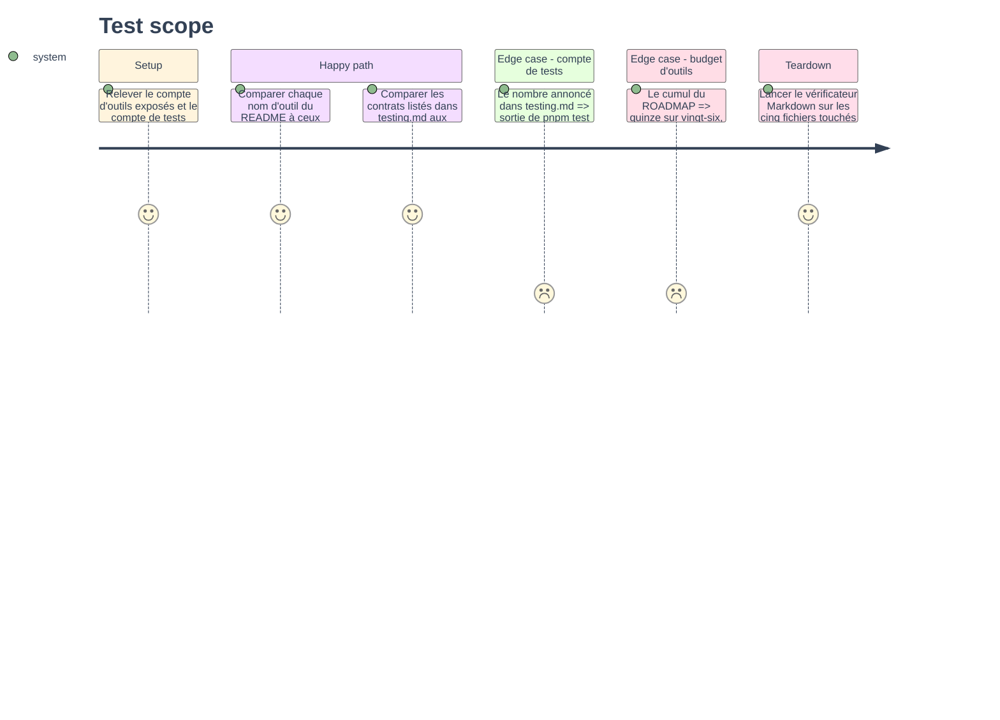

# Instruction: Documentation et mémoire projet

## Architecture projection

> Tree of the final files. ✅ create · ✏️ modify · ❌ delete

```txt
.
├── README.md                                ✏️ quinze outils, trois lignes de tableau
└── aidd_docs
    ├── ROADMAP.md                           ✏️ module 6 livré, budget d'outils rectifié
    └── memory
        ├── architecture.md                  ✏️ le patch, le périmètre élargi, la non-cascade
        ├── codebase-map.md                  ✏️ le manifeste d'écriture et ses fichiers
        └── testing.md                       ✏️ deux contrats de plus, compte de tests
```

## User Journey

Aucun diagramme ici : la phase ne décrit ni flux ni décision, elle réaligne cinq documents sur ce que les phases 1 à 5 ont livré.
Un tableau est plus dense qu'un dessin pour un inventaire.

| Document | Ce qui devient faux sans cette phase |
| --- | --- |
| `README.md` | Le compte d'outils et la surface annoncée à l'utilisateur |
| `ROADMAP.md` | L'état du module 6 et le budget des vingt-six outils |
| `codebase-map.md` | Le tableau des manifestes, qui ne connaît qu'un domaine contacts |
| `testing.md` | Le compte de tests et la liste des contrats |
| `architecture.md` | Les règles d'écriture, absentes puisque rien n'écrivait hors du mail |

## Test Scope



## Tasks to do

### `1)` Réaligner la surface annoncée

> Un README qui annonce douze outils quand le serveur en enregistre quinze est faux dès le premier démarrage.

1. Dans `README.md`, corriger le compte d'outils et la formule sur les domaines couverts.
2. Ajouter au tableau des outils les trois lignes `contacts_write`, `contacts_delete`, `contacts_book_manage`, avec leur classe d'opération.
3. Dire dans la ligne de `contacts_delete` qu'aucune corbeille ne rattrape une fiche supprimée.
4. Relire la section de configuration : le module n'ajoute aucune clé, elle ne doit pas bouger.

### `2)` Fermer le module dans la feuille de route

1. Dans `aidd_docs/ROADMAP.md`, passer le module 6 à livré et nommer ses trois outils.
2. Rectifier le tableau de budget : la tranche contacts passe de quatre outils à cinq, le cumul de douze à quinze sur vingt-six.
3. Inscrire l'arbitrage qui a coûté l'entrée : trois outils plutôt que deux, un carnet et une fiche ne partageant pas le même schéma.
4. Rappeler d'une ligne que le dépassement du budget se traite au module 9, pour qu'il ne se rejoue pas au module suivant.
5. Mettre à jour ce que le module 11 hérite : `shareWith` se patchera sur un `AddressBook` désormais gérable.

### `3)` Mettre la mémoire projet au niveau

> La mémoire est chargée à chaque session : une ligne fausse ici coûte plus qu'une ligne fausse ailleurs.

1. Dans `codebase-map.md`, ajouter `contactsWritingDomain` au tableau des manifestes, avec ses trois outils sur la capacité contacts.
2. Y mentionner `src/domains/contacts/edit.ts` comme le pendant écriture de `card.ts`, et `src/shared/batch.ts` comme le plafond que le mail et les contacts partagent désormais.
3. Corriger la note de tête, qui annonce deux outils de contacts en lecture seule.
4. Dans `testing.md`, ajouter les lignes de contrat de la phase 5 et rectifier le compte de tests et de fichiers, relevé sur la sortie de `pnpm test`.
5. Dans `architecture.md`, écrire la règle du patch : une écriture de fiche part en `PatchObject` sur les chemins nommés, parce qu'un objet complet effacerait ce que la lecture ne rend pas.
6. Y écrire aussi que le périmètre s'élargit sans effet avant le redémarrage, et que la non-cascade porte maintenant deux drapeaux, `onDestroyRemoveEmails` et `onDestroyRemoveContents`.
7. Ajouter au bloc des pièges que les clés de `members` sont des `uid`, jamais des identifiants JMAP : c'est le genre d'écart qui se paie une seconde fois.

### `4)` Vérifier plutôt qu'affirmer

1. Relever le compte d'outils depuis les manifestes, pas depuis le README qu'on vient d'écrire.
2. Relever le compte de tests depuis la sortie de `pnpm test`, pas depuis l'ancien chiffre incrémenté.
3. Passer le vérificateur Markdown sur les cinq fichiers touchés.
4. Passer le PRD source en statut livré, sa question ouverte sur le nombre d'outils étant tranchée.

## Test acceptance criteria

| Task | Acceptance criteria                                                                                  |
| ---- | -------------------------------------------------------------------------------------------------------- |
| 1    | Chaque nom d'outil du README existe dans un manifeste, et le compte annoncé égale le compte enregistré    |
| 2    | Le budget du ROADMAP annonce quinze sur vingt-six, et l'arbitrage à trois outils y est écrit               |
| 3    | Les manifestes, les fichiers partagés et les contrats listés en mémoire correspondent aux fichiers réels   |
| 4    | Le compte de tests de `testing.md` égale la sortie de `pnpm test`, et le vérificateur Markdown sort à zéro |
