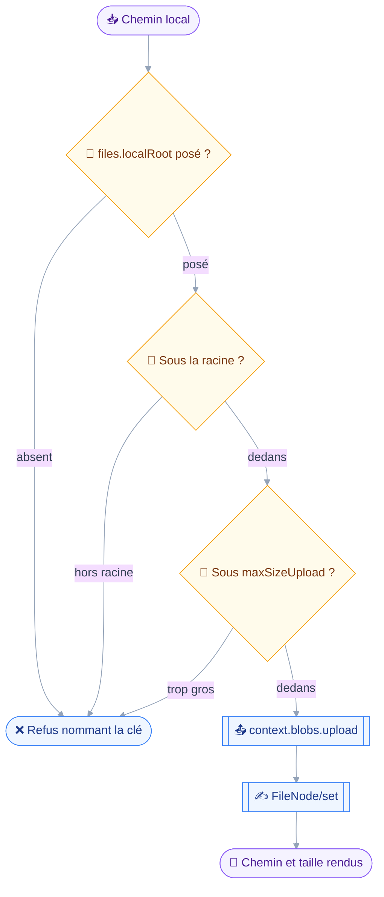
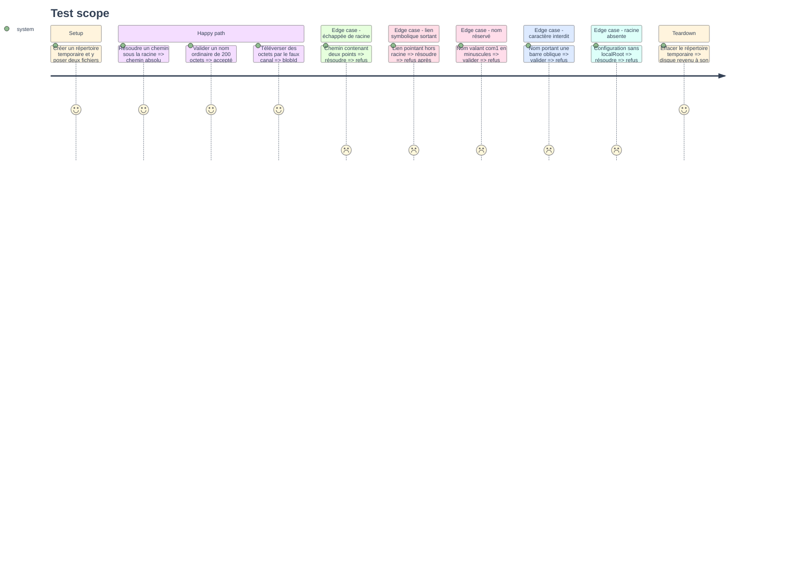

# Instruction — Socle du stockage de fichiers

Phase sans outil exposé.
Elle écrit les types `FileNode`, ouvre le canal d'octets au contexte d'outil, et pose la frontière du disque que les quatre outils suivants ne franchiront pas.

## 🗂️ Architecture projection

> Arbre des fichiers en fin de phase. ✅ créer · ✏️ modifier · ❌ supprimer

```txt
.
├── src
│   ├── config
│   │   └── schema.ts                             ✏️
│   ├── domains
│   │   └── files
│   │       ├── local.ts                          ✅
│   │       └── name.ts                           ✅
│   ├── jmap
│   │   ├── blob.ts                               ✏️
│   │   └── types
│   │       └── filenode.ts                       ✏️
│   ├── registry
│   │   ├── compose.ts                            ✏️
│   │   └── define-tool.ts                        ✏️
│   └── server.ts                                 ✏️
└── tests
    ├── fixtures
    │   ├── client.ts                             ✏️
    │   ├── file-node-get.json                    ✅
    │   └── file-node-set.json                    ✅
    └── unit
        ├── files-local.test.ts                   ✅
        └── files-name.test.ts                    ✅
```

## 🚶 User Journey

Le chemin qu'un octet suivra, une fois les outils posés.



## 🧪 Test Scope



## 📝 Tasks to do

### `1)` Types `FileNode`

> Décrire ce que les quatre méthodes acceptent, et rien de plus.

1. `FileNode` : `id`, `parentId`, `nodeType`, `blobId`, `size`, `name`, `type`, `created`, `modified`, `changed`, `executable`, `role`, `myRights`. `blobId`, `size` et `type` sont nuls sur un dossier, le draft l'imposant.
2. `FilesRights` : `mayRead`, `mayAddChildren`, `mayRename`, `mayDelete`, `mayModifyContent`, `mayShare`.
3. `FileNodeGetArguments`, `FileNodeQueryArguments`, `FileNodeSetArguments`. Ce dernier porte `onDestroyRemoveChildren` et `onExists` requis dans le type, non optionnels.
4. `FileNodeFilterCondition` : les neuf conditions honorées seulement, `parentId`, `ancestorId`, `descendantId`, `isTopLevel`, `nodeType`, `name`, `nameMatch`, `minSize`, `maxSize`. Aucune autre n'entre dans le type.
5. `FileNodeComparator` : `name`, `size`, `nodeType`. Aucun tri par date n'est représentable.
6. `NODE_TYPES = ["file", "directory"]`. `symlink` est écarté, le serveur rendant un ensemble vide pour cette valeur.
7. Commentaire de tête énonçant les trois règles : conditions closes, tri clos, `onExists` toujours écrit.

### `2)` Le canal d'octets dans le contexte d'outil

> Donner aux outils de quoi transférer des octets sans jamais tenir le jeton.

1. Ajouter `blobs: BlobChannel` au `ToolContext` de `src/registry/define-tool.ts`, avec `upload(body, contentType)` et `download(blobId, name, type)`.
2. Écrire l'implémentation dans `src/jmap/blob.ts`, qui expose déjà `uploadBlob` et `downloadBlob` sans être importé nulle part : une fabrique `blobChannel(session, bearerToken, fetchImpl?)` ferme sur le jeton et les URL de session.
3. Construire le canal dans `src/server.ts`, qui tient la configuration et la session, et le passer à `compose()`.
4. Le renseigner dans le `ToolContext` que `register()` bâtit à chaque invocation.
5. Étendre `fakeTransport` de `tests/fixtures/client.ts` d'un canal factice enregistrant les téléversements et servant des octets fixes.

### `3)` La frontière du disque

> Un chemin local n'est utilisable que sous une racine que l'utilisateur a nommée.

1. Ajouter `files: { localRoot?: string }` à `configSchema`, chemin absolu, sans valeur par défaut.
2. `src/domains/files/local.ts` : `resolveWithinRoot(path, root)` normalise, applique `realpath` sur le parent existant, et refuse tout résultat hors racine.
3. `refuseMissingRoot(config)` : le refus qui nomme `files.localRoot` quand la clé est absente, à lever depuis un `precheck`.
4. `statLocalFile(path)` : taille et existence, pour refuser avant transfert.
5. `writeWithoutOverwrite(path, bytes)` : refuse si la cible existe, sur la symétrie du dépôt qui n'écrase jamais.
6. `maxUploadSize(session)` : lit `maxSizeUpload` de la capacité noyau, seul plafond que la session publie.

### `4)` Le contrôle de nom

> Refuser avant la requête ce que le serveur refuserait, avec le motif.

1. `src/domains/files/name.ts` : `refuseInvalidName(name)`, une phrase de refus ou `undefined`.
2. Longueur : entre 1 et 255 octets, mesurés en octets et non en points de code.
3. Caractères interdits, repris de `set.rs:40` : `/`, `<`, `>`, `:`, `"`, `\`, `|`, `?`, `*`.
4. Noms réservés, repris de `set.rs:41-45` : `.`, `..`, `CON`, `PRN`, `AUX`, `NUL`, `COM0` à `COM9`, `LPT0` à `LPT9`, comparés sans tenir compte de la casse.
5. Le motif est nommé dans le refus : lequel des trois contrôles a échoué, et sur quel caractère le cas échéant.

### `5)` Fixtures et couverture unitaire

> Prouver les fonctions pures sans serveur et sans disque partagé.

1. `file-node-get.json` : une racine, deux dossiers dont un vide, trois fichiers avec `type` et `size`, un dossier peuplé pour la phase 4.
2. `file-node-set.json` : une réponse mêlant `created`, `updated`, `notCreated` en `alreadyExists`, `notDestroyed` en `nodeHasChildren`.
3. `tests/unit/files-local.test.ts` : racine absente, échappée par deux points, échappée par lien symbolique, écrasement refusé, taille lue.
4. `tests/unit/files-name.test.ts` : les trois motifs de refus, plus un nom valide de 255 octets et un de 256.

## ✅ Test acceptance criteria

| Tâche | Critère d'acceptation |
| --- | --- |
| 1.3 | Un `FileNode/set` construit sans `onExists` ni `onDestroyRemoveChildren` ne compile pas |
| 1.4 | Écrire une condition `text` ou `createdBefore` dans un filtre ne compile pas |
| 1.5 | Écrire un tri sur `created` ou `modified` ne compile pas |
| 2 | Un outil téléverse des octets sans qu'aucun de ses arguments ni de son contexte n'expose le jeton |
| 3.2 | Un chemin remontant hors racine par deux points est refusé, racine nommée |
| 3.2 | Un lien symbolique pointant hors racine est refusé après résolution réelle |
| 3.3 | Sans `files.localRoot`, le refus nomme la clé de configuration à poser |
| 3.5 | Écrire sur un chemin déjà occupé est refusé, aucun octet n'étant écrit |
| 4.2 | Un nom de 256 octets est refusé, un de 255 accepté |
| 4.3 | Un nom portant une barre oblique est refusé en nommant le caractère |
| 4.4 | Le nom `com1` est refusé au même titre que `COM1` |
