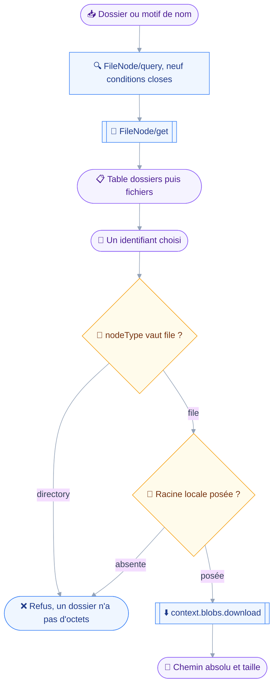
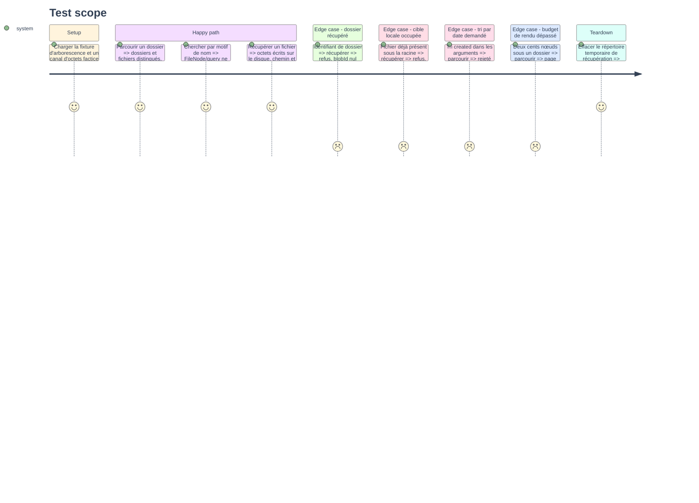

# Instruction — Parcourir et récupérer

Deux outils de lecture, un seul manifeste.
`files_browse` rend une arborescence et une recherche par nom, `files_fetch` écrit un fichier sur le disque et n'en rend que le chemin.

## 🗂️ Architecture projection

> Arbre des fichiers en fin de phase. ✅ créer · ✏️ modifier · ❌ supprimer

```txt
.
├── src
│   └── domains
│       └── files
│           ├── browse.ts                         ✅
│           ├── fetch.ts                          ✅
│           ├── index.ts                          ✏️
│           └── node.ts                           ✅
└── tests
    ├── contract
    │   └── files-read-only.test.ts               ✅
    └── unit
        ├── files-browse.test.ts                  ✅
        ├── files-fetch.test.ts                   ✅
        └── files-node.test.ts                    ✅
```

## 🚶 User Journey



## 🧪 Test Scope



## 📝 Tasks to do

### `1)` Le rendu partagé

> Rassembler dans `src/domains/files/node.ts` ce que les quatre outils répéteraient.

1. `renderNodeRow(node)` : type, nom, taille, type MIME, identifiant. Taille et type MIME restent vides sur un dossier, jamais à zéro ni à `application/octet-stream`.
2. `formatSize(bytes)` : une taille lisible, l'octet brut ne se lisant pas au-delà du kilo-octet.
3. `renderNodeDetail(node)` : le bloc d'un nœud seul, sur le patron de `renderCard` des contacts.
4. `describeNodes(nodes)` : la phrase qui nomme un ensemble de nœuds dans un refus ou un résumé.
5. `resolveNodes(ids, context)` : `FileNode/get` mis en cache par `context.once`, clé triée sur les identifiants, sur le patron de `readCards`.
6. `describeNodeOutcome(response, ids, done, half)` et `describeNodeSetError(error)` : le rendu par identifiant, réservé aux phases 3 et 4 mais posé ici avec le reste.

### `2)` `files_browse`

> Un seul outil pour le parcours et la recherche, la requête et le rendu étant les mêmes.

1. Schéma d'entrée : `parentId`, `ancestorId`, `name`, `nameMatch`, `nodeType`, `minSize`, `maxSize`, `sort`, `limit`, `cursor`. Rien d'autre n'est offert.
2. `sort` est une énumération de trois valeurs, `name`, `size`, `nodeType`, plus une direction. Aucune date n'y figure, et la description dit pourquoi.
3. `parentId` absent vaut la racine : le filtre émis est alors `isTopLevel`, jamais un `parentId` nul.
4. La description énonce les trois limites du serveur : pas de tri par date, pas de recherche dans le contenu, pas de filtre sur le type MIME.
5. `FileNode/query` puis `FileNode/get` par back-reference, sur le patron de `contacts_search`.
6. Pagination : `takeWithinBudget` sur un budget local, `encodeCursor` et `inRequestedOrder`, sur le patron des trois domaines existants.
7. En-tête : le compte de résultats, le dossier parcouru nommé, puis la table. Dossiers avant fichiers.
8. `classes: ["read"]`, `classify` rendant `read` quels que soient les arguments, aucun `precheck` ni `confirmWhen`.

### `3)` `files_fetch`

> Écrire un fichier là où l'utilisateur peut l'ouvrir, et n'en rendre que le chemin.

1. Schéma d'entrée : `id`, un seul, et `saveAs` optionnel, nom de fichier relatif à la racine locale.
2. `precheck` : `refuseMissingRoot` si `files.localRoot` manque, le refus nommant la clé.
3. `run` lit le nœud par `FileNode/get`, refuse un `nodeType` valant `directory` et refuse un `blobId` nul, en nommant le nœud.
4. Le chemin de destination est résolu par `resolveWithinRoot`, défaut sur le nom du nœud, et `writeWithoutOverwrite` refuse une cible occupée.
5. `context.blobs.download` transporte les octets, jamais `client.request`.
6. La réponse rend le chemin absolu, la taille écrite et le type MIME. Aucun octet, aucun extrait, aucun encodage base64.
7. `classes: ["read"]` : l'appel ne mute rien dans le compte, et le disque local est borné par la racine configurée.

### `4)` Le manifeste de lecture

> Deux outils, la capacité fichiers pour seule condition.

1. Renseigner `tools: [filesBrowse, filesFetch]` dans `filesDomain`, qui existe déjà à vide.
2. Aucun changement dans `src/domains/index.ts`, qui agrège déjà `filesDomain`.
3. Aucun changement dans `src/registry/instructions.ts`, où `DOMAIN_NAMES` porte déjà la capacité fichiers.

### `5)` Le contrat de lecture

> Prouver que la surface de lecture n'écrit rien et ne ment sur aucun filtre.

1. `tests/contract/files-read-only.test.ts`, sur le patron de `calendar-read-only.test.ts` : liste blanche de méthodes entières, `FileNode/get` et `FileNode/query`, jamais une règle par suffixe.
2. Parcours du manifeste avec arguments minimaux dérivés du schéma, pour qu'un outil ajouté au domaine soit tenu sans réécriture.
3. Chaque outil déclare `["read"]` et classe `read` même sur des arguments portant des clés destructrices injectées.
4. Aucun outil ne porte de `precheck` autre que celui de la racine locale, ni de `confirmWhen`.
5. Assertion propre au domaine : tout `FileNode/query` émis ne porte que des conditions de la liste des neuf, quels que soient les arguments d'entrée.
6. Gating par capacité : sans `urn:ietf:params:jmap:filenode`, aucun outil n'est enregistré et `report.skipped` nomme le domaine et la capacité.

## ✅ Test acceptance criteria

| Tâche | Critère d'acceptation |
| --- | --- |
| 1.1 | Un dossier rendu ne porte ni taille ni type MIME, pas même une valeur nulle affichée |
| 2.1 | Un argument `text` ou `createdAfter` est rejeté par le schéma, aucune requête n'étant émise |
| 2.2 | Un tri sur `created` est rejeté par le schéma, jamais accepté puis ignoré |
| 2.3 | Un parcours sans `parentId` émet `isTopLevel` et jamais un `parentId` nul |
| 2.4 | La description de l'outil nomme les trois limites du serveur |
| 2.6 | Deux cents nœuds sous un dossier rendent une page tronquée et un curseur qui reprend au bon rang |
| 3.3 | Récupérer un dossier est refusé en nommant le nœud, aucun octet n'étant transféré |
| 3.4 | Une cible locale occupée est refusée, le fichier existant restant intact |
| 3.6 | La réponse ne contient aucun octet du fichier, ni brut ni encodé |
| 5.5 | Un `FileNode/query` émis ne porte jamais une condition hors des neuf honorées |
| 5.6 | Sans la capacité fichiers, le rapport de composition nomme `files` et la capacité manquante |
