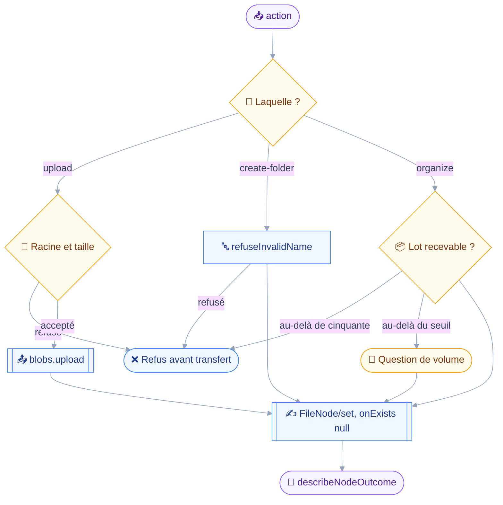
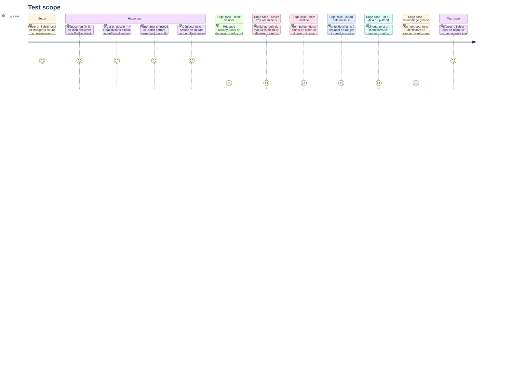

# Instruction — Déposer et ranger

Un seul outil pour trois gestes : déposer un fichier, créer un dossier, renommer ou déplacer.
Les trois écrivent le même objet et les mêmes champs, ce qui justifie de les fondre là où le carnet et la fiche du module 6 restaient séparés.

## 🗂️ Architecture projection

> Arbre des fichiers en fin de phase. ✅ créer · ✏️ modifier · ❌ supprimer

```txt
.
├── src
│   └── domains
│       └── files
│           ├── edit.ts                           ✅
│           ├── index.ts                          ✏️
│           └── write.ts                          ✅
└── tests
    └── unit
        ├── files-edit.test.ts                    ✅
        └── files-write.test.ts                   ✅
```

## 🚶 User Journey



## 🧪 Test Scope



## 📝 Tasks to do

### `1)` Le module partagé d'écriture

> Rassembler dans `src/domains/files/edit.ts` ce que les deux outils d'écriture partagent.

1. `FILE_NODES` : le `BatchSubject` que `refuseOversizedBatch` consomme, `discoveredBy` pointant sur `files_browse`.
2. `buildNodePatch(edit)` : un `PatchObject` sur les seuls chemins nommés, `name` et `parentId`, refusant un patch préfixe d'un autre comme `refusePrefixCollision` chez les contacts.
3. `buildNodeCreation(edit)` : l'objet complet, seul cas d'écriture entière. `blobId` et `type` sur un fichier, ni l'un ni l'autre sur un dossier.
4. `fileNodeSetArguments(extra)` : la fabrique qui écrit `onExists: null` et `onDestroyRemoveChildren: false` sur chaque appel, la cascade n'étant surchargée que par `files_delete`.
5. `resolveParent(parentId, context)` : lecture mise en cache du dossier cible, pour que le refus nomme un dossier plutôt qu'un identifiant.
6. `describeSetError` traduit `alreadyExists`, `nodeHasChildren`, `invalidProperties` et `overQuota` en une phrase, `alreadyExists` renvoyant explicitement vers `files_delete`.

### `2)` `files_write`

> Trois actions, un objet, aucune n'écrasant jamais.

1. Schéma discriminé sur `action`, valant `upload`, `create-folder` ou `organize`, sur le patron de `mail_folder_manage`.
2. `upload` : `path` local, `parentId` optionnel, `name` optionnel. `create-folder` : `name`, `parentId` optionnel. `organize` : `ids`, `parentId` optionnel, `name` optionnel.
3. `precheck` d'`upload` : racine locale posée, chemin sous la racine, fichier existant, taille sous `maxSizeUpload`. Le plafond est annoncé dans le refus.
4. `precheck` d'`organize` : `refuseOversizedBatch`, plus le refus d'un `name` accompagné de plus d'un identifiant, un nom ne se partageant pas.
5. `precheck` de `create-folder` et des deux autres quand un nom est écrit : `refuseInvalidName`, motif nommé.
6. `confirmWhen` : sur `organize` seulement, au-delà de `context.bulkConfirmAbove`, la raison nommant le nombre de nœuds et le seuil.
7. `classes: ["draft"]`, `classify` rendant `draft` sur les trois actions : aucune ne détruit, `onExists` restant à `null`.
8. `run` d'`upload` : `context.blobs.upload` puis `FileNode/set` create portant le `blobId` rendu. Les deux étapes sont séquentielles, le blob devant exister avant d'être référencé.
9. `run` refait le contrôle de nom et de taille, la redondance étant voulue : un `precheck` qui a avalé une lecture en échec n'a pas le dernier mot.
10. La réponse rend le nœud créé ou corrigé par `describeNodeOutcome`, avec son identifiant, son nom et son dossier.

### `3)` Le manifeste d'écriture

> Un second manifeste sur la même capacité, pour que la lecture reste prouvablement pure.

1. `filesWritingDomain` dans `src/domains/files/index.ts`, `requires: [CAPABILITY_FILENODE]`, `tools: [filesWrite]` puis `filesDelete` à la phase suivante.
2. Ajouter le manifeste à `ALL_DOMAINS` dans `src/domains/index.ts`, à côté de `filesDomain`.

### `4)` Couverture unitaire

> Prouver les fonctions pures et le fil émis, sans serveur et sans disque partagé.

1. `tests/unit/files-edit.test.ts` : patch borné aux chemins nommés, création complète, arguments toujours écrits, traduction des erreurs.
2. `tests/unit/files-write.test.ts` : les trois actions, les six refus, le seuil de volume, et une dernière section vérifiant qu'aucun appel émis ne porte `destroy`.

## ✅ Test acceptance criteria

| Tâche | Critère d'acceptation |
| --- | --- |
| 1.4 | Tout `FileNode/set` émis par `files_write` porte `onExists` à `null` et `onDestroyRemoveChildren` à faux |
| 1.4 | Un argument d'entrée nommant `onExists` ou `onDestroyRemoveChildren` est éliminé au parse et n'atteint jamais la requête |
| 1.6 | Une réponse `alreadyExists` rend un refus qui nomme `files_delete` comme seul chemin vers le remplacement |
| 2.3 | Un fichier au-delà de `maxSizeUpload` est refusé avant tout transfert, le plafond étant chiffré dans le refus |
| 2.4 | Un nom accompagné de trois identifiants est refusé avant toute requête |
| 2.6 | Trente identifiants à ranger posent une question sans que la classe cesse de valoir `draft` |
| 2.6 | Cinquante et un identifiants sont refusés avant toute requête et avant toute question |
| 2.8 | Un dépôt émet le téléversement avant le `FileNode/set`, et jamais l'inverse |
| 4.2 | Aucun appel émis par `files_write`, sur aucune de ses branches, ne porte un `destroy` |
