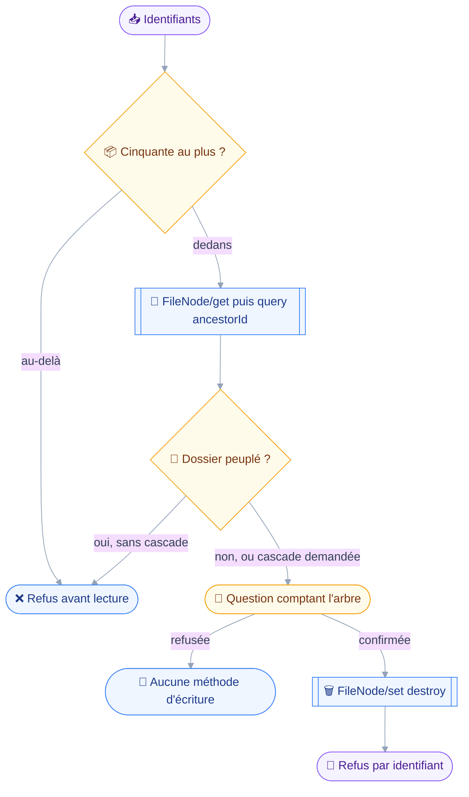
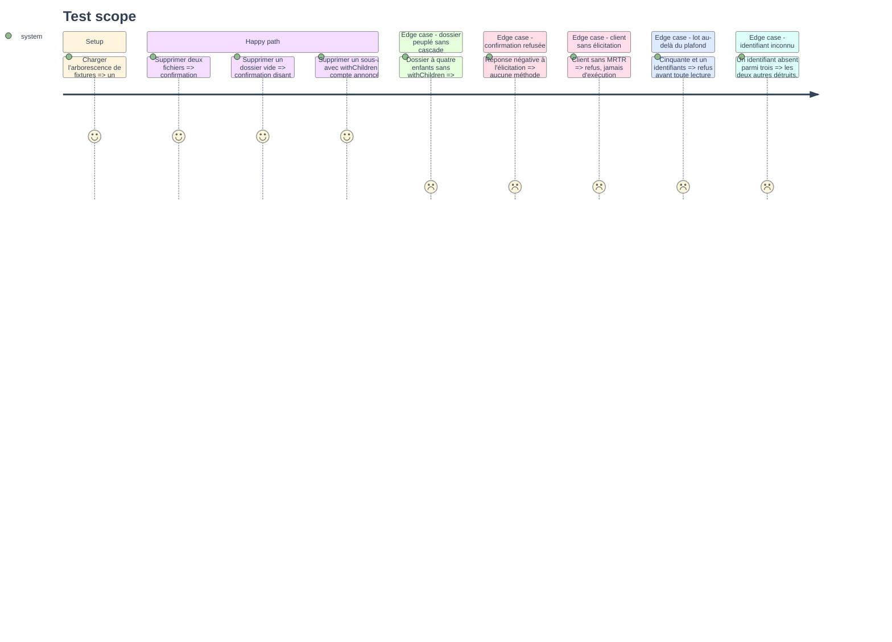

# Instruction — Détruire, cascade nommée d'avance

Un seul outil, une seule classe, aucune exception : `files_delete` vaut `destroy` sur tous ses arguments.
Il n'y a pas de corbeille dans le stockage de Stalwart, donc ce que la question de confirmation annonce est ce qui disparaît définitivement.

## 🗂️ Architecture projection

> Arbre des fichiers en fin de phase. ✅ créer · ✏️ modifier · ❌ supprimer

```txt
.
├── src
│   └── domains
│       └── files
│           ├── delete.ts                         ✅
│           └── index.ts                          ✏️
└── tests
    ├── contract
    │   ├── files-write-guard.test.ts             ✅
    │   └── no-cascade-destroy.test.ts            ✏️
    └── unit
        └── files-delete.test.ts                  ✅
```

## 🚶 User Journey



## 🧪 Test Scope



## 📝 Tasks to do

### `1)` `files_delete`

> Prendre des identifiants, compter l'arbre, puis demander.

1. Schéma d'entrée : `ids`, tableau non vide, et `withChildren`, booléen valant faux par défaut. Aucun chemin, aucun filtre, aucun motif de nom.
2. `classes: ["destroy"]` et `classify` rendant `destroy` sur tous les arguments : `withChildren` élargit l'ampleur, jamais la nature.
3. `precheck` : `refuseOversizedBatch(ids, FILE_NODES)` d'abord, avant toute lecture.
4. `precheck` : lecture de l'arbre par `countSubtree`, puis refus d'un dossier peuplé quand `withChildren` vaut faux, en nommant le dossier et son nombre d'enfants.
5. `summarize` : la phrase de confirmation, comptant fichiers et dossiers séparément, et disant qu'aucune corbeille ne les rattrapera.
6. `run` : `FileNode/set` portant `destroy` et `onDestroyRemoveChildren` réglé sur `withChildren`, `onExists` restant à `null`.
7. Le rendu final passe par `describeNodeOutcome` : détruits d'un côté, refusés par identifiant de l'autre avec le motif traduit.

### `2)` Le comptage du sous-arbre

> Compter une fois, s'en servir deux.

1. `countSubtree(ids, context)` dans `src/domains/files/delete.ts` : un `FileNode/query` par identifiant de dossier, filtre `ancestorId`, `calculateTotal` à vrai.
2. Le résultat est mis en cache par `context.once`, clé triée sur les identifiants : `precheck` puis `summarize` lisent le même comptage sans redemander.
3. Un dossier dont le comptage échoue est traité comme peuplé : l'incertitude ne doit pas ouvrir une destruction.
4. Le comptage rend fichiers et dossiers distinctement, la phrase de confirmation devant dire les deux.

### `3)` Le manifeste complété

> Le second outil rejoint le manifeste d'écriture ouvert à la phase 3.

1. `tools: [filesWrite, filesDelete]` dans `filesWritingDomain`.
2. Rien d'autre ne bouge : `ALL_DOMAINS` porte déjà les deux manifestes.

### `4)` Le contrat d'écriture

> Prouver que rien ne détruit sans garde, sans confirmation et sans plafond.

1. `tests/contract/files-write-guard.test.ts`, sur le patron de `calendar-write-guard.test.ts` : parcours du manifeste, arguments minimaux dérivés du schéma.
2. Table écrite à la main des arguments qui atteignent la branche destructrice, plus un test d'exhaustivité qui tombe si un outil déclare `destroy` sans y figurer.
3. Tout `FileNode/set` émis porte `onExists` à `null`, sur chacun des chemins qui y mènent : dépôt, création de dossier, rangement, suppression, suppression en cascade.
4. Une destruction non confirmée n'émet aucune écriture ; les lectures qui la précèdent sont tolérées et l'assertion porte sur toutes les méthodes émises, rien hors des `/get` et `/query`.
5. Sans élicitation, l'outil refuse au lieu de s'exécuter.
6. `refuseOversizedBatch` tombe avant toute méthode, y compris avant le comptage du sous-arbre.

### `5)` L'extension du contrat de non-cascade

> Le troisième drapeau rejoint les deux qui existent.

1. Étendre `tests/contract/no-cascade-destroy.test.ts` : `onDestroyRemoveChildren` est toujours présent sur tout `FileNode/set` émis.
2. La règle qui vaut pour les deux autres drapeaux ne s'applique pas ici : la valeur peut être vraie, mais seulement quand `withChildren` a été demandé et confirmé.
3. `filesNaming("FileNode/set")` : un seul module du code émet cette méthode avec `destroy`, sur le patron des deux assertions d'émetteur unique existantes.
4. Assertion complémentaire : aucun autre module que `src/domains/files/delete.ts` n'écrit `onDestroyRemoveChildren` à vrai.

### `6)` Couverture unitaire

> Les fonctions pures du comptage et du rendu, sans serveur.

1. `tests/unit/files-delete.test.ts` : comptage d'un sous-arbre, refus d'un dossier peuplé, phrase de confirmation, rendu des refus par identifiant.
2. Le cas du comptage en échec traité comme peuplé y figure explicitement.

## ✅ Test acceptance criteria

| Tâche | Critère d'acceptation |
| --- | --- |
| 1.1 | Un argument portant un chemin ou un filtre de recherche est rejeté par le schéma |
| 1.2 | `withChildren` à vrai ou à faux classe l'appel `destroy` dans les deux cas |
| 1.4 | Un dossier à quatre enfants sans `withChildren` est refusé avant toute question, le compte étant nommé |
| 1.5 | La phrase de confirmation compte les fichiers et les dossiers séparément et dit l'absence de corbeille |
| 2.2 | Le sous-arbre n'est compté qu'une fois, `precheck` et `summarize` partageant le cache |
| 2.3 | Un comptage en échec fait refuser la suppression, jamais la laisser passer |
| 4.3 | Tout `FileNode/set` émis par le domaine porte `onExists` à `null`, sur les cinq chemins |
| 4.4 | Une destruction non confirmée n'émet aucune méthode hors `/get` et `/query` |
| 4.5 | Sans élicitation, l'outil refuse et n'émet aucune écriture |
| 4.6 | Cinquante et un identifiants sont refusés avant même le comptage du sous-arbre |
| 5.3 | Un second module émettant `FileNode/set` avec `destroy` fait tomber le contrat |
