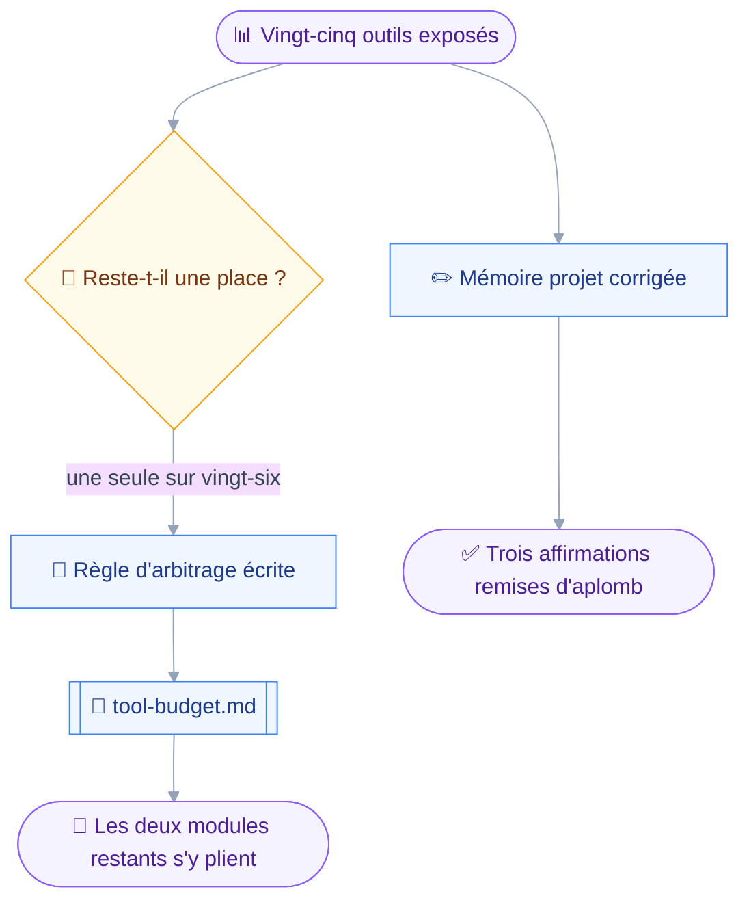
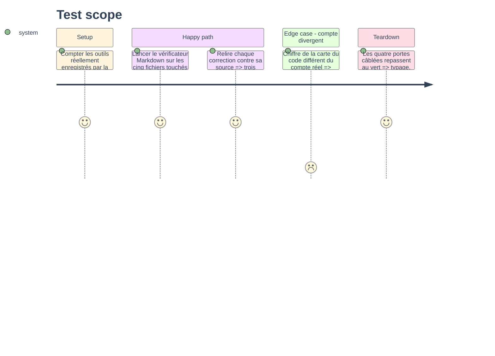

# Instruction — Budget d'outils et mémoire projet

Phase sans code de production.
Elle tranche le budget d'outils que les deux modules restants dépassent, et remet la mémoire projet d'aplomb sur trois affirmations que la lecture des sources a contredites.

## 🗂️ Architecture projection

> Arbre des fichiers en fin de phase. ✅ créer · ✏️ modifier · ❌ supprimer

```txt
.
├── README.md                                     ✏️
└── aidd_docs
    └── memory
        ├── architecture.md                       ✏️
        ├── codebase-map.md                       ✏️
        ├── external
        │   └── stalwart-jmap.md                  ✏️
        ├── internal
        │   └── tool-budget.md                    ✅
        └── testing.md                            ✏️
```

## 🚶 User Journey



## 🧪 Test Scope



## 📝 Tasks to do

### `1)` L'arbitrage du budget

> Écrire la règle maintenant, pour que les deux modules restants n'aient pas à la réinventer sous pression.

1. Créer `aidd_docs/memory/internal/tool-budget.md`, document interne chargé quand la tâche le réclame.
2. Établir le compte réel : vingt et un outils avant ce module, vingt-cinq après, pour une cible de vingt-six.
3. Rappeler d'où vient la cible : la dégradation de sélection se voit dès trente outils exposés, et vingt-six est la marge que le projet s'est donnée.
4. Poser la règle d'arbitrage, dans cet ordre : un domaine dont la capacité est absente ne coûte rien, un verbe métier prime sur une méthode JMAP, et deux outils qui partagent un schéma discriminé n'en font qu'un.
5. Nommer explicitement ce qui reste à placer et ce que cela coûte, sans l'arbitrer ici : ce module ne décide pas pour les suivants, il leur laisse une règle et une place.
6. Dire ce qui se passe si la place manque : le gating par capacité borne le nombre d'outils vus par un client donné, et c'est ce nombre-là qui compte, pas le total du dépôt.

### `2)` Les trois corrections de la surface Stalwart

> Trois affirmations de `external/stalwart-jmap.md` que la lecture du code a contredites.

1. Ligne 198 : le plafond de vingt-cinq méga-octets attribué à `FileStorage.maxSize`, et son refus tombant au `FileNode/set`, n'apparaissent pas dans `file/set.rs`. Ne garder que `maxSizeUpload`, publié par la capacité noyau et appliqué au téléversement.
2. Ligne 203 : `onExists` a quatre valeurs et non deux. Les nommer toutes, en disant lesquelles détruisent l'existant.
3. Ligne 197 : « le tri par date est impossible » sous-déclare le problème. Un comparateur non supporté est retiré silencieusement de la liste, pas rejeté en `UnsupportedSort`, et une liste vidée retombe en ordre de document.
4. Ajouter le constat des neuf conditions honorées sur vingt-deux parsées, avec sa référence de fichier et de lignes.

### `3)` La carte du code

> Deux manifestes de plus, quatre outils de plus, trois modules partagés de plus.

1. Mettre à jour la note de tête : vingt-cinq outils, dont quatre pour les fichiers, deux en lecture et deux en écriture.
2. Ajouter `filesDomain` et `filesWritingDomain` à la table des manifestes, avec leur capacité et leurs outils.
3. Nommer les modules partagés du domaine : `node.ts` pour le rendu, `edit.ts` pour l'écriture, `local.ts` pour la frontière du disque, `name.ts` pour le contrôle de nom, `delete.ts` pour le comptage du sous-arbre.
4. Dire pourquoi le canal d'octets vit dans `src/jmap/blob.ts` et non dans le domaine : il ferme sur le jeton, qu'aucun outil ne doit voir.

### `4)` L'architecture

> Trois décisions structurantes que ce module ajoute.

1. Le canal d'octets dans le contexte d'outil : ce qu'il ferme, ce qu'il n'expose pas, et pourquoi le jeton ne peut pas voyager dans un argument.
2. La frontière du disque : `files.localRoot`, la double résolution contre l'échappée, et le refus qui nomme la clé plutôt que d'inventer un répertoire.
3. La cascade autorisée : `onDestroyRemoveChildren` est le premier des trois drapeaux à pouvoir valoir vrai, et la raison en est écrite plutôt que sous-entendue.
4. Ajouter aux pièges : le filtre qui ment sur treize conditions, le tri qui disparaît sans erreur, et l'absence de corbeille.

### `5)` Les tests et la vitrine

> Le compte de tests et la table des contrats suivent, le README aussi.

1. Mettre à jour la note de tête de `testing.md` : nombre de tests, nombre de fichiers, nombre de contrats, après la mesure réelle et non par estimation.
2. Ajouter `files-read-only.test.ts` et `files-write-guard.test.ts` à la table des contrats, avec l'invariant que chacun tient.
3. Décrire l'assertion propre au domaine : un `FileNode/query` émis ne porte jamais une condition hors des neuf honorées.
4. `README.md` : ajouter les quatre outils à la table publique, avec leur classe d'opération, et documenter la clé de configuration `files.localRoot`.
5. Le README reste exempté du contrat Markdown : le vérificateur s'y lance avec `--ignore=FM001,EMO001`, et les huit erreurs qu'il signale sans ce drapeau sont attendues.

### `6)` Vérification

> Aucune de ces modifications n'est finie tant que les portes ne sont pas vertes.

1. `node scripts/check-markdown.js` du skill `markdown-style` sur les cinq fichiers Markdown touchés.
2. Les quatre portes câblées : `pnpm typecheck`, `pnpm lint`, `pnpm test`, `pnpm build`, sous Node 24.
3. Le compte d'outils est relevé sur le rapport de composition, jamais compté à la main dans les fichiers sources.

## ✅ Test acceptance criteria

| Tâche | Critère d'acceptation |
| --- | --- |
| 1.2 | Le chiffre écrit dans `tool-budget.md` correspond au rapport de composition, capacités toutes présentes |
| 1.4 | La règle d'arbitrage est énoncée en trois critères ordonnés, applicables sans nouvelle décision |
| 2.1 | Aucune affirmation sur un plafond de vingt-cinq méga-octets ne subsiste dans la mémoire |
| 2.2 | Les quatre valeurs de `onExists` sont nommées, et celles qui détruisent sont dites |
| 2.3 | La mémoire dit que le tri non supporté est retiré en silence, pas rejeté |
| 3.1 | Le nombre d'outils de la carte du code est celui que la composition enregistre |
| 5.1 | Le nombre de tests de `testing.md` provient d'une exécution, pas d'une estimation |
| 6.1 | `check-markdown.js` sort à zéro sur les cinq fichiers touchés |
| 6.2 | Les quatre portes câblées passent au vert après les modifications |
