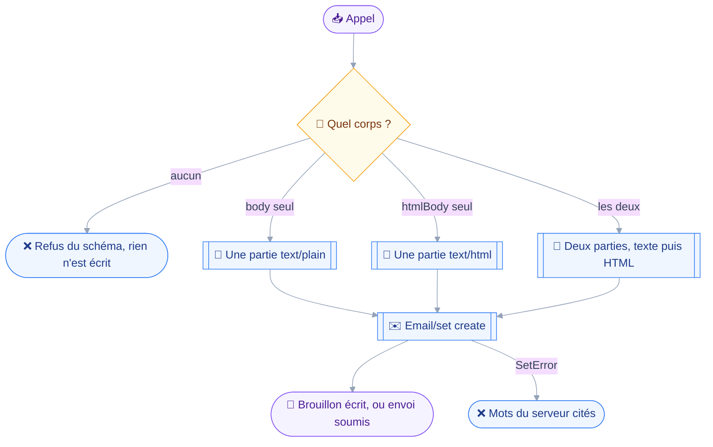
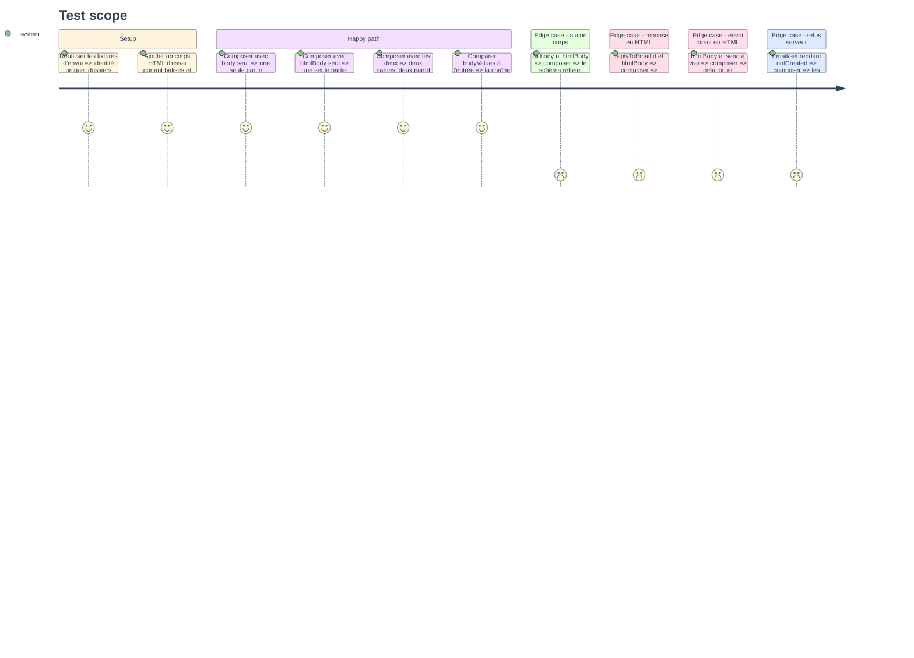

# Instruction — Le corps HTML part, et l'absence de corps est refusée

La phase ouvre le seul chemin d'écriture de corps du projet à un second type de partie.
Elle ferme du même geste la porte qu'elle vient d'ouvrir : rendre `body` optionnel sans rien exiger en échange laisserait partir un message vide.

## 🗂️ Architecture projection

> Arbre des fichiers en fin de phase. ✅ créer · ✏️ modifier · ❌ supprimer

```txt
.
├── src
│   ├── jmap
│   │   └── types
│   │       └── mail.ts                          ✏️
│   └── domains
│       └── mail
│           └── compose.ts                       ✏️
└── tests
    └── unit
        └── mail-compose.test.ts                 ✏️
```

## 🚶 User Journey



## 🧪 Test Scope



## 📝 Tasks to do

### `1)` Le type de la création

> Déclarer ce que le serveur accepte déjà, et rien de plus.

1. `src/jmap/types/mail.ts` : `EmailCreate` gagne `htmlBody?: { partId: string; type: string }[]`, à côté de `textBody`.
2. Le commentaire de tête du type dit les trois conditions relevées sur `email/set.rs` : aucune `bodyStructure` dans la requête — `:128-129` — une partie au plus par propriété — `:263-285` — et un `type` exact, faute de quoi le serveur nomme le type attendu — `:453-467`.
3. Ni `bodyStructure` ni `attachments` n'entrent dans le type : leur seule présence dans l'objet ferait basculer `htmlBody` dans la branche de refus.
4. `bodyValues` reste tel quel, sa carte portant désormais jusqu'à deux entrées.

### `2)` Les deux arguments de l'outil

> Un corps de plus, et la contrainte qui porte sur la paire.

1. `body` passe en `.optional()`, sa description inchangée sur le fond.
2. `htmlBody` en `z.string().optional()`, décrit comme envoyé tel quel : rien n'est retiré, échappé ni réécrit, et aucun corps texte n'en est dérivé.
3. La description de `htmlBody` invite à fournir `body` en plus pour les clients qui n'affichent que du texte, sans en faire une obligation.
4. Un second `.refine` sur le schéma exige `body` ou `htmlBody`, avec `path: ["body"]`, sur le patron exact du `refine` de `to` — `compose.ts:68-72`.
5. Le message de refus nomme les deux arguments et dit qu'un message sans corps n'est pas écrit.
6. La description de l'outil dit qu'il écrit du texte, du HTML ou les deux, la mention « plain-text message » ne tenant plus.

### `3)` La construction du brouillon

> Deux parties possibles là où une seule était câblée.

1. `HTML_PART_ID` posé à côté de `BODY_PART_ID`, deux identifiants distincts parce que `bodyValues` est une carte.
2. `buildDraft` accumule les entrées de `bodyValues` et n'écrit `textBody` que si `body` est donné, `htmlBody` que si `htmlBody` l'est.
3. Aucune propriété n'est écrite à tableau vide : une partie absente est une propriété absente, pas une liste sans élément.
4. La valeur écrite dans `bodyValues` est l'argument reçu, sans passage par une fonction de rendu, de troncature ou d'échappement.
5. Le commentaire de tête de `buildDraft` gagne la raison de l'exclusion de `bodyStructure`, aujourd'hui implicite.

### `4)` Couverture unitaire du corps

> Prouver l'intégrité sur les trois formes, sans serveur.

1. `tests/unit/mail-compose.test.ts` : un cas par forme de corps, assertant les propriétés émises et celles absentes.
2. Un cas compare la chaîne HTML rendue dans `bodyValues` à la chaîne d'entrée, caractère pour caractère, sur un HTML portant balises, attributs, entités et lien.
3. Le cas « sans corps » assert le refus du schéma et l'absence de toute méthode émise.
4. Le test existant « sends exactly one plain-text body part and no headers » — `mail-compose.test.ts:76` — est conservé tel quel : c'est la non-régression du critère 1.
5. Les chemins réponse et envoi direct sont éprouvés avec un corps HTML, le fil et l'enveloppe restant ceux d'aujourd'hui.

## ✅ Test acceptance criteria

| Tâche | Critère d'acceptation |
| --- | --- |
| 1.1 | Un `EmailCreate` portant `htmlBody` compile ; un `bodyStructure` ne se représente pas |
| 2.4 | Un appel sans `body` ni `htmlBody` est refusé, et aucune requête ne part |
| 3.2 | Un appel avec `htmlBody` seul n'émet aucune propriété `textBody` |
| 3.2 | Un appel avec `body` seul n'émet aucune propriété `htmlBody` |
| 3.3 | Aucune propriété de corps n'est jamais émise comme tableau vide |
| 3.4 | La chaîne HTML de `bodyValues` est identique à celle reçue en argument |
| 4.4 | Le cas texte seul émet exactement ce qu'il émettait avant la tranche |
| 4.5 | Une réponse en HTML garde `inReplyTo` et `references` de l'origine |
