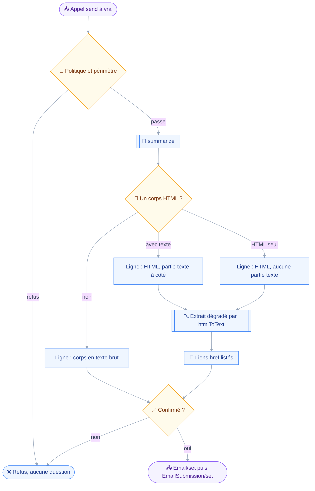
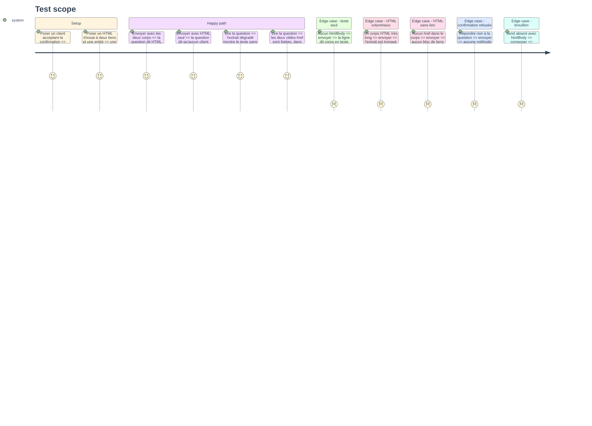

# Instruction — La confirmation le nomme, un contrat le tient intact

Le HTML ne traverse aucun filtre, par décision du PRD.
La phrase de confirmation est donc tout ce qui reste entre un corps rédigé par un modèle et un message signé par l'utilisateur, et un contrat garde ce corps intact jusqu'au fil.

## 🗂️ Architecture projection

> Arbre des fichiers en fin de phase. ✅ créer · ✏️ modifier · ❌ supprimer

```txt
.
├── .changeset
│   └── mail-html-body.md                        ✅
├── README.md                                    ✏️
├── aidd_docs
│   └── memory
│       ├── architecture.md                      ✏️
│       ├── codebase-map.md                      ✏️
│       └── testing.md                           ✏️
├── src
│   └── domains
│       └── mail
│           ├── compose.ts                       ✏️
│           └── html.ts                          ✅
└── tests
    ├── contract
    │   └── html-body-untouched.test.ts          ✅
    └── unit
        ├── mail-compose.test.ts                 ✏️
        └── mail-html.test.ts                    ✅
```

## 🚶 User Journey



## 🧪 Test Scope



## 📝 Tasks to do

### `1)` Le module de lecture du HTML

> Une fonction pure sur une chaîne, sur le patron de `sieve/radius.ts`.

1. `src/domains/mail/html.ts`, sans aucun import de client JMAP : il ne fait que lire un texte.
2. `htmlLinks(html)` rend les valeurs d'attribut `href`, dédoublonnées et dans l'ordre d'apparition, en acceptant les guillemets doubles, simples et l'absence de guillemets.
3. Les attributs `src` sont hors périmètre, et le commentaire dit pourquoi : une image incorporée est exclue de la tranche d'envoi depuis son PRD d'origine.
4. `describeHtmlBody(html)` rend l'extrait dégradé par `htmlToText` — `src/shared/render.ts:61-83` — puis le bloc des liens, ce dernier absent quand il n'y a aucun lien.
5. Un plafond de rendu tronque l'extrait et la liste en disant ce qui manque, jamais en coupant en silence, sur le patron de la troncature de `sieve/script.ts`.
6. Le commentaire de tête dit la raison d'être du bloc de liens : `htmlToText` efface la cible d'un lien, qui est exactement ce qui trompe un destinataire.

### `2)` La ligne de format dans la confirmation

> Nommer ce qui part avant que cela ne parte.

1. `summarizeCompose` prend les deux corps et rend une ligne de format sous la phrase existante.
2. Trois formulations, pas deux : texte brut seul, HTML avec une partie texte à côté, HTML sans aucune partie texte.
3. La troisième dit la contrepartie assumée du PRD, qu'un client n'affichant que du texte montrera peu ou rien.
4. L'extrait et les liens de `describeHtmlBody` suivent la ligne de format, et rien n'est ajouté quand l'appel n'a pas de HTML.
5. `summarize` n'étant appelé que sur le chemin de l'élicitation — `src/registry/compose.ts:187` — aucun brouillon ne gagne une ligne, ce qu'un test assert plutôt que de le supposer.

### `3)` Le contrat d'intégrité du corps

> Ce qu'aucun nom d'argument ne trahit : une réécriture silencieuse.

1. `tests/contract/html-body-untouched.test.ts`, parcourant les chemins d'écriture de `mail_compose` : brouillon, envoi direct, réponse, réponse envoyée.
2. Tout `Email/set` émis dont la création porte `htmlBody` reproduit la chaîne d'entrée à l'identique dans `bodyValues`.
3. Aucun `Email/set` émis ne porte `bodyStructure`, `attachments` ni `headers` : leur présence ferait refuser le corps par le serveur.
4. Toute propriété de corps émise ne nomme qu'une partie, et son `type` vaut exactement `text/plain` ou `text/html`.
5. Un appel portant `htmlBody` seul n'émet jamais de `textBody` : aucun repli texte n'est dérivé.
6. Une assertion lit les sources pour tenir `buildDraft` seul émetteur d'une propriété de corps, un second émetteur échappant au contrat.

### `4)` Couverture unitaire du rendu

> Le dégradé et les liens, sans serveur.

1. `tests/unit/mail-html.test.ts` : extraction des `href` sur les trois formes de guillemets, dédoublonnage, ordre préservé, absence de bloc sans lien.
2. Un cas assert qu'un `src` d'image n'est pas listé.
3. Un cas assert la troncature d'un HTML long, et que le nombre manquant est dit.
4. `tests/unit/mail-compose.test.ts` : les trois formulations de la ligne de format, et l'absence de toute ligne sur un brouillon.

### `5)` Mémoire projet, vitrine et changeset

> Ce que la tranche change dans ce qui est écrit ailleurs.

1. `aidd_docs/memory/architecture.md` gagne trois pièges : `htmlBody` refusé dès qu'un `bodyStructure` accompagne la requête, le garde-fou serveur du message vide inopérant parce qu'il compte les en-têtes, et la normalisation `7bit` d'un saut de ligne nu.
2. `aidd_docs/memory/codebase-map.md` : `mail/html.ts` ajouté à la description du domaine mail, comme module pur lu par le seul `mail_compose`.
3. `aidd_docs/memory/testing.md` : ligne de contrat `html-body-untouched.test.ts` ajoutée à la table, et les compteurs de tests et de fichiers relevés sur une exécution réelle de `pnpm test`.
4. `README.md` : la ligne `mail_compose` de la table des outils dit texte, HTML ou les deux ; aucune autre ligne ne bouge.
5. `.changeset/mail-html-body.md` en `minor`, décrivant l'ajout d'un argument optionnel et le refus nouveau d'un appel sans corps.
6. Le PRD passe de `draft` à un statut traité, et sa question ouverte sur le contenu de la confirmation est close par la décision prise au plan.

## ✅ Test acceptance criteria

| Tâche | Critère d'acceptation |
| --- | --- |
| 1.2 | Deux liens identiques ne sont listés qu'une fois, dans l'ordre d'apparition |
| 1.3 | Un `src` d'image n'apparaît dans aucun bloc de liens |
| 1.5 | Un HTML dépassant le plafond est tronqué en disant combien d'octets manquent |
| 2.2 | Un HTML sans partie texte est annoncé comme tel, distinct des deux autres cas |
| 2.5 | Un appel qui écrit un brouillon ne rend aucune ligne de format |
| 3.2 | Modifier la chaîne écrite dans `bodyValues` fait tomber le contrat |
| 3.3 | Ajouter `bodyStructure` à une création fait tomber le contrat |
| 3.5 | Dériver un `textBody` d'un `htmlBody` fait tomber le contrat |
| 5.3 | Les compteurs de `testing.md` correspondent à une exécution réelle |
| 5.5 | `pnpm changeset status` reconnaît un changeset mineur en attente |
