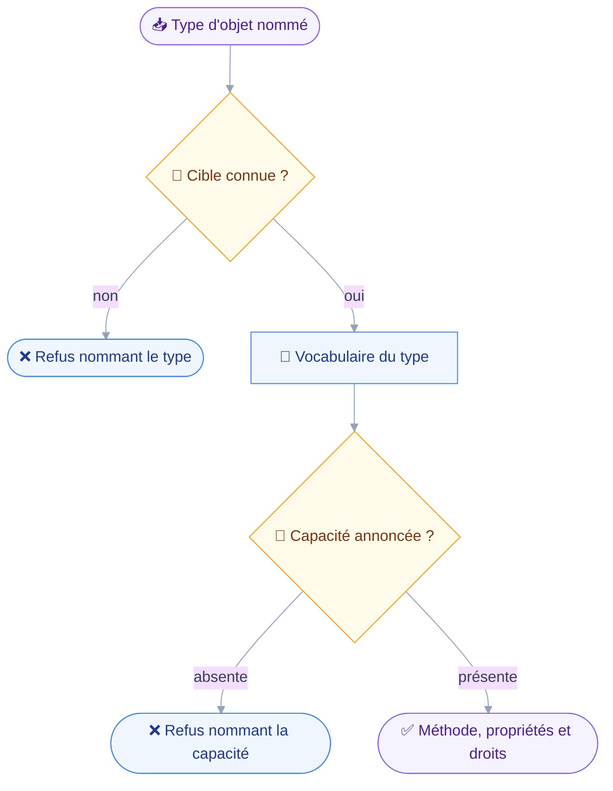
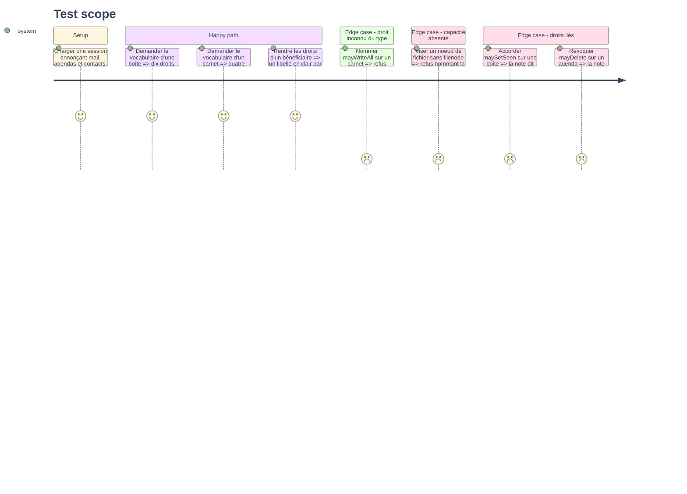

# Instruction — Types de partage, quatre vocabulaires et la cible

Aucun outil n'est enregistré à la fin de cette phase : la composition rend toujours vingt-huit.
Ce qui se pose ici est le socle des deux suivantes — les types que quatre spécifications avaient laissés de côté, les quatre jeux de droits que rien n'unifie, et la table qui relie un type d'objet à sa méthode, sa capacité et son vocabulaire.

## 🗂️ Architecture projection

> Arbre des fichiers en fin de phase. ✅ créer · ✏️ modifier · ❌ supprimer

```txt
.
├── src
│   ├── domains
│   │   └── sharing
│   │       ├── rights.ts                          ✅
│   │       └── target.ts                          ✅
│   └── jmap
│       └── types
│           ├── calendars.ts                       ✏️
│           ├── contacts.ts                        ✏️
│           ├── filenode.ts                        ✏️
│           ├── mail.ts                            ✏️
│           └── sharing.ts                         ✏️
└── tests
    └── unit
        ├── sharing-rights.test.ts                 ✅
        └── sharing-target.test.ts                 ✅
```

## 🚶 User Journey



## 🧪 Test Scope



## 📝 Tasks to do

### `1)` Les types de la spécification de partage

> Remplir un fichier qui n'est aujourd'hui qu'un commentaire.

1. `Principal` dans `src/jmap/types/sharing.ts` : `id`, `type`, `name`, `description`, `email`, `timeZone`, `capabilities`. Rien de plus, les propriétés que Stalwart ne remplit jamais restent optionnelles.
2. `ShareNotification` : `id`, `created`, `changedBy` — objet `{ principalId, name, email }` —, `objectType`, `objectAccountId`, `objectId`, `oldRights`, `newRights`.
3. `objectType` est une union close des quatre types partageables, et `oldRights`/`newRights` portent le jeu de droits du type visé, jamais un enregistrement générique.
4. Un commentaire nomme ce que le serveur ne rend jamais : `changedBy.name` vaut toujours la chaîne vide, et `Principal.timeZone` toujours `null`.
5. Aucun type de requête ni de tri pour `ShareNotification/query` : le serveur ignore silencieusement le tri, donc rien ne doit pouvoir en demander un.

### `2)` Le partage sur les quatre objets partagés

> Ouvrir `shareWith` et `myRights` là où quatre modules les avaient laissés fermés.

1. `MailboxRights` dans `mail.ts`, `CalendarRights` dans `calendars.ts`, `AddressBookRights` dans `contacts.ts` : un booléen par droit, tous optionnels en lecture.
2. `FilesRights` existe déjà — `filenode.ts:34` — et ne bouge pas ; seuls ses six droits sont vérifiés contre le code du serveur.
3. `shareWith?: Record<string, XRights>` et `myRights?: XRights` sur `Mailbox`, `Calendar` et `AddressBook` ; `FileNode` porte déjà `myRights` et gagne `shareWith`.
4. Le commentaire de `contacts.ts:5-7` annonçait cette phase : il est remplacé, pas laissé à côté de ce qu'il annonçait.
5. Les propriétés restent optionnelles parce qu'une réponse partielle est légale : une lecture qui ne les demande pas ne doit pas les typer comme présentes.

### `3)` Les quatre vocabulaires

> Les nommer comme le serveur les parse, et dire ce qu'ils ne disent pas.

1. `src/domains/sharing/rights.ts` : quatre listes closes, dans l'ordre du code serveur, plus un libellé français par droit pour la phrase de confirmation.
2. `isKnownRight(type, name)` : un nom hors de la liste du type est refusé côté client, le serveur ignorant silencieusement tout droit écrit à `false`.
3. `describeRights(type, rights)` : rend les droits accordés en clair, sans jamais afficher un nom de propriété brut seul.
4. `linkedRightsNote(type, rights)` : rend la note d'effet de bord quand elle s'applique, et rien sinon.
5. Deux notes seulement, tirées des alias d'ACL : `maySetSeen` et `maySetKeywords` sont indiscernables sur une boîte, révoquer `mayDelete` sur un agenda fait retomber `mayWriteAll`.
6. Aucune fonction de ce module ne touche le réseau ni ne connaît un client JMAP.

### `4)` La cible partageable

> Un identifiant JMAP ne dit pas de quel type il est : la table le dit.

1. `src/domains/sharing/target.ts` : pour chacun des quatre types, la méthode `/get`, la méthode `/set`, la capacité requise et le vocabulaire de droits.
2. `requireCapability(type, session)` : refuse en nommant la capacité absente, la composition étant statique et le schéma ne pouvant pas rétrécir.
3. Les propriétés lues par type : l'identifiant, le nom d'affichage, `shareWith` et `myRights`, jamais le contenu de l'objet.
4. Le nom d'affichage diffère par type — `name` sur trois d'entre eux — et la table le porte plutôt qu'un `if` dans chaque outil.
5. Ce module ne fait aucun appel : il décrit une cible, la lecture arrive à la phase 2.

## ✅ Test acceptance criteria

| Tâche | Critère d'acceptation |
| --- | --- |
| 1.3 | Un `objectType` hors des quatre types ne compile pas |
| 1.5 | Aucun type n'autorise à exprimer un tri sur `ShareNotification/query` |
| 2.3 | Les quatre objets partageables portent `shareWith` et `myRights`, tous deux optionnels |
| 3.1 | Chaque vocabulaire rend exactement les droits du code serveur : dix, huit, quatre et six |
| 3.2 | `mayWriteAll` nommé sur un carnet est refusé, en nommant le droit et le type |
| 3.3 | Un droit rendu porte un libellé français, jamais son seul nom de propriété |
| 3.5 | Accorder `maySetSeen` produit la note sur `maySetKeywords` ; révoquer `mayDelete` sur un agenda produit celle sur `mayWriteAll` |
| 4.2 | Viser un nœud de fichier sur une session sans `filenode` est refusé, la capacité étant nommée |
| 4.5 | Aucun module de la phase n'importe un client JMAP |
