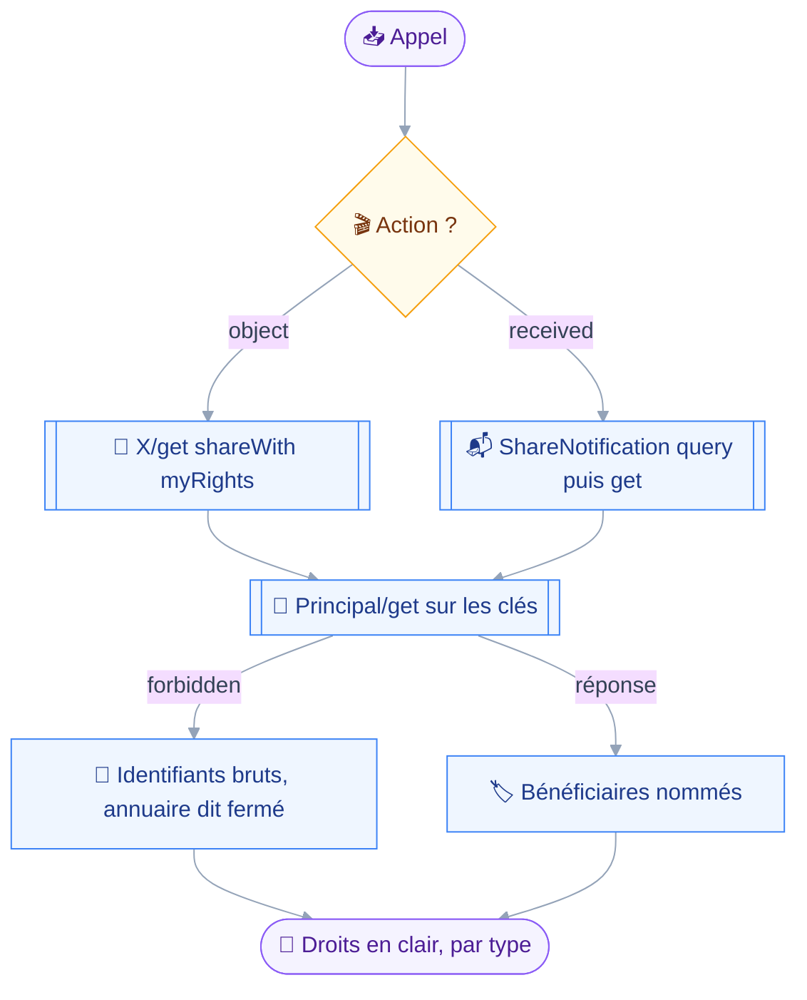
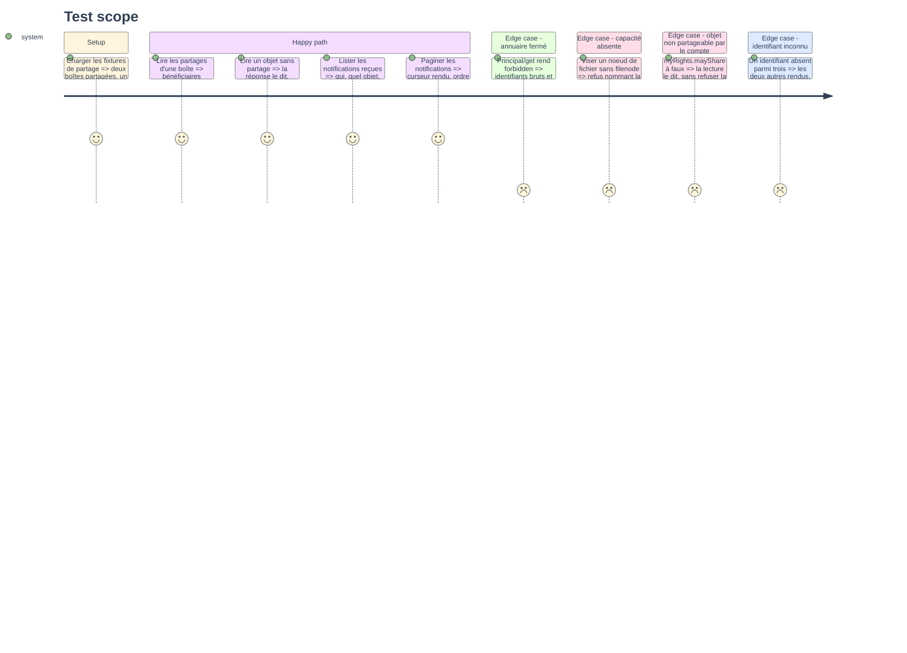

# Instruction — `sharing_access`, qui a accès et ce qu'on m'a ouvert

Un seul outil, une seule classe : `read` sur ses deux actions, sans hook, sans question.
Il répond à deux questions distinctes — ce que j'expose, et ce qu'on m'a ouvert — et c'est la même surface parce que les deux se lisent et qu'aucune n'écrit.

## 🗂️ Architecture projection

> Arbre des fichiers en fin de phase. ✅ créer · ✏️ modifier · ❌ supprimer

```txt
.
├── src
│   └── domains
│       └── sharing
│           ├── access.ts                          ✅
│           ├── grant.ts                           ✅
│           ├── index.ts                           ✏️
│           └── principal.ts                       ✅
└── tests
    ├── contract
    │   └── sharing-read-only.test.ts              ✅
    ├── fixtures
    │   └── sharing.ts                             ✅
    └── unit
        └── sharing-access.test.ts                 ✅
```

## 🚶 User Journey



## 🧪 Test Scope



## 📝 Tasks to do

### `1)` `sharing_access`

> Deux actions sous un discriminant, aucune écriture sur aucune des deux.

1. Schéma discriminé sur `action` : `"object"` prend `objectType` et `ids`, `"received"` prend une pagination et rien d'autre.
2. `ids` est borné à cinquante par le schéma lui-même, et non par un `precheck` : la surface de lecture reste sans hook, comme les cinq autres lectures livrées.
3. `classes: ["read"]` et `classify` rendant `read` sur tous les arguments : aucune branche ne change de classe.
4. Ni `precheck` ni `confirmWhen` : une lecture ne pose pas de question, et le contrat le vérifie.
5. `action: "object"` : `requireCapability` d'abord, puis un seul `X/get` sur les propriétés de la table de cible.
6. `action: "received"` : `ShareNotification/query` puis `/get`, sans tri, l'ordre du serveur étant le seul qui existe.
7. Le curseur passe par `src/shared/pagination.ts`, comme les quatre domaines qui paginent déjà.

### `2)` La résolution des bénéficiaires

> Une clé de `shareWith` est un identifiant, pas un nom.

1. `src/domains/sharing/principal.ts` : `resolvePrincipals(ids, context)`, un `Principal/get` sur les clés rencontrées, mis en cache par `context.once`.
2. Une erreur de méthode `forbidden` n'est pas une panne : elle rend un résultat marqué « annuaire fermé », et la lecture continue sur les identifiants bruts.
3. Toute autre erreur remonte telle quelle : répondre depuis rien serait une réponse sûre d'elle et sans fondement, comme pour le repli de disponibilité.
4. Le rendu nomme la cause en clair — le serveur a désactivé les requêtes d'annuaire — plutôt que d'afficher une liste sans explication.
5. La même fonction sert les deux actions : `changedBy.principalId` d'une notification se résout par le même chemin que les clés de `shareWith`.

### `3)` Le rendu des partages

> Les droits d'un type ne s'affichent pas dans le vocabulaire d'un autre.

1. `src/domains/sharing/grant.ts` : rendu d'un objet partagé — nom d'affichage, puis une ligne par bénéficiaire avec ses droits accordés en clair.
2. Le vocabulaire vient de `rights.ts`, par type : rien n'est traduit vers un jeu commun, et aucun droit n'est inventé.
3. Un objet sans bénéficiaire le dit explicitement ; une liste vide sans phrase serait indistinguable d'une lecture partielle.
4. `myRights.mayShare` à faux est signalé sur l'objet : la lecture reste permise, mais elle annonce ce que la phase 3 refusera.
5. Le rendu d'une notification dit qui, quel objet, et ce qui a changé entre `oldRights` et `newRights`, droits nommés en clair.
6. `changedBy.name` n'est jamais affiché : le serveur le remplit toujours de la chaîne vide, l'adresse est le seul nom réel.
7. Le rendu compact passe par `src/shared/render.ts`, comme les cinq domaines livrés.

### `4)` Le manifeste de lecture

> Un domaine qui portait un tableau vide depuis le premier module.

1. `sharingDomain` dans `src/domains/sharing/index.ts` : `tools: [sharingAccess]`, `requires` inchangé sur `CAPABILITY_PRINCIPALS`.
2. `ALL_DOMAINS` porte déjà `sharingDomain` — `src/domains/index.ts:24` — et ne bouge pas.
3. Le rapport de composition rend vingt-neuf outils avec toutes les capacités, et le gating nomme `principals` quand elle manque.

### `5)` Le contrat de lecture

> Prouver que la surface ne peut pas écrire, pas seulement qu'elle ne le fait pas.

1. `tests/contract/sharing-read-only.test.ts`, sur le patron de `calendar-read-only.test.ts` : parcours du manifeste, arguments minimaux dérivés du schéma de chaque outil.
2. Deux affirmations séparées : la classe déclarée d'une part, les méthodes réellement émises d'autre part.
3. La liste blanche nomme des méthodes entières — `Mailbox/get`, `Calendar/get`, `AddressBook/get`, `FileNode/get`, `Principal/get`, `ShareNotification/get`, `ShareNotification/query` — jamais un suffixe.
4. Aucun outil du manifeste ne porte `precheck` ni `confirmWhen`.
5. Aucun `ShareNotification/set` n'est émis, sur aucune branche : écarter appartient à la phase 3.
6. Le gating est tenu : sans `principals`, le manifeste n'enregistre rien et le rapport nomme la capacité manquante.
7. Le contrat est validé par mutation : retirer la ligne qu'il garde doit le faire tomber au rouge.

### `6)` Fixtures et couverture unitaire

> Aucun serveur réel, comme partout ailleurs dans le projet.

1. `tests/fixtures/sharing.ts` : principals, notifications, et les quatre objets partageables portant un `shareWith` peuplé.
2. Une fixture porte l'erreur `forbidden` de l'annuaire fermé, l'autre une réponse normale : le repli se teste sur les deux.
3. `tests/unit/sharing-access.test.ts` : rendu par type, objet sans partage, notification rendue, pagination, identifiant inconnu.

## ✅ Test acceptance criteria

| Tâche | Critère d'acceptation |
| --- | --- |
| 1.2 | Cinquante et un identifiants sont refusés par le schéma, avant tout appel |
| 1.3 | Les deux actions classent l'appel `read`, sans exception |
| 1.6 | Aucun tri ne part sur `ShareNotification/query`, le serveur l'ignorant silencieusement |
| 2.2 | Un `forbidden` sur `Principal/get` rend les identifiants bruts et nomme l'annuaire fermé |
| 2.3 | Une erreur de transport remonte telle quelle, sans repli inventé |
| 3.2 | Les droits d'une boîte ne s'affichent jamais dans le vocabulaire d'un carnet |
| 3.3 | Un objet sans bénéficiaire rend une phrase, jamais un bloc vide |
| 3.4 | `mayShare` à faux est signalé sans que la lecture soit refusée |
| 5.3 | Une méthode hors de la liste blanche fait tomber le contrat |
| 5.4 | Ajouter un `precheck` à un outil du manifeste fait tomber le contrat |
| 5.5 | Aucun `ShareNotification/set` n'est émis par la surface de lecture |
| 5.6 | Sans `principals`, aucun outil n'est enregistré et le rapport nomme la capacité |
