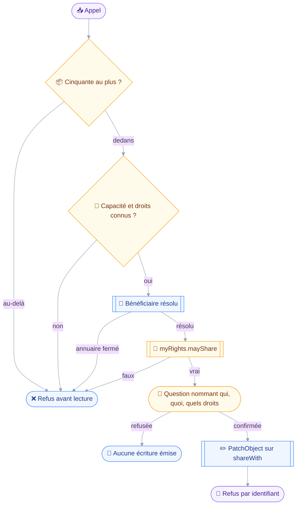
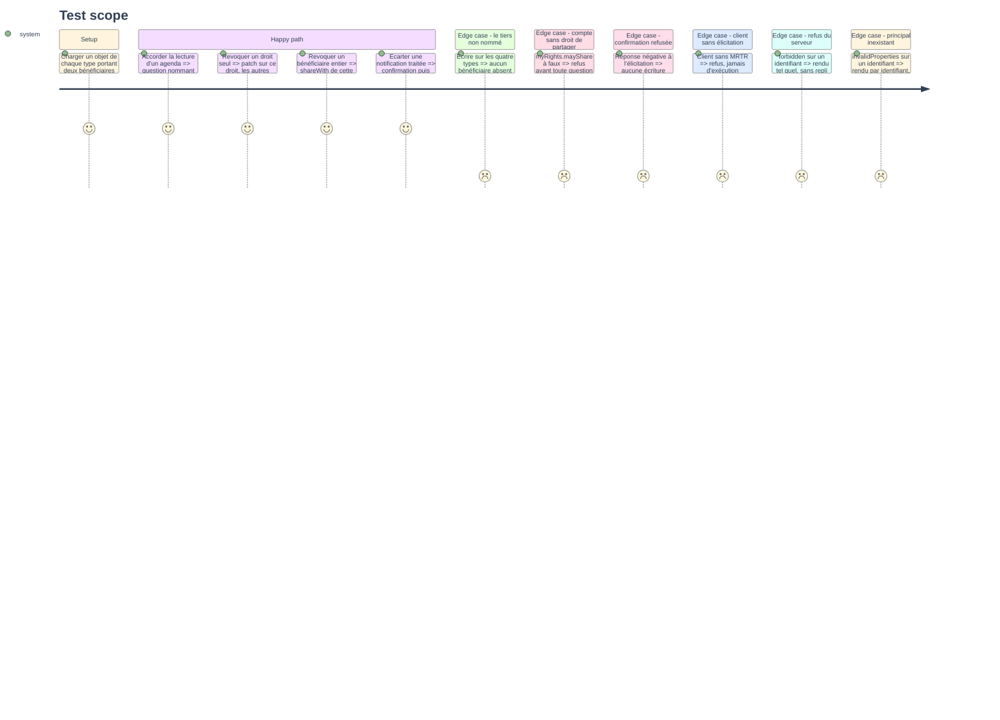

# Instruction — `sharing_manage`, accorder, révoquer, écarter

C'est la seule écriture du projet dont l'annulation ne restaure pas l'état antérieur : révoquer un accès ne rappelle pas ce qui a déjà été lu.
Trois actions, deux classes — accorder est un `send`, révoquer et écarter sont des `destroy` — et un émetteur unique pour les quatre types d'objet que le module ne possède pas.

## 🗂️ Architecture projection

> Arbre des fichiers en fin de phase. ✅ créer · ✏️ modifier · ❌ supprimer

```txt
.
├── src
│   └── domains
│       └── sharing
│           ├── edit.ts                            ✅
│           ├── index.ts                           ✏️
│           └── manage.ts                          ✅
└── tests
    ├── contract
    │   ├── no-cascade-destroy.test.ts             ✏️
    │   └── sharing-write-guard.test.ts            ✅
    └── unit
        └── sharing-manage.test.ts                 ✅
```

## 🚶 User Journey



## 🧪 Test Scope



## 📝 Tasks to do

### `1)` `sharing_manage`

> Trois actions, deux classes, et la classe se lit sur l'action jamais sur le nom.

1. Schéma discriminé sur `action` : `"grant"` et `"revoke"` prennent `objectType`, `ids`, `beneficiary` et `rights` ; `"dismiss"` prend `notificationIds` et rien d'autre.
2. `rights` est obligatoire sur `grant`, optionnel sur `revoke` : absent, il retire le bénéficiaire entier plutôt qu'un droit.
3. `classes: ["send", "destroy"]`, `classify` rendant `send` sur `grant` et `destroy` sur `revoke` comme sur `dismiss`.
4. Aucun critère de recherche dans le schéma : des identifiants, un type, un bénéficiaire, rien qui ressemble à un filtre.
5. `beneficiary` accepte une adresse ou un identifiant de principal, la première se résolvant, la seconde partant telle quelle.

### `2)` Ce que `precheck` refuse avant de demander

> Un appel voué au refus ne se fait pas confirmer.

1. `refuseOversizedBatch` en premier, avant toute lecture, sur `ids` comme sur `notificationIds`.
2. `requireCapability(objectType, session)` : le type dont la capacité manque est refusé en la nommant.
3. Tout droit hors de la liste close du type est refusé côté client : le serveur ignore silencieusement un droit inconnu écrit à `false`.
4. Résolution du bénéficiaire : une adresse passe par `Principal/query`, et un `forbidden` refuse en nommant l'annuaire fermé plutôt qu'en devinant un identifiant.
5. Lecture de `myRights` sur les objets visés : `mayShare` à faux fait refuser avant toute question, l'objet étant nommé.
6. Une lecture en échec fait refuser : confirmer un partage dont on ne sait pas s'il est permis coûte plus qu'un aller-retour perdu.
7. `dismiss` ne lit aucun droit : le serveur n'oppose aucun refus à la destruction d'une notification.

### `3)` La phrase de confirmation

> Nommer qui, quoi, et quels droits en clair.

1. `summarize` nomme le bénéficiaire par son adresse quand elle est connue, par son identifiant sinon, et jamais par une clé opaque seule.
2. L'objet est nommé par son nom d'affichage, lu dans le même `once` que `precheck` : un seul comptage des faits, deux lecteurs.
3. Les droits sont énoncés dans le vocabulaire du type, en français, jamais sous leur seul nom de propriété.
4. La note d'effet de bord s'affiche quand elle s'applique : `maySetKeywords` suit `maySetSeen`, et révoquer `mayDelete` sur un agenda fait retomber `mayWriteAll`.
5. Une révocation dit qu'elle ne rappelle pas ce qui a déjà été lu : c'est la seule écriture du projet dans ce cas.
6. `dismiss` dit ce qui disparaît — la trace d'un accès accordé — et non l'accès lui-même, qui n'est pas touché.

### `4)` L'émetteur unique

> Quatre types, quatre méthodes, un seul fichier qui les nomme.

1. `src/domains/sharing/edit.ts` est le seul module à écrire les chaînes `Mailbox/set`, `Calendar/set`, `AddressBook/set` et `FileNode/set` hors de leurs domaines respectifs.
2. `shareSetArguments(type, accountId, update)` : une fabrique unique qui écrit `update` seul, jamais `create` ni `destroy`, et le drapeau de non-cascade du type à faux quoi qu'il arrive.
3. Le patch d'octroi porte `shareWith/{principalId}/{droit}: true`, un chemin par droit nommé.
4. Le patch de révocation porte `shareWith/{principalId}/{droit}: false` quand des droits sont nommés, et `shareWith/{principalId}: null` sinon.
5. Les deux formes ne se mélangent jamais dans un même appel : un patch préfixe d'un autre est invalide — RFC 8620 §5.3 — et le refus se tient ici plutôt que sur le fil.
6. Aucune carte `shareWith` n'est jamais écrite entière : c'est ce qui préserve les bénéficiaires que l'appel ne nomme pas.
7. `dismiss` émet `ShareNotification/set` avec `destroy` seul, la seule méthode du module à porter cette clé.
8. Les refus par identifiant passent par `src/shared/render.ts`, `forbidden` et `invalidProperties` remontant tels quels.

### `5)` Le manifeste d'écriture

> Une lecture prouvablement pure exige un second manifeste.

1. `sharingWritingDomain` dans `src/domains/sharing/index.ts`, `requires` sur `CAPABILITY_PRINCIPALS`, `tools: [sharingManage]`.
2. Le nom du manifeste est `sharing-writing` et non `sharing` : le rapport de composition nomme un domaine écarté, et deux entrées homonymes ne diraient pas laquelle s'est tue.
3. `ALL_DOMAINS` gagne `sharingWritingDomain` après `sharingDomain`.
4. L'outil ne rejoint aucun manifeste d'agenda : c'est ce qui laisse `calendar-write-guard.test.ts:538-547` vrai mot pour mot.

### `6)` Le contrat d'écriture

> Prouver la préservation sur les quatre types, pas seulement sur celui qu'on a testé.

1. `tests/contract/sharing-write-guard.test.ts`, sur le patron de `files-write-guard.test.ts` : parcours du manifeste, table écrite à la main des arguments atteignant chaque branche, test d'exhaustivité qui tombe si une classe déclarée n'y figure pas.
2. L'assertion centrale, sur les quatre types : un patch émis ne nomme aucune clé de `shareWith` autre que le bénéficiaire de l'appel, et n'écrit jamais la carte entière.
3. Aucun `update` émis ne porte deux chemins dont l'un préfixe l'autre.
4. Tout `/set` d'objet émis porte `update` seul, plus le drapeau de non-cascade du type à faux ; `ShareNotification/set` porte `destroy` seul.
5. Une destruction non confirmée n'émet aucune écriture ; les lectures de `precheck` et `summarize` sont tolérées et l'assertion porte sur toutes les méthodes émises, rien hors des `/get` et `/query`.
6. Sans élicitation, l'outil refuse au lieu de s'exécuter, sur les trois actions.
7. `refuseOversizedBatch` tombe avant toute méthode, y compris avant la lecture de `myRights`.
8. `mayShare` à faux refuse avant que la question ne soit posée, ce que le test vérifie sur l'élicitation autant que sur le fil.

### `7)` L'extension du contrat de non-cascade

> Trois assertions d'émetteur unique gagnent une entrée, une quatrième naît.

1. `filesNaming("Mailbox/set")`, `("AddressBook/set")` et `("FileNode/set")` gagnent chacune `domains/sharing/edit.ts` — lignes 160, 216 et 273 aujourd'hui.
2. Une quatrième assertion naît : `filesNaming("Calendar/set")` vaut exactement `["domains/sharing/edit.ts"]`, ce qui étend au dépôt entier une interdiction que `calendar-write-guard.test.ts` ne tient que sur son manifeste.
3. `CASCADE_ON` ne bouge pas : sa négation exclut déjà le littéral `false`, et l'émetteur de partage n'écrit jamais autre chose.
4. Une assertion complémentaire tient l'émetteur unique par le haut : un seul module écrit les quatre chaînes de `/set` hors de leur domaine d'origine.

### `8)` Couverture unitaire

> Les fonctions pures du patch et de la phrase, sans serveur.

1. `tests/unit/sharing-manage.test.ts` : construction du patch dans les trois formes, refus d'un droit inconnu, refus d'un patch préfixe, phrase de confirmation par type.
2. Le cas de la lecture de `myRights` en échec y figure explicitement, traité comme un refus.
3. Le rendu des refus par identifiant couvre `forbidden` et `invalidProperties`, les deux réponses que le serveur donne réellement.

## ✅ Test acceptance criteria

| Tâche | Critère d'acceptation |
| --- | --- |
| 1.3 | `grant` classe `send`, `revoke` et `dismiss` classent `destroy`, sans exception |
| 1.4 | Un argument portant un filtre de recherche est rejeté par le schéma |
| 2.1 | Cinquante et un identifiants sont refusés avant toute lecture |
| 2.3 | Un droit hors du vocabulaire du type est refusé avant tout appel |
| 2.5 | `mayShare` à faux fait refuser sans qu'aucune question ne soit posée |
| 2.6 | Une lecture de droits en échec fait refuser, jamais laisser passer |
| 3.1 | La confirmation nomme le bénéficiaire, l'objet et les droits en clair |
| 3.4 | La note d'effet de bord apparaît sur les deux cas connus, et sur eux seuls |
| 4.2 | Aucun `/set` d'objet émis ne porte `create` ni `destroy` |
| 4.5 | Un appel mêlant un chemin et son préfixe est refusé avant d'être émis |
| 4.6 | Aucune carte `shareWith` n'est écrite entière, sur aucun des quatre types |
| 6.2 | Un patch nommant un bénéficiaire absent de l'appel fait tomber le contrat |
| 6.5 | Une destruction non confirmée n'émet aucune méthode hors `/get` et `/query` |
| 6.6 | Sans élicitation, les trois actions refusent |
| 7.2 | Un `Calendar/set` écrit hors de `domains/sharing/edit.ts` fait tomber le contrat |
