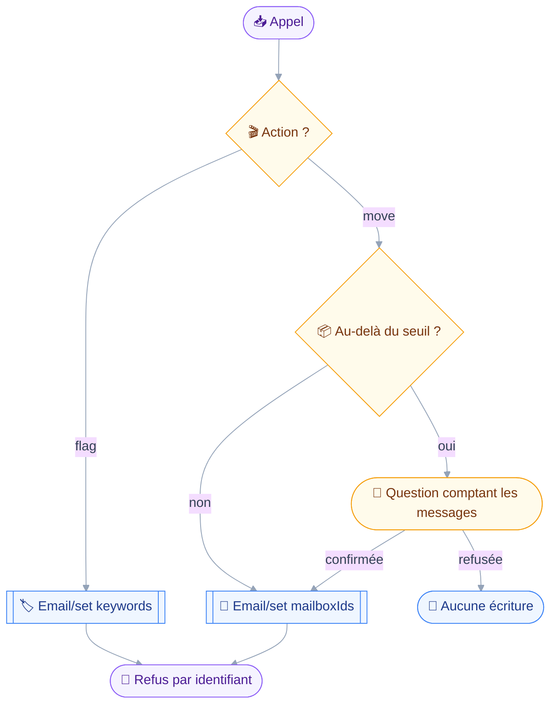
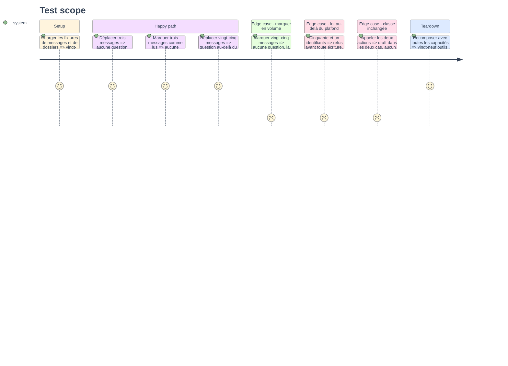

# Instruction — `mail_organize`, fondre deux verbes voisins

`mail_move` et `mail_flag` tiennent les quatre conditions du troisième critère d'arbitrage : deux verbes voisins, même classe `draft`, un lot d'identifiants, rien d'irréversible.
Ce que la fusion doit préserver est la seule chose qui les distingue — marquer ne demande jamais confirmation, quel que soit le volume — et c'est là que se joue toute la phase.

## 🗂️ Architecture projection

> Arbre des fichiers en fin de phase. ✅ créer · ✏️ modifier · ❌ supprimer

```txt
.
├── src
│   └── domains
│       └── mail
│           ├── delete.ts                          ✏️
│           ├── filing.ts                          ✅
│           ├── flag.ts                            ❌
│           ├── folder-manage.ts                   ✏️
│           ├── index.ts                           ✏️
│           ├── move.ts                            ❌
│           └── organize.ts                        ✏️
└── tests
    ├── contract
    │   ├── bulk-confirmation.test.ts              ✏️
    │   ├── organizing-takes-ids.test.ts           ✏️
    │   └── read-only-surface.test.ts              ✏️
    └── unit
        ├── mail-flag.test.ts                      ❌
        ├── mail-folder-manage.test.ts             ✏️
        ├── mail-move.test.ts                      ❌
        └── mail-organize.test.ts                  ✅
```

> [!NOTE]
> `organize.ts` change de rôle sans changer de nom : il portait ce que les quatre outils de rangement partagent, il portera l'outil fusionné.
> Le contenu partagé part dans `filing.ts`, et les cinq fichiers qui l'importent suivent le renommage.

## 🚶 User Journey



## 🧪 Test Scope



## 📝 Tasks to do

### `1)` Le module partagé renommé

> Séparer ce qui est partagé de ce qui devient l'outil.

1. `src/domains/mail/organize.ts` devient `src/domains/mail/filing.ts` : plafond de lot, résolution des dossiers mise en cache, rendu des refus par identifiant.
2. Les cinq fichiers qui l'importent suivent : `delete.ts`, `folder-manage.ts`, et les trois modules d'écriture des autres domaines qui en lisent le rendu.
3. Aucun changement de signature : le renommage est mécanique, et `pnpm typecheck` en est la preuve.
4. Faire ce renommage en premier laisse `organize.ts` libre pour l'outil, sans passer par un nom transitoire.

### `2)` `mail_organize`

> Un schéma discriminé, une classe, deux comportements de confirmation.

1. `src/domains/mail/organize.ts` : schéma discriminé sur `action`, `"move"` prenant `ids` et le dossier cible, `"flag"` prenant `ids`, les mots-clés et leur sens.
2. Les deux schémas sont repris tels quels de `move.ts:20-72` et `flag.ts:38-78` : la fusion change le nom et l'enveloppe, jamais les arguments.
3. `classes: ["draft"]` et `classify` rendant `draft` sur les deux actions : aucun discriminant ne change la classe.
4. `precheck` : `refuseOversizedBatch` sur les deux actions, comme les deux outils le faisaient chacun.
5. `confirmWhen` branche sur `action === "move"` et rend `undefined` sur `"flag"`, quel que soit le volume.
6. C'est le premier `confirmWhen` du dépôt à brancher sur une action : un commentaire dit pourquoi, un marquage se défaisant d'un second appel là où un déplacement en masse ne se retrouve pas.
7. `run` dispatche vers les deux implémentations existantes, déplacées telles quelles : `Email/set` sur `mailboxIds` d'un côté, sur `keywords` de l'autre.
8. `move.ts` et `flag.ts` sont supprimés une fois leur contenu déplacé, jamais laissés en coquilles.

### `3)` Le manifeste de rangement

> Quatre outils deviennent trois.

1. `mailOrganizingDomain` porte `[mailOrganize, mailDelete, mailFolderManage]` — `src/domains/mail/index.ts:9,37`.
2. Rien d'autre ne bouge dans le domaine : détruire et gérer les dossiers gardent leur nom, leur classe et leurs arguments.
3. Le rapport de composition rend vingt-neuf outils toutes capacités présentes, et vingt-sept avant les deux outils de partage.

### `4)` Les contrats qui nomment les deux outils

> Trois contrats portent les noms en dur, et ce n'est pas un défaut à corriger.

1. `read-only-surface.test.ts:64-65` : les deux noms deviennent `mail_organize`, l'assertion restant que le manifeste de lecture ne les porte pas.
2. `bulk-confirmation.test.ts:80,93,106,120,134` : les cas de `mail_move` et de `mail_flag` deviennent deux actions du même outil, et l'assertion qui compte le plus est conservée mot pour mot — marquer ne demande jamais confirmation.
3. `organizing-takes-ids.test.ts` parcourt le manifeste et ne nomme rien : il suit sans être touché, sauf si son parcours suppose quatre outils.
4. `elicitation-required.test.ts` et `confirm-escalation.test.ts` construisent des outils synthétiques : ils ne bougent pas, et le vérifier vaut mieux que le supposer.
5. Aucun contrat n'est assoupli pour accueillir la fusion : ceux qui nomment les outils sont mis à jour, ceux qui parcourent le manifeste ne changent pas.

### `5)` Les tests unitaires fusionnés

> Deux fichiers en un, sans perdre un cas.

1. `tests/unit/mail-move.test.ts` et `tests/unit/mail-flag.test.ts` fusionnent en `tests/unit/mail-organize.test.ts`.
2. Le cas de `mail-flag.test.ts:67-75` — `confirmWhen` vaut `undefined` — est conservé sous sa forme d'action et devient le cas central de la fusion.
3. Un cas nouveau naît de la fusion : au-delà du seuil, `move` demande et `flag` ne demande pas, dans le même fichier et sur le même volume.
4. `mail-folder-manage.test.ts:164` nomme l'un des deux outils et suit le renommage.

## ✅ Test acceptance criteria

| Tâche | Critère d'acceptation |
| --- | --- |
| 1.3 | `pnpm typecheck` passe après le seul renommage, avant toute fusion |
| 2.3 | Les deux actions classent l'appel `draft`, aucun discriminant ne le change |
| 2.5 | `confirmWhen` rend `undefined` sur `flag` à vingt-cinq identifiants comme à trois |
| 2.5 | `confirmWhen` rend une raison sur `move` au-delà du seuil de lot |
| 2.8 | Ni `move.ts` ni `flag.ts` ne subsiste dans l'arbre |
| 3.2 | `mail_delete` et `mail_folder_manage` gardent nom, classe et arguments |
| 3.3 | Le rapport de composition rend vingt-sept outils à la fin de la phase |
| 4.2 | Le contrat de confirmation en lot tient toujours que marquer ne demande jamais |
| 4.5 | Aucun contrat n'est assoupli, seuls les noms en dur changent |
| 5.3 | Un même volume produit une question sur `move` et aucune sur `flag` |
