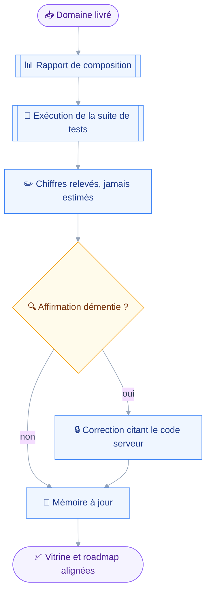
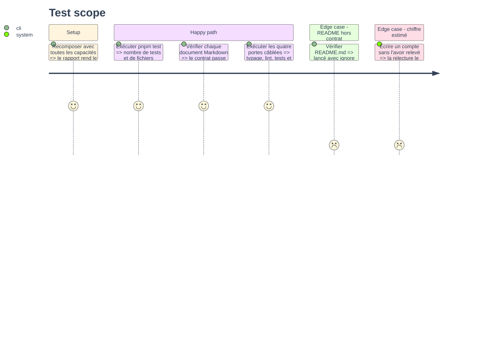

# Instruction — Budget, mémoire projet et vitrine

Le dernier domaine de la roadmap est livré, et la mémoire projet parle encore de six domaines dont un vide.
Cette phase n'ajoute aucun outil : elle remet les chiffres au relevé, corrige une affirmation que la lecture du serveur a démentie, et clôt le budget d'outils sur un dépassement mesuré plutôt qu'arrondi.

## 🗂️ Architecture projection

> Arbre des fichiers en fin de phase. ✅ créer · ✏️ modifier · ❌ supprimer

```txt
.
├── README.md                                      ✏️
├── ROADMAP.md                                     ✏️
└── aidd_docs
    └── memory
        ├── architecture.md                        ✏️
        ├── codebase-map.md                        ✏️
        ├── external
        │   └── stalwart-jmap.md                   ✏️
        ├── internal
        │   └── tool-budget.md                     ✏️
        └── testing.md                             ✏️
```

## 🚶 User Journey



## 🧪 Test Scope



## 📝 Tasks to do

### `1)` Le budget d'outils, clos

> Le dernier module est placé : le document perd sa colonne d'attente.

1. `aidd_docs/memory/internal/tool-budget.md` : la table du compte gagne deux lignes — après la fusion du rangement, puis après les partages.
2. Le chiffre vient du rapport de composition, capacités toutes présentes, jamais d'un décompte à la main.
3. La section « Ce qui reste à placer » disparaît : le module Partages est livré, et la table qui l'annonçait à une ou deux places devient un constat à deux.
4. La section des candidats à la fusion devient un fait accompli : `mail_move` et `mail_flag` sont fondus, et la ligne dit ce que la fusion a coûté — un schéma discriminé, et un `confirmWhen` qui branche sur l'action.
5. La règle du critère 3 est confirmée par le module, pas assouplie : la découpe des partages en deux outils vient de son interdiction de mêler une lecture et une destruction.
6. Le dépassement final est écrit tel quel : vingt-neuf pour une cible de vingt-six, sous un seuil de dégradation de trente.

### `2)` La carte du code

> Deux manifestes, deux outils, et un nom d'outil qui disparaît.

1. La note d'ouverture passe de vingt-huit à vingt-neuf outils, et le mail de dix à neuf.
2. `mail_move` et `mail_flag` deviennent `mail_organize` dans la liste et dans la table des manifestes.
3. Deux lignes naissent dans la table des manifestes : `sharingDomain` et `sharingWritingDomain`, tous deux sur `principals`.
4. Une table des modules partagés du domaine, sur le patron de celle des fichiers : `rights.ts`, `target.ts`, `principal.ts`, `grant.ts`, `edit.ts`, avec ce que chacun porte.
5. La raison de la découpe en deux manifestes est écrite comme pour les quatre autres domaines : la lecture reste prouvablement sans écriture.
6. Le renommage de `src/domains/mail/organize.ts` en `filing.ts` est dit, la ligne actuelle nommant l'ancien fichier.

### `3)` L'architecture, et une affirmation à corriger

> La lecture du serveur a démenti une phrase écrite sans elle.

1. Corriger l'affirmation sur `allowDirectoryQueries` : le verrou est un ET avec la permission, et le rôle utilisateur par défaut reçoit toute permission dont le nom commence par `jmap`.
2. Le repli de disponibilité reste juste, seule sa cause déclarée était fausse : `forbidden` arrive bien, mais pas par le chemin décrit.
3. Une section neuve sur le partage : ce qu'un octroi traverse, et pourquoi le patch par chemin est la seule forme sûre.
4. Y écrire que révoquer ne rappelle pas ce qui a été lu : c'est la seule écriture du projet dont l'annulation ne restaure pas l'état antérieur.
5. Trois pièges rejoignent la liste : les droits liés d'une boîte et d'un agenda, le droit inconnu écrit à `false` que le serveur ignore sans erreur, et `maxShares` à dix par défaut.
6. Un quatrième piège : `changedBy.name` d'une notification vaut toujours la chaîne vide, donc l'adresse est le seul nom réel.
7. La ligne sur la non-cascade passe de trois à quatre drapeaux si l'émetteur de partage en écrit un quatrième, et le dit tel quel sinon.

### `4)` Les tests

> Deux contrats de plus, et des chiffres à relever.

1. `aidd_docs/memory/testing.md` : le nombre de tests et de fichiers vient d'une exécution de `pnpm test`, jamais d'une estimation.
2. Deux lignes dans la table des contrats : `sharing-read-only.test.ts` et `sharing-write-guard.test.ts`, avec l'invariant que chacun tient.
3. La ligne de `no-cascade-destroy.test.ts` dit la quatrième assertion d'émetteur unique, sur `Calendar/set`.
4. Un paragraphe sur ce que le contrat d'écriture des partages tient de particulier : la préservation d'un tiers non nommé, sur les quatre types.
5. Les fixtures de partage rejoignent la liste des spécifications couvertes.

### `5)` La roadmap et la vitrine

> Le dernier module coché, et deux noms d'outil à corriger.

1. `ROADMAP.md` : le module 11 passe à livré, et ses deux mentions de `mail_move` et `mail_flag` — lignes 98 et 273 — suivent la fusion.
2. `README.md` : la table des outils gagne `sharing_access` et `sharing_manage`, et perd une ligne par la fusion — lignes 21-22 et 77.
3. Le README dit ce que le module ne fait pas : ni gestion de principals, ni accès aux données d'un compte tiers, le multi-compte restant exclu.
4. Il dit aussi la limite qui frappe le plus un utilisateur : Claude Desktop n'expose pas l'élicitation, donc accorder et révoquer y échouent par conception.

### `6)` Les portes câblées

> Rien n'est fini tant que les quatre ne sont pas au vert.

1. `nvm use` depuis la racine, puis `pnpm typecheck`, `pnpm lint`, `pnpm test` et `pnpm build`.
2. Le vérificateur Markdown passe sur les six fichiers touchés, `README.md` lancé avec `--ignore=FM001,EMO001`.
3. Les huit erreurs que le README signale sans ce drapeau sont attendues, jamais une régression à corriger.

## ✅ Test acceptance criteria

| Tâche | Critère d'acceptation |
| --- | --- |
| 1.2 | Le compte écrit vient du rapport de composition, et une relecture le retrouve |
| 1.6 | Le dépassement est chiffré, jamais arrondi ni tu |
| 2.1 | Aucun document de mémoire ne dit plus vingt-huit outils |
| 2.2 | Aucune occurrence de `mail_move` ni de `mail_flag` ne subsiste dans le dépôt |
| 3.1 | L'affirmation corrigée cite le fichier et les lignes du code serveur |
| 4.1 | Le nombre de tests écrit correspond à une exécution réelle |
| 5.2 | La table du README compte vingt-neuf outils |
| 6.1 | Les quatre portes câblées passent au vert |
| 6.2 | Le vérificateur Markdown passe sur les six fichiers touchés |
