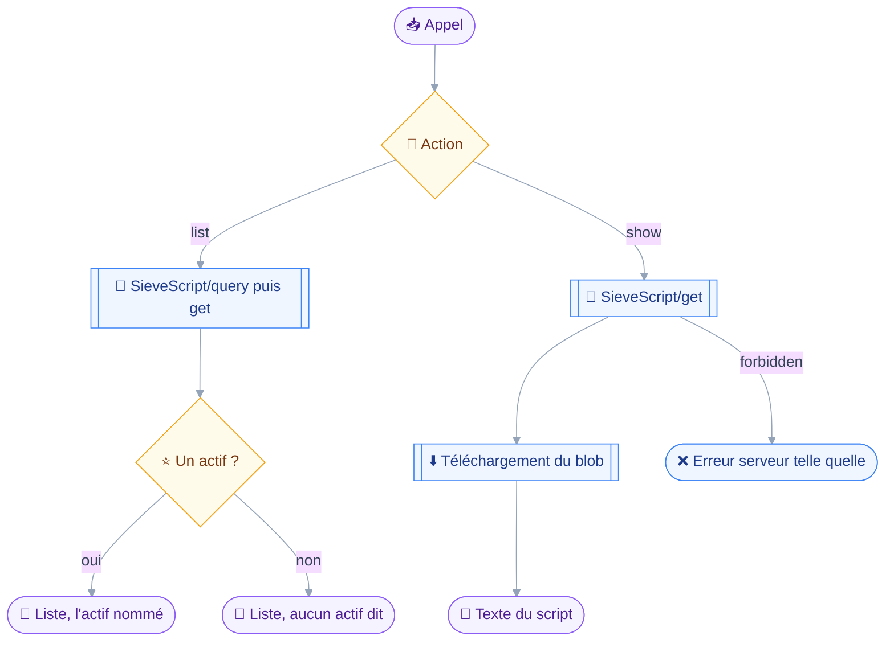
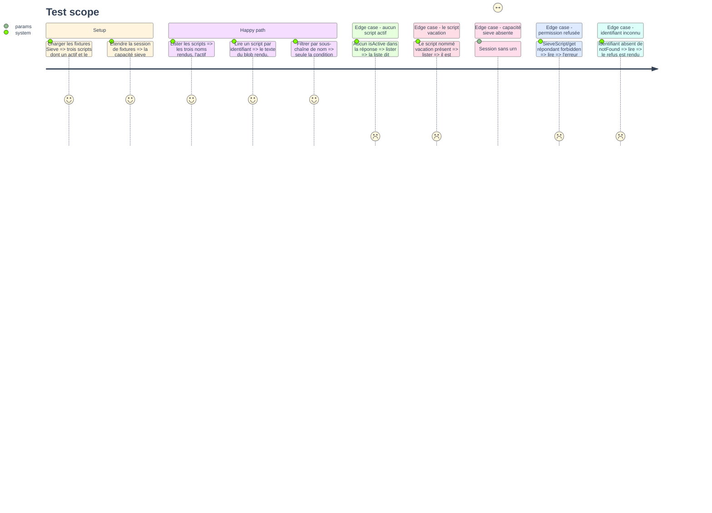

# Instruction — Types, deux manifestes et lecture des scripts

La phase ouvre le domaine par sa seule surface sans conséquence : voir ce qui filtre le courrier aujourd'hui.
Elle pose aussi la découpe qui gouverne tout le module, deux manifestes sur deux capacités que Stalwart accorde par deux permissions distinctes.

## 🗂️ Architecture projection

> Arbre des fichiers en fin de phase. ✅ créer · ✏️ modifier · ❌ supprimer

```txt
.
├── src
│   ├── jmap
│   │   └── types
│   │       └── sieve.ts                          ✅
│   └── domains
│       ├── index.ts                              ✏️
│       └── sieve
│           ├── index.ts                          ✏️
│           ├── script.ts                         ✅
│           └── scripts.ts                        ✅
└── tests
    ├── contract
    │   └── sieve-read-only.test.ts               ✅
    ├── fixtures
    │   ├── client.ts                             ✏️
    │   └── sieve.ts                              ✅
    └── unit
        └── sieve-scripts.test.ts                 ✅
```

## 🚶 User Journey



## 🧪 Test Scope



## 📝 Tasks to do

### `1)` Les types de la spécification

> Un fichier par spécification, les règles porteuses écrites en tête.

1. `src/jmap/types/sieve.ts` sur le patron de `filenode.ts` : commentaire d'en-tête nommant les trois chemins d'activation et le nom réservé.
2. `SieveScript` à quatre propriétés exactement — `id`, `name`, `blobId`, `isActive` — parce que `sieve/get.rs:40-44` n'en rend pas d'autres.
3. `SieveScriptFilter` clos sur `name` et `isActive`, `SieveScriptComparator` clos sur les deux mêmes : au-delà, Stalwart lève `UnsupportedFilter` ou `UnsupportedSort`.
4. `SieveScriptSetArguments` : `accountId`, `create`, `update`, `destroy`, `onSuccessActivateScript`, `onSuccessDeactivateScript`. La propriété `isActive` est rendue non représentable dans le type des créations et des mises à jour, pas seulement interdite ailleurs.
5. `SieveScriptValidateArguments` et sa réponse : `error` valant `SetError` ou `null`.
6. `VacationResponse` avec ses six propriétés et son identifiant `singleton`, posé ici pour la phase 4.

### `2)` Les deux manifestes

> Un serveur sans absence ne fait pas taire le filtrage, ni l'inverse.

1. `src/domains/sieve/index.ts` : `sieveDomain` passe à `requires: [CAPABILITY_SIEVE]`, la capacité absence quittant la liste.
2. Second manifeste `sieveVacationDomain`, `name: "sieve-vacation"`, `requires: [CAPABILITY_VACATION]`, `tools: []` jusqu'à la phase 4.
3. Le nom porte un suffixe distinct pour la raison du module 9 : le rapport de composition nomme un domaine écarté, et deux entrées homonymes ne diraient pas laquelle s'est tue.
4. `src/domains/index.ts` : `sieveVacationDomain` ajouté à `ALL_DOMAINS`.

### `3)` Le module partagé des scripts

> Ce que la lecture et l'écriture liront toutes deux.

1. `src/domains/sieve/script.ts` : rendu d'une ligne de script — nom, marque d'actif, identifiant.
2. Le script nommé `vacation` est reconnu et rendu comme l'absence, avec le renvoi vers son propre outil.
3. Résolution d'un script par identifiant, mise en cache par `context.once` : la phase 3 la relira pour son `precheck`.
4. Téléchargement du texte par `context.blobs.download`, la section du `BlobId` bornant déjà la réponse à la source.
5. Troncature explicite au-delà d'un plafond de rendu, disant combien d'octets manquent plutôt que de couper en silence.

### `4)` `sieve_scripts`

> Lister et lire, rien d'autre.

1. Schéma discriminé sur `action` : `list` avec un `nameContains` optionnel, `show` avec un `id` unique.
2. `classes: ["read"]`, `classify` rendant `read` sur tous les arguments, ni `precheck` ni `confirmWhen`.
3. `list` : `SieveScript/query` puis `SieveScript/get` par back-reference `#ids`, en un seul aller-retour.
4. Seules les conditions `name` et `isActive` peuvent partir, et seul le comparateur `name` ascendant est émis.
5. L'en-tête du rendu nomme le script actif, ou dit qu'aucun ne filtre le courrier — la nuance est un critère d'acceptation, pas un détail de présentation.
6. `show` : un identifiant, jamais un lot, sur le patron de `files_fetch` — un lot de téléchargements n'a pas de refus par identifiant.
7. Un identifiant rendu en `notFound` est signalé sans qu'aucun téléchargement ne parte.
8. `tools: [sieveScripts]` dans `sieveDomain`.

### `5)` Le canal d'octets des fixtures

> Le texte doit varier d'un script à l'autre.

1. `tests/fixtures/client.ts` : `FakeTransportOptions` gagne un remplacement du canal de blobs, le canal actuel rendant un contenu constant.
2. Le canal de test rend un texte par `blobId`, pour que la détection d'actions à large rayon de la phase 3 soit testable.
3. `tests/fixtures/sieve.ts` : trois scripts dont un actif, le script `vacation`, et les textes correspondants.

### `6)` Le contrat de lecture seule

> Prouver que la surface de lecture ne peut rien écrire.

1. `tests/contract/sieve-read-only.test.ts` sur le patron de `files-read-only.test.ts` : parcours du manifeste, arguments minimaux dérivés du schéma de chaque outil.
2. Liste blanche de méthodes entières, jamais de suffixes : `SieveScript/get` et `SieveScript/query`, rien d'autre.
3. Tout outil du manifeste ne déclare que `read`, et classe `read` même sur des clés d'apparence mutante.
4. Aucun outil du manifeste ne porte de `precheck` ni de `confirmWhen`.
5. Toute condition émise appartient aux deux honorées, et tout comparateur aux deux supportés.
6. Gating : sans `urn:ietf:params:jmap:sieve`, le manifeste n'enregistre rien et `report.skipped` nomme la capacité manquante.

### `7)` Couverture unitaire

> Le rendu et la reconnaissance, sans serveur.

1. `tests/unit/sieve-scripts.test.ts` : rendu d'une liste, marque de l'actif, phrase d'absence d'actif, reconnaissance du script `vacation`, troncature d'un texte long.

## ✅ Test acceptance criteria

| Tâche | Critère d'acceptation |
| --- | --- |
| 1.3 | Un filtre ou un tri hors des deux honorés est irreprésentable dans le type |
| 1.4 | Une création ou une mise à jour portant `isActive` ne compile pas |
| 2.1 | Une session annonçant l'absence sans Sieve n'enregistre pas les outils de scripts |
| 2.2 | Une session annonçant Sieve sans l'absence enregistre les outils de scripts |
| 3.2 | Le script nommé `vacation` est rendu comme l'absence, avec le renvoi vers son outil |
| 4.3 | Lister n'émet qu'un seul aller-retour, la lecture suivant la requête par back-reference |
| 4.5 | Sans script actif, la liste le dit explicitement au lieu de rester muette |
| 4.7 | Un identifiant inconnu est rendu comme tel, aucun téléchargement n'étant tenté |
| 6.2 | Une méthode hors des deux nommées fait tomber le contrat |
| 6.6 | Le rapport de composition nomme `urn:ietf:params:jmap:sieve` quand elle manque |
