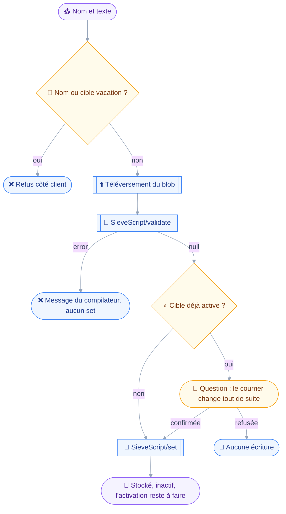
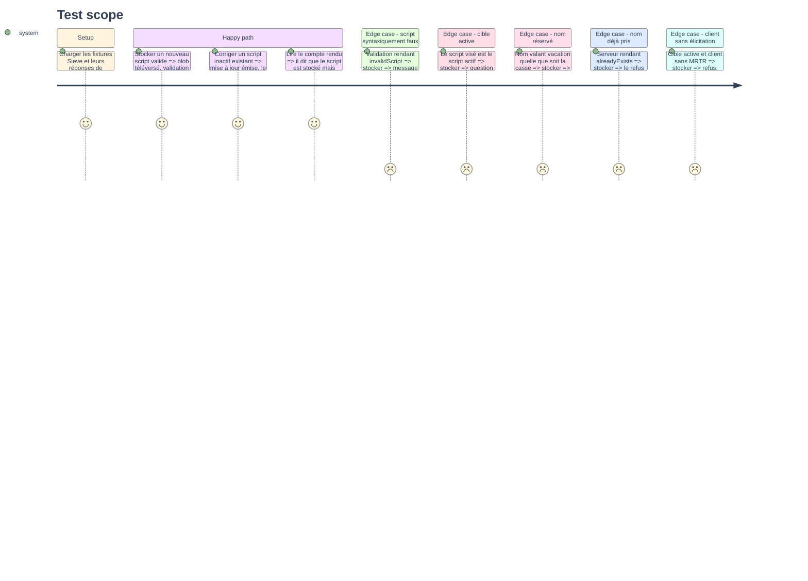

# Instruction — Valider puis stocker, sans activer

Stocker un script est la seule écriture du module qui ne change rien au courrier, et elle ne le reste que si trois choses sont vraies.
Aucun argument d'activation n'est émis, la propriété `isActive` non plus, et écraser le script actuellement actif est une exception qui se fait confirmer.

## 🗂️ Architecture projection

> Arbre des fichiers en fin de phase. ✅ créer · ✏️ modifier · ❌ supprimer

```txt
.
├── src
│   └── domains
│       ├── index.ts                              ✏️
│       └── sieve
│           ├── edit.ts                           ✅
│           ├── index.ts                          ✏️
│           └── write.ts                          ✅
└── tests
    ├── fixtures
    │   └── sieve.ts                              ✏️
    └── unit
        └── sieve-write.test.ts                   ✅
```

## 🚶 User Journey



## 🧪 Test Scope



## 📝 Tasks to do

### `1)` Le manifeste d'écriture

> La lecture de la phase 1 reste prouvablement pure.

1. `sieveWritingDomain` dans `src/domains/sieve/index.ts`, `name: "sieve-writing"`, `requires: [CAPABILITY_SIEVE]`, `tools: [sieveWrite]`.
2. Le suffixe distinct suit la leçon du module 9 : le rapport de composition nomme un domaine écarté, et deux entrées homonymes ne diraient pas laquelle s'est tue.
3. `src/domains/index.ts` : le manifeste rejoint `ALL_DOMAINS`, portant la surface à trois manifestes sur deux capacités.

### `2)` Le module d'édition

> Un seul endroit construit les arguments d'écriture.

1. `src/domains/sieve/edit.ts` : `sieveScriptSetArguments(accountId, extra)` sur le patron de `fileNodeSetArguments`, seul émetteur des arguments de `SieveScript/set`.
2. La fonction n'accepte ni `onSuccessActivateScript` ni `onSuccessDeactivateScript` sur le chemin du stockage : la phase 3 ouvrira une seconde porte, explicite.
3. Aucune création ni mise à jour ne porte `isActive` — `sieve/set.rs:482-484` la retraduit en activation, et le type de la phase 1 la rend irreprésentable.
4. `name` est toujours écrit à la création : sans lui, `sieve/set.rs:507-513` attribue un nom aléatoire de quinze caractères.
5. Traduction des refus par identifiant : `alreadyExists` avec son `existingId`, `invalidProperties` pour un nom trop long, `overQuota`, `forbidden`.
6. Les codes traduits sont ceux du fil, pas ceux de la RFC : `invalidScript` et non `invalidSieve`.

### `3)` Le téléversement puis la validation

> Deux méthodes, un seul blob, aucun stockage avant le verdict.

1. `context.blobs.upload(texte, "application/sieve")` rend le `blobId` ; le texte de l'utilisateur traverse la conversation, contrairement aux octets du module 9, parce que c'est ce qu'il rédige et relit.
2. `SieveScript/validate` sur ce même `blobId` : c'est le compilateur de `set`, donc le verdict vaut pour l'écriture qui suit — `sieve/validate.rs:37`.
3. Un `error` non nul interrompt : le message du compilateur est rendu tel quel, la ligne comprise quand il la donne, et aucun `SieveScript/set` ne part.
4. `blobNotFound` est remonté distinctement d'une erreur de syntaxe : l'un dit que le téléversement a échoué, l'autre que le script est fautif.

### `4)` `sieve_write`, action `store`

> Écrire ne peut pas activer, sauf à écraser ce qui l'est déjà.

1. Schéma discriminé sur `action`, première branche `store` : `name` obligatoire, `script` obligatoire, `id` optionnel pour une correction.
2. `classes: ["draft"]` à ce stade, `classify` rendant `draft` sur la branche `store`.
3. `precheck` : refus si `name` vaut `vacation` sans égard à la casse, et refus si `id` désigne le script nommé `vacation`.
4. `precheck` : résolution de l'état actif par le cache de `script.ts`, sans requête supplémentaire quand la phase 3 l'aura déjà lue.
5. `confirmWhen` : quand la cible est le script actif, rendre la raison — écraser son corps change le traitement du courrier immédiatement, ce que la classe `draft` n'annonce pas.
6. `run` : `SieveScript/set` portant la seule création ou la seule mise à jour, `name` et `blobId` écrits, rien d'autre.
7. Le compte rendu dit que le script est stocké et inactif, et nomme l'action qui l'activerait.

### `5)` Couverture unitaire

> Construction des arguments et traduction des refus, sans serveur.

1. `tests/unit/sieve-write.test.ts` : arguments de création, arguments de mise à jour, absence d'`isActive` et des deux arguments d'activation sur les deux chemins.
2. Traduction de chacun des quatre refus, `alreadyExists` rendant son identifiant existant.
3. Le verdict de validation en échec n'émet aucun `set`, assertion portée sur la liste des méthodes émises.
4. `tests/fixtures/sieve.ts` gagne les deux réponses de `SieveScript/validate`, `null` et `invalidScript` avec un message portant une ligne.

## ✅ Test acceptance criteria

| Tâche | Critère d'acceptation |
| --- | --- |
| 1.1 | Un serveur sans la capacité Sieve n'enregistre ni la lecture ni l'écriture, le rapport nommant les deux domaines |
| 2.2 | Aucun `SieveScript/set` émis par le chemin du stockage ne porte d'argument d'activation |
| 2.3 | Aucune création ni mise à jour émise ne porte `isActive` |
| 2.4 | Une création sans nom explicite est impossible, le schéma l'exigeant |
| 2.5 | Un `alreadyExists` est rendu avec l'identifiant du script qui occupe le nom |
| 3.3 | Une validation en échec n'émet aucun `SieveScript/set` |
| 3.4 | `blobNotFound` et `invalidScript` sont rendus par deux messages distincts |
| 4.3 | Un nom valant `Vacation` ou `VACATION` est refusé avant toute méthode |
| 4.5 | Écraser le script actif pose une question, alors même que l'appel est classé `draft` |
| 4.7 | Le compte rendu d'un stockage réussi dit explicitement que rien n'est activé |
